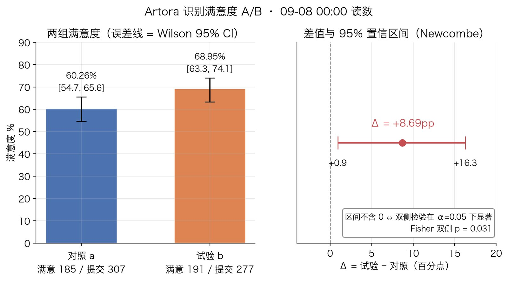

# Artora 识别优化 A/B：小流量下用 Fisher 精确检验判显著

## 背景

Artora 的识别优化项目在跑 A/B 实验：

- **对照组 a**：线上常规版本，工具里标为「v3 纯 LLM」
- **试验组 b**：加了新功能、改了 prompt、同时提高了识别定价，工具里标为「相似图+抬价+无夹回」
- **北极星指标**：用户识别满意度 = 满意 / 提交

问题是流量小，一天只有三百多个用户进组。看到试验组满意度高出将近 10 个百分点，怎么判断是功能带来的，还是随机波动？

## 为什么用它

满意度是二元结果，两组对比就是一张 2×2 表，问的是"两组比例是否相同"，这正是 [Fisher 精确检验](../concept/fisher-exact-test.md)干的事。选它的理由有三条站得住的：

1. **精确**：不做大样本近似，样本再小、切片再细，结果都对。
2. **零依赖**：只要 `math.comb`，能塞进一条 shell 管道，不用装 scipy。
3. **不用惦记前提**：不必每次先算期望频数够不够，看细分维度时尤其省心。

当时还有第四条理由："流量小，[卡方](../concept/chi-square-test.md)做不了，只能用 Fisher"。复盘时把期望频数算出来，发现这条不成立（见结果与复盘）。它不影响选 Fisher 这个决定，但影响以后怎么解释这个决定。

## 怎么做的

`./sensors arm-split` 输出两组的满意 / 提交数，grep 出对照、试验、Δ 三行，`tee` 到 stderr 留底，再管给一段 Python 算双侧 Fisher p。09-08 00:00 的一次读数：

```
$ date '+%m-%d %H:%M'; ./sensors arm-split 2>&1 | grep -E "对照|试验|Δ" | tee /dev/stderr | python3 -c "..."
09-08 00:00
  a 对照(v3 纯 LLM)               满意   185 / 提交   307   满意度 60.26%
  b 试验(相似图+抬价+无夹回)             满意   191 / 提交   277   满意度 68.95%
  Δ(试验-对照) = +8.69pp   ⚠ 样本量小时波动大,引用带日期与 n;UV 跨组不可加
fisher p = 0.031
```

管道里那段 Python，原样：

```python
import sys,re
from math import comb
rows=re.findall(r'满意\s+(\d+) / 提交\s+(\d+)',sys.stdin.read())
(a_s,a_n),(b_s,b_n)=[(int(x),int(y)) for x,y in rows]
def fisher(a,b,c,d):
    n=a+b+c+d; r1=a+b; c1=a+c
    p=lambda x: comb(r1,x)*comb(n-r1,c1-x)/comb(n,c1)
    p0=p(a); return sum(p(x) for x in range(max(0,c1-(n-r1)),min(r1,c1)+1) if p(x)<=p0+1e-12)
print('fisher p =',round(fisher(b_s,b_n-b_s,a_s,a_n-a_s),3))
```

它算的列联表（第二列 = 提交 − 满意；工具只给了满意和提交两个数，没有细分"其余"是什么）：

```
            满意   非满意   提交
  试验 b     191      86    277
  对照 a     185     122    307
  合计       376     208    584
```

`fisher(b_s, b_n-b_s, a_s, a_n-a_s)` 把试验组放第一行；双侧 p 取"所有概率不大于观测表概率的表之和"，与 R、scipy 的默认定义一致。

## 结果与复盘

**结果**：双侧 p = 0.031。如果两组满意率其实相同，出现这么大或更大差距的概率约 3%。按 α = 0.05，差异显著。

两组满意度各自的 Wilson 95% 置信区间，以及差值的 Newcombe 区间（写这篇时补算，`tools/figures/artora-ab-satisfaction-fisher.py`）：



**写这篇时用同一张表补算的数**（不是当时管道的输出；scipy 1.18.1 复核）：

| 量 | 值 |
|---|---|
| Fisher 单侧 p（试验组更高） | 0.0176 |
| 期望频数最小的格子 | 98.7（试验 · 非满意） |
| 卡方 p：无校正 / Yates 校正 | 0.0285 / 0.0354 |
| 无条件精确检验 p：Barnard / Boschloo | 0.0294 / 0.0293 |
| Δ 的 95% 置信区间（Newcombe） | +0.9pp ～ +16.3pp |

**复盘**：

1. **"流量小不能用卡方"在这张表上不成立。** 卡方的经验规则是期望频数 ≥ 5，这里最小格 98.7；n = 584 对 2×2 表不算小样本，五种方法的 p 全在 0.03 上下，结论一致。就算按天切片、一组一百多人，期望频数也还够卡方用。只有再细分到几十人一组、或指标本身很稀疏（比如个位数百分比的投诉率）时，卡方才真的不可靠，那才是 Fisher 兑现优势的地方。教训：先算期望频数，再说"卡方不能用"。原理见[卡方检验](../concept/chi-square-test.md)。
2. **显著不等于差多少。** 置信区间从 +0.9pp 到 +16pp，"提高近 10 个点"这个点估计本身还很不稳。工具输出里那句「样本量小时波动大,引用带日期与 n」说的就是这个。汇报时报区间，不只报点估计。
3. **两个前提要盯住。** 一是独立性：检验按"提交"计数，如果同一用户可以多次提交，独立性就破了，p 会偏乐观；提交是否等于用户，要回工具里确认。二是窥探：每天跑一次、p < 0.05 就宣布，假阳性率远超 5%。要么预定样本量到了再看，要么换序贯方法。
4. **归因归不到单项。** 试验组同时改了三样（新功能、prompt、定价），p 值只说明这一整包有效，分不出是哪一项在起作用。抬价是否改变了"谁来提交"，是一个待验证的猜想，不是结论。
