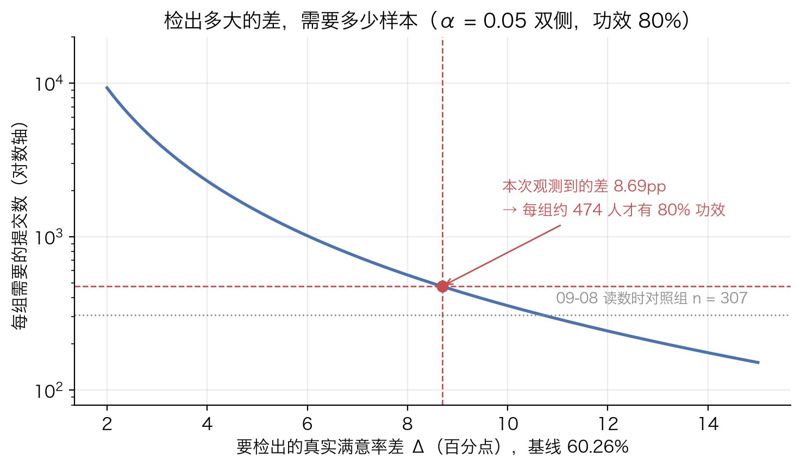

# Artora 识别优化 A/B：小流量下用 Fisher 精确检验判显著

## 背景

### 实验是什么

Artora 的识别优化项目在跑 A/B 实验：

- **对照组 a**：线上常规版本，工具里标为「v3 纯 LLM」
- **试验组 b**：加了新功能、改了 prompt、同时提高了识别定价，工具里标为「相似图+抬价+无夹回」。注意是**三处同时改**，这一点复盘时会回来说
- **北极星指标**：用户识别满意度 = 满意 / 提交

### 拿到手的数据长什么样

数据来自内部工具 `./sensors arm-split`，它按分组吐出满意数和提交数。09-08 00:00 的一次读数，原样：

```
  a 对照(v3 纯 LLM)               满意   185 / 提交   307   满意度 60.26%
  b 试验(相似图+抬价+无夹回)             满意   191 / 提交   277   满意度 68.95%
  Δ(试验-对照) = +8.69pp   ⚠ 样本量小时波动大,引用带日期与 n;UV 跨组不可加
```

每行三个信息：分母是"提交"（用户提交了一次识别），分子是"满意"（用户对这次识别表示满意），满意度是两者之比。两组提交数不一样（307 和 277），比较的是比例不是绝对数。工具自己带了一句提醒：样本小的时候这个比例波动大，引用时要带日期和 $n$。

### 要回答的问题

试验组高出 $8.69$ 个百分点。问题是：**这个差距是新功能带来的，还是两组人数都只有几百、随机波动碰巧凑出来的？**

约束是流量：一天只有三百多个用户进组。等不起上万样本，需要一个在几百人这个量级上就可靠的判断方法。

把问题翻译成统计语言：两组、每个提交一个二元结果（满意 / 不满意）、比较两组的比例。这是标准的 $2\times 2$ 列联表问题，检验的原假设是"两组满意率相同"。

## 为什么用它

### 从问题形状到候选方法

二元结果、两组、比比例，教科书上的候选有三个：两比例 $z$ 检验、[卡方检验](../concept/statistics/chi-square-test.md)、[Fisher 精确检验](../concept/statistics/fisher-exact-test.md)。前两个本质是同一个东西（$z^2=\chi^2$），依赖大样本正态近似；Fisher 不做近似，把所有可能的表枚举出来直接算概率。

当时的推理是："流量小 → 大样本近似靠不住 → 卡方做不了 → 只能用 Fisher。"

### 站得住的理由

复盘之后，选 Fisher 的理由有三条站得住：

1. **精确**：不做大样本近似，样本再小、切片再细，$p$ 值都是对的。
2. **零依赖**：整个检验只要 `math.comb`，能塞进一条 shell 管道，不用装 scipy，在任何有 Python 3 的机器上都能跑。
3. **不用惦记前提**：卡方每次要先算期望频数够不够，Fisher 不用，看细分维度时尤其省心。

### 站不住的理由

"卡方做不了"这条，复盘时把期望频数算出来发现不成立，细节在结果与复盘。它不影响选 Fisher 这个决定，但影响以后怎么解释这个决定：正确的说法是"Fisher 在这里和卡方一样好，而且更省事"，不是"卡方不能用"。

## 怎么做的

### 第 1 步：把工具输出变成 2×2 表

工具输出是给人看的文本，要先抓出四个数。用正则匹配"满意 数字 / 提交 数字"：

```python
rows = re.findall(r'满意\s+(\d+) / 提交\s+(\d+)', sys.stdin.read())
(a_s, a_n), (b_s, b_n) = [(int(x), int(y)) for x, y in rows]
```

`findall` 按出现顺序返回两个 `(满意, 提交)` 对，第一个是对照 a，第二个是试验 b（工具输出的行序）。于是 `a_s = 185, a_n = 307, b_s = 191, b_n = 277`。

列联表要的是"成功 / 失败"两列，工具只给了满意和提交，第二列用提交减满意得到。这里叫它"非满意"，材料没有细分这些提交里除了满意还有什么：

```
            满意   非满意   提交
  试验 b     191      86    277
  对照 a     185     122    307
  合计       376     208    584
```

### 第 2 步：算 Fisher 双侧 p

管道里那段 Python，原样：

```python
def fisher(a,b,c,d):
    n=a+b+c+d; r1=a+b; c1=a+c
    p=lambda x: comb(r1,x)*comb(n-r1,c1-x)/comb(n,c1)
    p0=p(a); return sum(p(x) for x in range(max(0,c1-(n-r1)),min(r1,c1)+1) if p(x)<=p0+1e-12)
print('fisher p =',round(fisher(b_s,b_n-b_s,a_s,a_n-a_s),3))
```

每一行对应原理的哪一步（推导见 [Fisher 精确检验](../concept/statistics/fisher-exact-test.md)）：

| 代码 | 做什么 | 对应原理 |
|---|---|---|
| `n, r1, c1` | 总数、第一行人数、第一列（满意）总数 | 固定的边际 |
| `p = lambda x: comb(r1,x)*comb(n-r1,c1-x)/comb(n,c1)` | 第一行有 $x$ 个满意的概率 | 超几何分布，第 2 步 |
| `range(max(0,c1-(n-r1)), min(r1,c1)+1)` | $x$ 能取的所有值 | 取值范围，第 4 步 |
| `p0 = p(a)` | 观测表的概率 | |
| `sum(... if p(x) <= p0 + 1e-12)` | 所有概率不大于观测表的表，概率相加 | 双侧 $p$，第 5 步 |

`+1e-12` 是浮点容差：概率是浮点数，理论上相等的两个值算出来可能差在第 16 位，不加容差会漏掉本该算进去的对称表。

调用 `fisher(b_s, b_n-b_s, a_s, a_n-a_s)` 把试验组放第一行，参数依次是 $a=191,\ b=86,\ c=185,\ d=122$。双侧 $p$ 和行的顺序无关，换成对照组在前结果一样。

把数字走一遍：$n=584$，$r_1=277$，$c_1=376$。$H_0$ 下试验组满意数的期望是 $r_1c_1/n=277\times 376/584=178.3$，观测是 $191$，比期望多 $12.7$。观测表本身的概率 $P(A=191)=0.0063$。把分布里所有概率不超过 $0.0063$ 的表加起来，右边是 $a\ge 191$ 的那些，左边是 $a\le 165$ 的那些，总和 $0.0307$，打印时四舍五入成 `fisher p = 0.031`。Fisher 那篇的第一张图画的就是这个分布和这两截红色尾巴。

### 第 3 步：整条管道怎么拼

```
$ date '+%m-%d %H:%M'; ./sensors arm-split 2>&1 | grep -E "对照|试验|Δ" | tee /dev/stderr | python3 -c "..."
09-08 00:00
  a 对照(v3 纯 LLM)               满意   185 / 提交   307   满意度 60.26%
  b 试验(相似图+抬价+无夹回)             满意   191 / 提交   277   满意度 68.95%
  Δ(试验-对照) = +8.69pp   ⚠ 样本量小时波动大,引用带日期与 n;UV 跨组不可加
fisher p = 0.031
```

每一段的用意：

- `date '+%m-%d %H:%M'`：先打时间戳。样本每天在涨，同一条命令明天跑出来的数不一样，工具那句"引用带日期与 n"就是这个意思。
- `./sensors arm-split 2>&1`：拉分组数据，stderr 并进 stdout，免得警告行丢了。
- `grep -E "对照|试验|Δ"`：只留三行，去掉工具的其他输出。
- `tee /dev/stderr`：把这三行原样打到屏幕上**再**交给 Python。这样一次输出里同时有输入数字和 $p$ 值，截图就是完整证据，不用再解释 $p$ 是从哪几个数算出来的。
- `python3 -c "..."`：第 1 步和第 2 步。

整条是一个命令，谁都能重跑，结果自带日期、样本量和 $p$。

## 结果与复盘

### 结果怎么读

双侧 $p=0.031$。含义：**如果两组满意率其实一样**，光靠随机分配就出现当前这么大或更大差距的概率，大约是 $3\%$。按 $\alpha=0.05$ 的惯例，差异显著，倾向于认为试验组确实更高。

$p$ 值说的只有这一件事。它不说差多少，不说是三处改动里哪一处起作用，也不保证明天再看还是这个数。下面三个补算分别处理这三个问题。所有补算都是写这篇时用同一张表算的，不是当时管道的输出，scipy 1.18.1 复核过。

### 补算 1：期望频数，检查"卡方做不了"

卡方能不能用，看的是每个格子的期望频数够不够（为什么，见[卡方检验](../concept/statistics/chi-square-test.md)第 4 步），不是看总人数。算一下：

- 合并满意率 $\bar p=376/584=0.644$
- 试验组：期望满意 $277\times 0.644=178.3$，期望非满意 $277\times 0.356=98.7$
- 对照组：期望满意 $307\times 0.644=197.7$，期望非满意 $307\times 0.356=109.3$

最小的格子 $98.7$，经验规则是 $\ge 5$，差了将近二十倍。**卡方完全可以用。** 把几种方法都算出来放在一起：

| 方法 | $p$ |
|---|---|
| Fisher 精确，双侧（当时用的） | $0.0307$ |
| Fisher 精确，单侧（试验组更高） | $0.0176$ |
| 卡方，无校正 | $0.0285$ |
| 卡方，Yates 校正 | $0.0354$ |
| Barnard 无条件精确 | $0.0294$ |
| Boschloo 无条件精确 | $0.0293$ |

五个双侧 $p$ 全在 $0.03$ 上下，结论一致。$n=584$ 对 $2\times 2$ 表根本不是小样本。

那什么时候"流量小"才真的逼着用 Fisher？按一天三百多人进组、一组一百多人算，按天切片时非满意格子的期望是 $150\times 0.356\approx 53$，还是够卡方用。只有再细分到几十人一组，或者指标本身很稀疏（比如投诉率 $2\%$，$150\times 0.02=3$，低于 5）时，卡方才真的不可靠。**教训：先算期望频数，再说"卡方不能用"。**

### 补算 2：差多少，置信区间

$p$ 说差异不是零，没说是多少。点估计 $+8.69$pp 的不确定性有多大，用置信区间回答。

先给每组的满意率算区间。最简单的 Wald 区间是 $\hat p\pm 1.96\sqrt{\hat p(1-\hat p)/n}$，但它在 $n$ 小或 $\hat p$ 靠近 0、1 时覆盖率不够。这里用 **Wilson 区间**：把"$\hat p$ 和真值 $p$ 的标准化差不超过 $1.96$"这个不等式对 $p$ 反解，得到

$$
\frac{\hat p+\dfrac{z^2}{2n}\ \pm\ z\sqrt{\dfrac{\hat p(1-\hat p)}{n}+\dfrac{z^2}{4n^2}}}{1+\dfrac{z^2}{n}},\qquad z=1.96
$$

代入两组：

- 对照 $185/307$：$60.26\%$，区间 $[54.7\%,\ 65.6\%]$
- 试验 $191/277$：$68.95\%$，区间 $[63.3\%,\ 74.1\%]$

两比例之差的区间用 **Newcombe 法**：把两个 Wilson 区间按勾股定理拼起来，

$$
\Delta_{\text{lo}}=\hat d-\sqrt{(\hat p_1-l_1)^2+(u_2-\hat p_2)^2},\qquad
\Delta_{\text{hi}}=\hat d+\sqrt{(u_1-\hat p_1)^2+(\hat p_2-l_2)^2}
$$

其中 $\hat d=\hat p_1-\hat p_2$，$l$、$u$ 是各组 Wilson 区间的下上限。代入得 $\Delta\in[+0.9\text{pp},\ +16.3\text{pp}]$。


怎么读：真实的提升可能不到 1 个百分点，也可能超过 16 个百分点，$8.69$ 只是这个宽区间的中点。"提高了近 10 个点"这句话的可靠程度，就是这个区间的宽度。区间不含 0，和 $p<0.05$ 是一致的（两者不是同一个公式，但这里方向一致）。

### 补算 3：如果重来，样本量该定多少

事后看 $p=0.031$ 刚刚过线，是因为样本量只够勉强检出这么大的差。用两比例检验的标准样本量公式（正态近似，$\alpha=0.05$ 双侧，功效 $80\%$）：

$$
n_{\text{每组}}=\frac{\Big(z_{0.975}\sqrt{2\bar p(1-\bar p)}+z_{0.8}\sqrt{p_0(1-p_0)+p_1(1-p_1)}\Big)^2}{(p_1-p_0)^2}
$$

以对照组 $60.26\%$ 为基线，想以 $80\%$ 的把握检出 $8.69$pp 的差，每组要约 $474$ 个提交；读数时两组是 $277$ 和 $307$，不到一半。如果真实差只有 $5$pp，每组要约 $1466$ 个；$3$pp 要约 $4118$ 个。



这张图的用法：实验开始前先定"我至少要能检出多大的差"，查出每组样本量，按每天进组人数换算成天数，到了再看。不到样本量不看结果。

### 复盘

1. **"流量小不能用卡方"在这张表上不成立。** 最小期望频数 $98.7$，五种方法结论一致。选 Fisher 没错，理由要换成"精确、零依赖、省心"。
2. **显著不等于差多少。** 置信区间 $[+0.9,\ +16.3]$pp，点估计不稳。汇报报区间，不只报点估计；工具那句"样本量小时波动大"就是在说这个。
3. **两个前提要盯住。** 一是独立性：检验按"提交"计数，同一用户多次提交会破坏独立性，$p$ 会偏乐观；提交是否等于用户，要回工具里确认。二是窥探：每天跑一次、$p<0.05$ 就宣布，假阳性率远超 $5\%$；补算 3 的做法是解药。
4. **归因归不到单项。** 试验组同时改了三样（新功能、prompt、定价），$p$ 值只说明这一整包有效，分不出是哪一项在起作用。抬价是否改变了"谁来提交"（比如筛掉了本来就不太满意的人），是一个待验证的猜想，不是结论；要验证得拆成单变量实验。

图由 `tools/figures/artora-ab-satisfaction-fisher.py` 生成。
