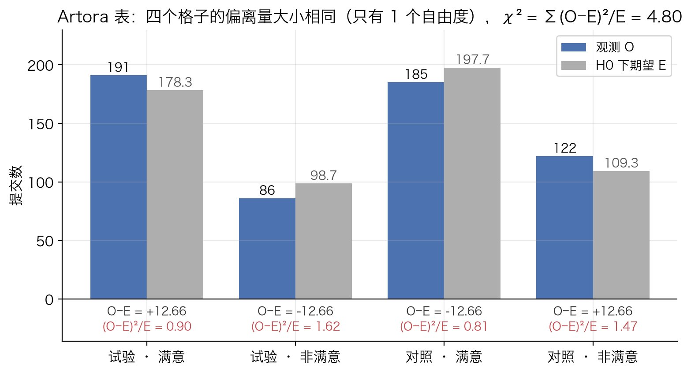
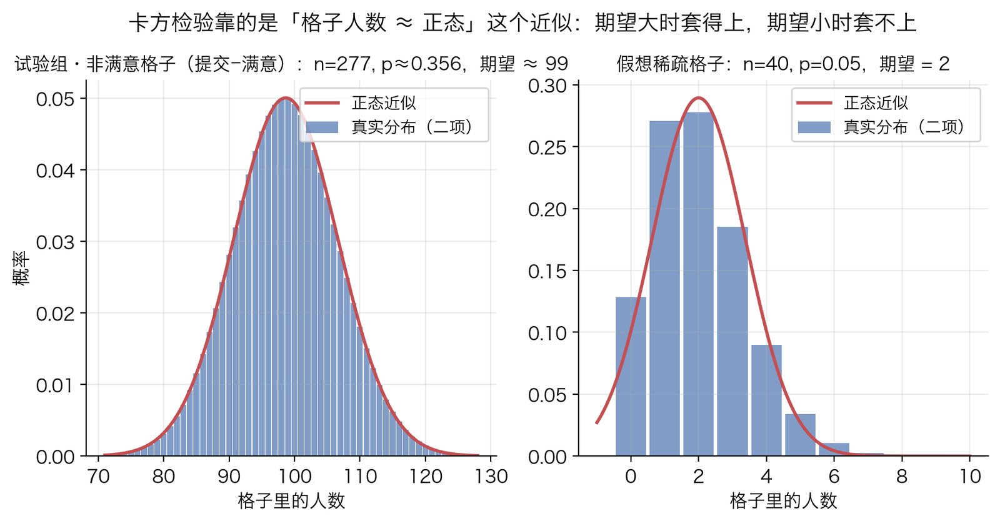
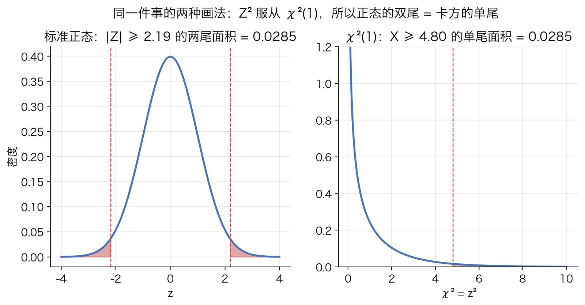

# 卡方检验（列联表独立性）

## 解决什么问题

### 场景

和 [Fisher 精确检验](fisher-exact-test.md)同一个问题：一张列联表，行是分组、列是结果，问"分组和结果有没有关系"。对 $2\times 2$ 表就是"两组的成功率是否相同"：

```
              成功    失败    合计
  组 1         a       b      r1
  组 2         c       d      r2
  合计        c1      c2      n
```

### 卡方检验的思路

Fisher 的办法是把所有可能的表枚举出来精确算概率。卡方检验走另一条路：

1. 假设两组没差别（$H_0$），算出每个格子"应该"有多少人，叫期望频数 $E$。
2. 用一个统计量度量观测 $O$ 偏离 $E$ 的总程度。
3. 利用大样本下这个统计量近似服从一个已知分布（卡方分布），查出偏离这么大的概率。

教科书通常直接给出统计量 $\sum (O-E)^2/E$ 和"服从卡方分布"两个结论。这篇把它们推出来。推的路线是：先从一个更熟悉的东西出发，"比较两个比例的 $z$ 检验"，然后证明卡方统计量就是 $z^2$。这样三个问题一起回答了：统计量为什么长那样、为什么服从卡方分布、"期望频数 $\ge 5$"这条规则从哪来。

## 原理

### 第 1 步：原假设下每个格子该有多少人

$H_0$ 是"组别与结果独立"。概率论里独立的定义是联合概率等于边缘概率之积：

$$
P(\text{落在第 } i \text{ 行且第 } j \text{ 列})=P(\text{第 } i \text{ 行})\cdot P(\text{第 } j \text{ 列})
$$

边缘概率不知道，用样本比例估：$P(\text{第 } i \text{ 行})\approx r_i/n$，$P(\text{第 } j \text{ 列})\approx c_j/n$。$n$ 个人里落在格子 $(i,j)$ 的期望人数就是

$$
E_{ij}=n\cdot\frac{r_i}{n}\cdot\frac{c_j}{n}=\frac{r_i\,c_j}{n}
$$

用 $2\times 2$ 的语言再说一遍：$H_0$ 下两组共用一个成功率 $\pi$，最好的估计是把两组合起来算的**合并比例** $\bar p=c_1/n$。组 1 有 $r_1$ 人，期望成功数 $r_1\bar p=r_1c_1/n$，和上式一致。

### 第 2 步：四个格子的偏离量其实是同一个数

算格子 $(1,1)$ 的偏离 $O-E$：

$$
a-\frac{r_1c_1}{n}=\frac{an-(a+b)(a+c)}{n}
$$

把分子展开：$an=a(a+b+c+d)=a^2+ab+ac+ad$，$(a+b)(a+c)=a^2+ac+ab+bc$，相减剩下 $ad-bc$。所以

$$
a-E_{11}=\frac{ad-bc}{n}\ \equiv\ D
$$

对另外三个格子做同样的展开，会得到 $b-E_{12}=-D$，$c-E_{21}=-D$，$d-E_{22}=+D$。四个偏离量的**大小完全相同**，只是符号交替。

为什么？因为行和、列和都是固定的：组 1 成功多了 $D$ 个，组 1 失败就必须少 $D$ 个（行和不变），组 2 成功也必须少 $D$ 个（列和不变），于是组 2 失败多 $D$ 个。整张表只有**一个**自由变动的量，这就是后面"自由度为 1"的来源。

下图是 Artora 表的四个格子，标出了每格的 $O-E$，确实是 $\pm 12.66$：



### 第 3 步：一个更熟悉的起点 —— 两比例 z 检验

先不管卡方，用大学概率课就能推的方法比较两个比例。

组 1 的样本成功率 $\hat p_1=a/r_1$，组 2 的 $\hat p_2=c/r_2$。每个人的结果是一个取 0 或 1 的随机变量，成功概率 $\pi$，方差 $\pi(1-\pi)$。$\hat p_1$ 是 $r_1$ 个这样的变量的平均，平均的方差是单个方差除以个数：

$$
\operatorname{Var}(\hat p_1)=\frac{\pi(1-\pi)}{r_1},\qquad
\operatorname{Var}(\hat p_2)=\frac{\pi(1-\pi)}{r_2}
$$

两组独立，差的方差是方差之和：

$$
\operatorname{Var}(\hat p_1-\hat p_2)=\pi(1-\pi)\left(\frac{1}{r_1}+\frac{1}{r_2}\right)
$$

$H_0$ 下 $\hat p_1-\hat p_2$ 的期望是 $0$。$\pi$ 不知道，用合并比例 $\bar p=c_1/n$ 代替。把差除以它的标准差，得到**标准化的差**：

$$
z=\frac{\hat p_1-\hat p_2}{\sqrt{\bar p(1-\bar p)\left(\dfrac{1}{r_1}+\dfrac{1}{r_2}\right)}}
$$

为什么要标准化：$\hat p_1-\hat p_2=0.087$ 这个数本身说明不了什么，样本大时 $0.087$ 可能很显著，样本小时可能纯属噪声。除以标准差之后，$z$ 的含义是"差了多少个标准差"，这才能和一个固定的参考分布比。

### 第 4 步：z 为什么近似正态 —— 中心极限定理

$\hat p_1$ 是 $r_1$ 个独立同分布的 0/1 变量的平均。中心极限定理说：独立同分布变量的平均，随着个数增加，分布趋向正态。所以 $r_1$、$r_2$ 够大时 $\hat p_1-\hat p_2$ 近似正态，标准化后的 $z$ 近似标准正态 $N(0,1)$。

"够大"是多大？0/1 变量的和是二项分布 $\mathrm{Bin}(r,\pi)$，它的偏度是

$$
\frac{1-2\pi}{\sqrt{r\pi(1-\pi)}}
$$

偏度接近 0 时正态近似才好。分母 $\sqrt{r\pi(1-\pi)}$ 要大，也就是 $r\pi$ 和 $r(1-\pi)$ 都要大，这两个数正是"期望的成功数"和"期望的失败数"，就是第 1 步的期望频数 $E$。**"每个格子期望频数 $\ge 5$"这条经验规则，本质是在要求二项分布够接近正态。**

下图左边是 Artora 试验组"非满意"格子的实际参数（$n=277$，比例 $0.356$，期望约 $99$），二项分布和正态曲线几乎重合；右边是假想的稀疏格子（期望 $2$），二项分布是几根歪斜的柱子，正态曲线套不上：



### 第 5 步：z 的平方就是卡方统计量

现在把第 3 步的 $z$ 平方，看它长什么样。

分子：

$$
\hat p_1-\hat p_2=\frac{a}{r_1}-\frac{c}{r_2}=\frac{a\,r_2-c\,r_1}{r_1r_2}
$$

而 $a\,r_2-c\,r_1=a(c+d)-c(a+b)=ad-bc$，所以分子等于 $\dfrac{ad-bc}{r_1r_2}$。

分母里：$\bar p(1-\bar p)=\dfrac{c_1}{n}\cdot\dfrac{c_2}{n}$，$\dfrac{1}{r_1}+\dfrac{1}{r_2}=\dfrac{r_1+r_2}{r_1r_2}=\dfrac{n}{r_1r_2}$，相乘得 $\dfrac{c_1c_2}{n\,r_1r_2}$。

于是

$$
z^2=\frac{(ad-bc)^2}{r_1^2r_2^2}\cdot\frac{n\,r_1r_2}{c_1c_2}=\frac{n\,(ad-bc)^2}{r_1\,r_2\,c_1\,c_2}
$$

另一边，把第 2 步的结果代进教科书的统计量 $\sum (O-E)^2/E$。四个格子的 $(O-E)^2$ 都等于 $D^2$，可以提出来：

$$
\sum_{i,j}\frac{(O_{ij}-E_{ij})^2}{E_{ij}}=D^2\sum_{i,j}\frac{1}{E_{ij}}
=D^2\sum_{i,j}\frac{n}{r_ic_j}
=D^2\cdot n\left(\frac{1}{r_1}+\frac{1}{r_2}\right)\left(\frac{1}{c_1}+\frac{1}{c_2}\right)
$$

最后一步是因为 $\sum_{i,j}\frac{1}{r_ic_j}$ 可以拆成两个和的乘积。而 $\frac{1}{r_1}+\frac{1}{r_2}=\frac{n}{r_1r_2}$，$\frac{1}{c_1}+\frac{1}{c_2}=\frac{n}{c_1c_2}$，$D^2=\frac{(ad-bc)^2}{n^2}$，代入：

$$
\sum_{i,j}\frac{(O_{ij}-E_{ij})^2}{E_{ij}}
=\frac{(ad-bc)^2}{n^2}\cdot n\cdot\frac{n}{r_1r_2}\cdot\frac{n}{c_1c_2}
=\frac{n\,(ad-bc)^2}{r_1\,r_2\,c_1\,c_2}
$$

和 $z^2$ **一模一样**。所以

$$
\chi^2\ \equiv\ \sum_{i,j}\frac{(O_{ij}-E_{ij})^2}{E_{ij}}\ =\ z^2
$$

这一步回答了"统计量为什么长那样"：$(O-E)^2/E$ 不是拍脑袋定的，它就是标准化差的平方。除以 $E$ 是在除以方差，把每个格子的偏离放到自己的尺度上：期望 100 的格子差 10 是小事，期望 5 的格子差 10 是大事。

用 Artora 表核一下：$D=(191\times 122-86\times 185)/584=12.658$，$\sum 1/E=0.02995$，$\chi^2=12.658^2\times 0.02995=4.798$；另一边 $z=2.190$，$z^2=4.798$。

### 第 6 步：从正态到卡方分布

卡方分布的定义：**$k$ 个独立标准正态变量的平方和**服从自由度为 $k$ 的卡方分布 $\chi^2_{(k)}$。这是定义，不是定理。

第 4 步说 $z$ 近似 $N(0,1)$，第 5 步说 $\chi^2=z^2$，合起来：$\chi^2$ 近似服从 $\chi^2_{(1)}$。自由度是 1，对应第 2 步"整张表只有一个自由变动的量"。

$p$ 值是"偏离至少这么大"的概率。$\chi^2$ 大，等价于 $|z|$ 大，所以

$$
p=P\big(\chi^2_{(1)}\ge\chi^2_{\text{obs}}\big)=P\big(|Z|\ge\sqrt{\chi^2_{\text{obs}}}\big)=2\big(1-\Phi(\sqrt{\chi^2_{\text{obs}}})\big)
$$

$\Phi$ 是标准正态的累积分布函数。它和误差函数的关系是 $1-\Phi(x)=\tfrac12\operatorname{erfc}(x/\sqrt2)$，代入得

$$
p=\operatorname{erfc}\!\left(\sqrt{\chi^2_{\text{obs}}/2}\right)
$$

Python 里一行：`erfc(sqrt(chi2 / 2))`。注意平方之后正负方向的信息没了，所以卡方检验天然是**双侧**的。Artora 表：$\chi^2=4.798$，$p=0.0285$。

下图是同一个 $p$ 的两种画法：左边标准正态两个尾巴的面积，右边卡方分布一个尾巴的面积，都是 $0.0285$：



### 第 7 步：推广到更大的表

$r\times c$ 表的统计量还是 $\sum (O-E)^2/E$，近似服从 $\chi^2_{(r-1)(c-1)}$。自由度这么数：一共 $rc$ 个格子，行和固定给了 $r$ 个约束，列和固定给了 $c$ 个约束，但总数在行和、列和里各算了一次，重复了一个，所以独立约束是 $r+c-1$ 个，自由度 $rc-(r+c-1)=(r-1)(c-1)$。$2\times 2$ 代进去正好是 1。

一般情形的证明要用多元中心极限定理和一点线性代数（把 $rc$ 个相关的偏离量正交化成 $(r-1)(c-1)$ 个独立的标准正态），思路和 $2\times 2$ 一样，这里不展开。

### 第 8 步：Yates 连续性校正

第 4 步用连续的正态去近似离散的二项，有一个系统性偏差：离散变量取整数值，"$X\ge k$"在连续曲线上对应的其实是"$Y\ge k-\tfrac12$"（整数 $k$ 那根柱子从 $k-\tfrac12$ 延伸到 $k+\tfrac12$）。Yates 的做法是把每个格子的 $|O-E|$ 先减 $\tfrac12$ 再平方：

$$
\chi^2_{\text{Yates}}=\sum_{i,j}\frac{\big(|O_{ij}-E_{ij}|-\tfrac12\big)^2}{E_{ij}}
$$

效果是 $\chi^2$ 变小、$p$ 变大、检验更保守。Artora 表上 $\chi^2$ 从 $4.80$ 降到 $4.43$，$p$ 从 $0.0285$ 变成 $0.0354$。它校正的目标是逼近 Fisher 的条件分布，而 Fisher 本身已经偏保守，所以 Yates 通常校正过头。现代观点：期望频数够大时不需要它，不够大时直接换 Fisher 或无条件精确检验。

## 适用边界

- **看期望频数，不看总人数。** 经验规则：所有格子 $E\ge 5$（宽松版：没有 $E<1$，且 $E<5$ 的格子不超过 $20\%$）。第 4 步说了原因：正态近似的好坏取决于 $r\pi$ 和 $r(1-\pi)$，不取决于 $n$。总人数大但结果稀有（比如投诉率 $2\%$），稀有那一列照样不满足。**先算 $E$ 再决定用不用**，Artora 那次的教训就在这里：$n=584$ 看着不大，最小 $E$ 却有 $98.7$。
- **不满足就换精确方法**：$2\times 2$ 用 [Fisher](fisher-exact-test.md)，或功效更高的 Barnard / Boschloo；大表用 Fisher–Freeman–Halton。
- **前提是观测独立。** 第 3 步算方差时用了独立性。同一用户多次提交、同一设备重复曝光都会破坏它。配对数据（同一批人前后测）用 McNemar。
- **只回答"有没有关系"，不回答"关系多强"。** $n$ 很大时芝麻大的差异也显著，汇报要带效应量：$2\times 2$ 报比例差和置信区间，大表报 Cramér's V。
- **同族替代**：G 检验（似然比卡方）在大样本下与 Pearson 卡方等价，稀疏时表现略有差异；有序类别用趋势检验（Cochran–Armitage），不要退化成普通卡方。

## 最小算例

### 手算：Artora 表

$a=191,\ b=86,\ c=185,\ d=122$，$r_1=277,\ r_2=307,\ c_1=376,\ c_2=208$，$n=584$。

第 1 步，期望频数：$E_{11}=277\times 376/584=178.34$，$E_{12}=98.66$，$E_{21}=197.66$，$E_{22}=109.34$。

第 2 步，偏离量：$D=(191\times 122-86\times 185)/584=(23302-15910)/584=12.658$。核对：$191-178.34=12.66$。

第 5 步，统计量：

$$
\chi^2=D^2\sum\frac{1}{E}=12.658^2\times\left(\frac{1}{178.34}+\frac{1}{98.66}+\frac{1}{197.66}+\frac{1}{109.34}\right)=160.21\times 0.02995=4.798
$$

第 6 步，$p$ 值：$p=\operatorname{erfc}(\sqrt{4.798/2})=\operatorname{erfc}(1.549)=0.0285$。

### 代码

零依赖实现，$2\times 2$ 专用：

```python
from math import erfc, sqrt

def chi2_2x2(a, b, c, d, yates=False):
    """表 [[a, b], [c, d]]。返回 (χ², p, 最小期望频数)。"""
    n = a + b + c + d
    rows, cols = (a + b, c + d), (a + c, b + d)
    obs = ((a, b), (c, d))
    stat, min_e = 0.0, float("inf")
    for i in range(2):
        for j in range(2):
            e = rows[i] * cols[j] / n
            min_e = min(min_e, e)
            diff = abs(obs[i][j] - e) - (0.5 if yates else 0.0)
            stat += max(diff, 0.0) ** 2 / e
    return stat, erfc(sqrt(stat / 2)), min_e
```

```python
>>> chi2_2x2(191, 86, 185, 122)            # Artora 表：试验 / 对照
(4.798..., 0.0285, 98.657...)
>>> chi2_2x2(191, 86, 185, 122, yates=True)
(4.426..., 0.0354, 98.657...)
```

有 scipy 就直接 `scipy.stats.chi2_contingency([[191, 86], [185, 122]], correction=False)`，返回值里带期望频数矩阵，顺手就能查经验规则。图由 `tools/figures/chi-square-test.py` 生成。
