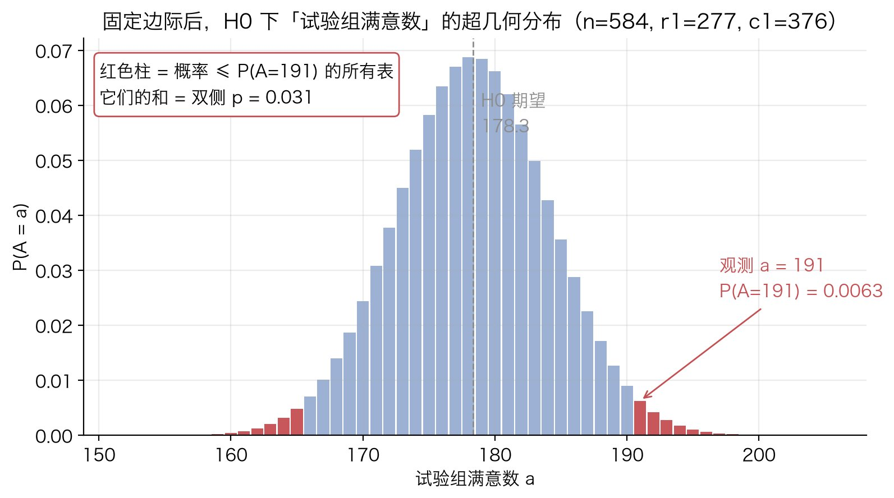
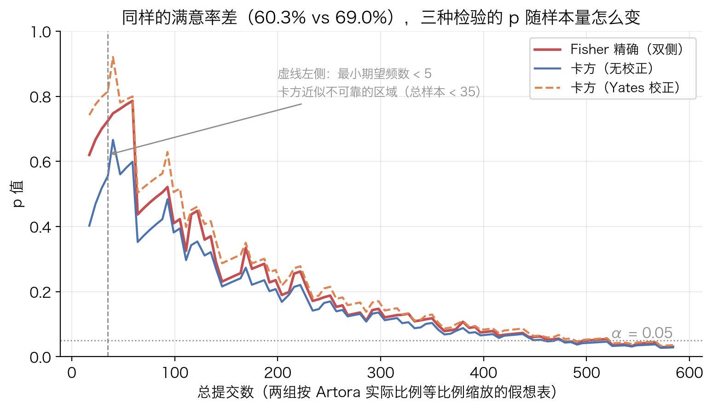

# Fisher 精确检验

## 解决什么问题

两组、每组一个二元结果（成功 / 失败），问：两组成功率的差异是真的，还是抽样波动？数据是一张 $2\times 2$ 列联表：

```
              成功    失败    合计
  组 1         a       b      r1
  组 2         c       d      r2
  合计        c1      c2      n
```

常规做法是[卡方检验](chi-square-test.md)，但它用的是近似分布，格子的期望频数小（经验规则 $E<5$）时近似失真。Fisher 精确检验不做近似，直接把概率算出来，所以样本多小都成立。

## 原理

核心一步：**把四个边际 $r_1, r_2, c_1, c_2$ 当成固定的**。固定之后整张表只剩一个自由度，知道 $a$ 就知道全表。

原假设 $H_0$：两组成功率相同，即组别与结果独立。在 $H_0$ 下，$n$ 个个体里有 $c_1$ 个成功，"哪 $c_1$ 个是成功的"与组别无关。这等价于从 $n$ 个球（其中 $c_1$ 个白球）里不放回地抽 $r_1$ 个，抽到 $a$ 个白球的概率，就是超几何分布：

$$
P(A=a)=\frac{\binom{r_1}{a}\binom{r_2}{c_1-a}}{\binom{n}{c_1}}
=\frac{\binom{c_1}{a}\binom{c_2}{r_1-a}}{\binom{n}{r_1}}
$$

两种写法相等（超几何分布的对称性）。$a$ 的取值范围是 $\max(0,\,c_1-r_2)\le a\le\min(r_1,\,c_1)$。

$p$ 值有两种：

- **单侧**（组 1 成功率更高）：$P(A\ge a_{\text{obs}})$，把 $a_{\text{obs}}$ 到上限的概率加起来。
- **双侧**：常用定义是把**所有概率不大于观测表概率的表**的概率加起来，即

$$
p_{\text{two-sided}}=\sum_{x:\;P(A=x)\le P(A=a_{\text{obs}})}P(A=x)
$$

  R 的 `fisher.test`、scipy 的 `fisher_exact` 默认都这么算。另一种定义是单侧乘 2。两种结果可能不同，报告时要说明用的哪种。

画出来就是下面这样。这是 [Artora A/B 实验](../case/artora-ab-satisfaction-fisher.md)那张表（$n=584$，试验组 $r_1=277$，总满意 $c_1=376$）在 $H_0$ 下"试验组满意数"的分布：期望 $178.3$，实际观测 $191$，红色柱是所有概率不超过 $P(A=191)$ 的表，它们加起来就是双侧 $p=0.031$。



固定边际是有代价的：可取的表是离散的、有限个，检验偏保守，实际第一类错误率低于名义 $\alpha$。样本大时差别可忽略；样本很小又在意功效时，可以用**只固定两组样本量、不固定成功总数**的无条件检验（Barnard、Boschloo），功效更高，代价是计算重。scipy.stats 有 `barnard_exact` / `boschloo_exact`，R 有 `Exact` 包。上面那张表两者的 $p$ 分别是 $0.0294$ 和 $0.0293$，都略小于 Fisher 的 $0.0307$，符合"条件检验偏保守"。

## 适用边界

- **任何样本量都成立**，小样本是它的主场。样本大时它和卡方给出几乎相同的 $p$，选哪个都行；Python 的 `math.comb` 是大整数运算，几百上千的 $n$ 不会溢出。
- **卡方的经验规则**：所有格子期望频数 $E\ge 5$。满足时无校正卡方与 Fisher 的 $p$ 很接近；Yates 校正版通常比 Fisher 还保守（$p$ 更大，属于过度校正），论贴近 Fisher，无校正卡方往往反而更近。**先算期望频数再决定"卡方不能用"**，别凭 $n$ 的大小拍脑袋。

下图把 Artora 那张表按两组实际比例等比例缩小，看三种检验的 $p$ 随总样本量怎么变：三条线在最小期望频数 $\ge 5$ 之后就贴在一起了，只有在最左边几十个样本的区域才明显分开。曲线有锯齿是因为缩放后人数要取整，不是方法本身的问题。



- **前提是观测相互独立。** 同一个用户多次提交都算进去，独立性就破了，$p$ 会偏乐观。
- **它只回答"差异是否为零"，不回答"差多少"。** 汇报要带效应量：比例差 $\hat p_1-\hat p_2$ 加置信区间（两比例差用 Newcombe 法比 Wald 法稳）。
- **反复窥探会毁掉它。** 每天跑一次、$p<0.05$ 就停，第一类错误率远超 $5\%$。Fisher 不解决这个；要么预定样本量到了再看，要么用序贯检验。
- 超过 $2\times 2$ 的 $r\times c$ 表有 Fisher–Freeman–Halton 推广；配对数据（同一批人前后测）用 McNemar，不是 Fisher。

## 最小算例

零依赖实现，双侧用"概率不大于观测表概率之和"的定义：

```python
from math import comb

def fisher_exact(a, b, c, d):
    """2×2 表 [[a, b], [c, d]]。返回 (单侧 P(A>=a), 双侧 p)。"""
    n, r1, c1 = a + b + c + d, a + b, a + c
    pmf = lambda x: comb(r1, x) * comb(n - r1, c1 - x) / comb(n, c1)
    lo, hi = max(0, c1 - (n - r1)), min(r1, c1)
    p_obs = pmf(a)
    greater = sum(pmf(x) for x in range(a, hi + 1))
    two_sided = sum(pmf(x) for x in range(lo, hi + 1) if pmf(x) <= p_obs * (1 + 1e-7))
    return greater, two_sided
```

手算能核的小例子：表 $\begin{pmatrix}3&1\\1&3\end{pmatrix}$，$n=8$，$r_1=c_1=4$，$a$ 可取 $0,\dots,4$，概率分别是 $\tfrac{1}{70},\tfrac{16}{70},\tfrac{36}{70},\tfrac{16}{70},\tfrac{1}{70}$。观测 $a=3$：

- 单侧：$P(3)+P(4)=\tfrac{17}{70}\approx 0.243$
- 双侧：概率 $\le\tfrac{16}{70}$ 的表之和 $=P(0)+P(1)+P(3)+P(4)=\tfrac{34}{70}\approx 0.486$

```python
>>> fisher_exact(3, 1, 1, 3)
(0.24285714285714285, 0.4857142857142857)
>>> fisher_exact(191, 86, 185, 122)      # Artora 表
(0.01756679091466034, 0.030692257982606948)
```

真实数据的用法见 [Artora 识别优化 A/B](../case/artora-ab-satisfaction-fisher.md)。图由 `tools/figures/fisher-exact-test.py` 生成。
