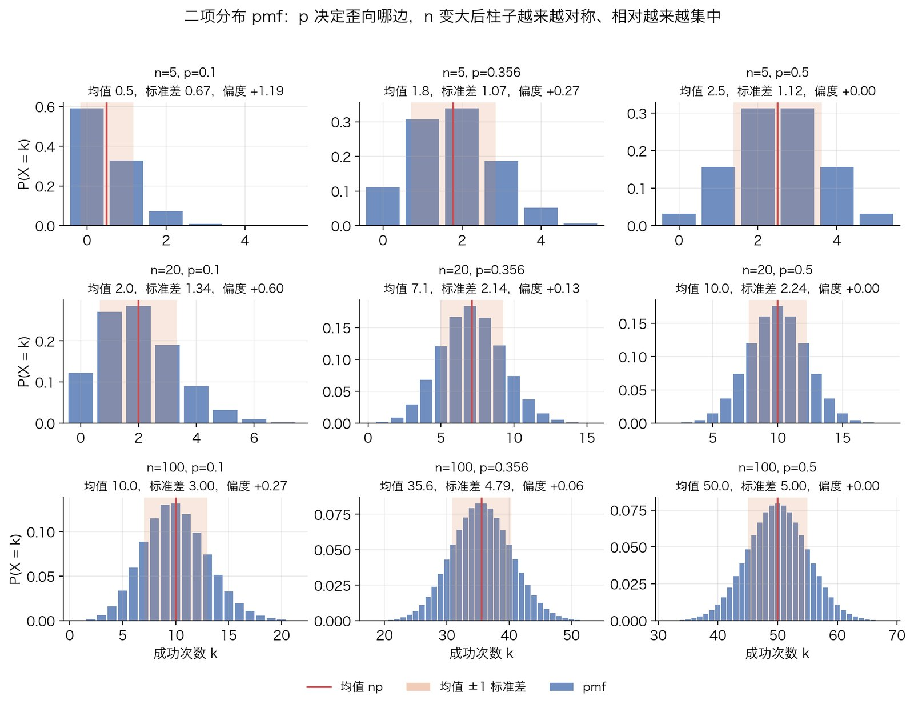
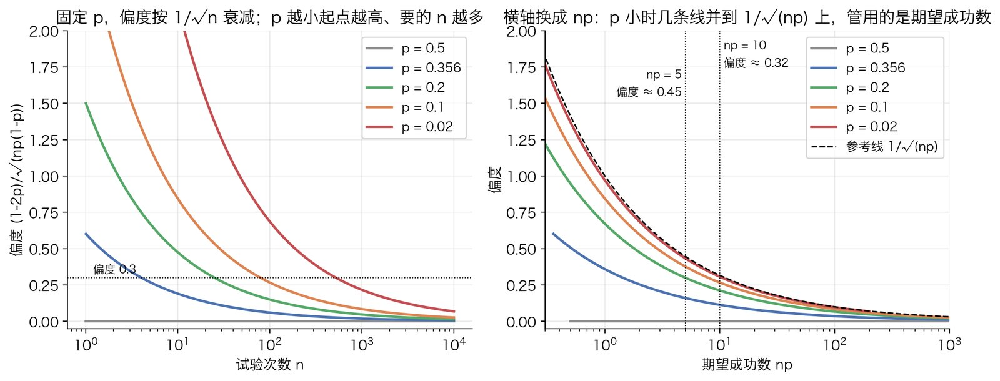
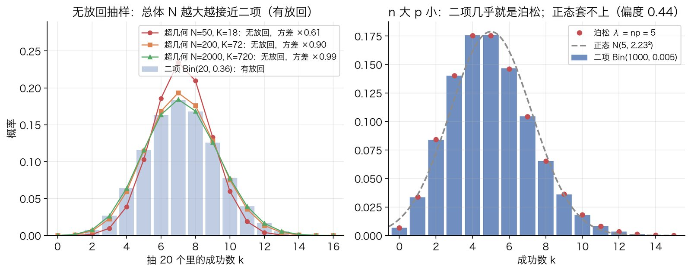
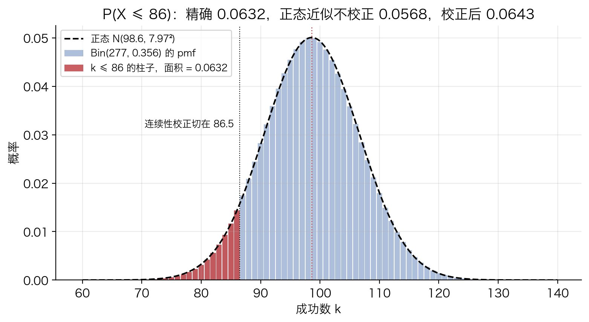

# 二项分布

## 解决什么问题

### 场景

一件事重复做 $n$ 次，每次只有两种结果（成功 / 失败、满意 / 非满意、点击 / 不点击），每次成功的概率都是同一个 $p$，各次互不影响。问：$n$ 次里恰好成功 $k$ 次的概率是多少？成功次数平均是多少、上下会波动多大？

抛 10 次硬币数正面是最经典的例子。更贴近实际的是 A/B 实验里的计数：一个组收到 277 次提交，每次提交独立地以概率 $p$ 被评为"非满意"，那么这 277 次里非满意的个数就是一个二项变量。z 检验、卡方检验判断"两组比例有没有差别"时，底层假设的就是每组的计数服从二项分布；它们的方差公式、"期望频数 $\ge 5$"这类经验规则，全部来自这篇要推的几个量。

### 这篇讲什么、不讲什么

讲：pmf 怎么数出来、期望方差偏度怎么算出来、形状随 $n$ 和 $p$ 怎么变、和超几何 / 正态 / 泊松三个邻居什么关系。不讲：拿到一组数据之后怎么估 $p$、怎么判断两组的 $p$ 是否相等。那是统计学的事，见 [z 检验](../statistics/z-test.md)。这里始终把 $n$ 和 $p$ 当成已知。

记号：$X\sim\mathrm{Bin}(n,p)$ 表示 $X$ 服从参数为 $n$、$p$ 的二项分布。

## 原理

### 第 1 步：一次试验，伯努利变量

先把"一次试验"写成随机变量。定义 $X_i$ 为第 $i$ 次试验的结果，成功记 1，失败记 0：

$$
P(X_i=1)=p,\qquad P(X_i=0)=1-p
$$

这叫伯努利变量。把结果编码成 0/1 而不是"成功 / 失败"两个词，好处是**成功次数就是这些 0/1 的和**，后面所有性质都从这个和上推。

**期望。** 按定义，期望是取值乘概率再求和：

$$
E[X_i]=1\cdot p+0\cdot(1-p)=p
$$

人话：0/1 变量的均值就是取 1 的概率。这是"比例"和"概率"在计算上可以互换的根源。

**方差。** 方差的定义是 $\operatorname{Var}(X)=E[(X-\mu)^2]$，$\mu=E[X]$。直接按定义算也行，但更省事的是先把平方展开：

$$
E[(X-\mu)^2]=E[X^2-2\mu X+\mu^2]=E[X^2]-2\mu E[X]+\mu^2=E[X^2]-\mu^2
$$

中间一步用了期望的线性性（常数可以提出来、和的期望等于期望的和）。于是只需要 $E[X_i^2]$。$X_i$ 只取 0 和 1，而 $0^2=0$、$1^2=1$，所以 $X_i^2=X_i$，$E[X_i^2]=E[X_i]=p$。代入：

$$
\operatorname{Var}(X_i)=p-p^2=p(1-p)
$$

$p(1-p)$ 这个函数会在后面每个公式里出现，值得看一眼它的形状：$p=0$ 或 $p=1$ 时为 0（结果已经确定，没有不确定性），$p=\tfrac12$ 时最大，等于 $\tfrac14$（最不确定）。

### 第 2 步：n 次里恰好 k 次成功，pmf

令 $X=X_1+X_2+\cdots+X_n$，它就是成功次数。要算 $P(X=k)$，分两步：先算一条**特定顺序**的结果序列的概率，再数有多少条序列的成功次数正好是 $k$。

**一条序列的概率。** 以 $n=4$、$k=2$ 为例，序列"成、成、败、败"的概率是

$$
P(X_1=1,X_2=1,X_3=0,X_4=0)=P(X_1=1)P(X_2=1)P(X_3=0)P(X_4=0)=p\cdot p\cdot(1-p)\cdot(1-p)
$$

第一个等号是**独立性**：独立的定义就是联合概率等于各自概率的乘积。没有独立性，这一步写不出来。第二个等号用了**每次都是同一个 $p$**：如果第 3 次的成功概率是 $p_3$ 而不是 $p$，这里就得写 $p_3$。

换一条序列"成、败、成、败"，概率是 $p(1-p)p(1-p)$，乘法可以交换顺序，结果还是 $p^2(1-p)^2$。推广：**任何**一条恰好 $k$ 个 1、$n-k$ 个 0 的序列，概率都是

$$
p^k(1-p)^{n-k}
$$

和 1 出现在哪几个位置无关。

**有多少条这样的序列。** 就是从 $n$ 个位置里挑 $k$ 个放 1，其余放 0。挑法数是二项系数

$$
\binom{n}{k}=\frac{n!}{k!\,(n-k)!}
$$

它为什么长这样：按顺序挑 $k$ 个位置有 $n(n-1)\cdots(n-k+1)=\frac{n!}{(n-k)!}$ 种挑法，但同一组位置换个挑选顺序算的是同一条序列，每组被重复数了 $k!$ 次，所以要除掉。

**加起来。** 不同序列是互斥事件（一次实验只能出一条序列），互斥事件的概率可以直接相加。$\binom{n}{k}$ 条序列每条概率 $p^k(1-p)^{n-k}$，于是

$$
P(X=k)=\binom{n}{k}p^k(1-p)^{n-k},\qquad k=0,1,\dots,n
$$

这就是二项分布的概率质量函数（pmf）。读法：**有多少种排法，乘以每种排法的概率。**

**验证它是个合法分布：所有概率加起来等于 1。** 二项式定理说

$$
(a+b)^n=\sum_{k=0}^{n}\binom{n}{k}a^kb^{n-k}
$$

令 $a=p$，$b=1-p$：

$$
\sum_{k=0}^{n}P(X=k)=\sum_{k=0}^{n}\binom{n}{k}p^k(1-p)^{n-k}=(p+1-p)^n=1^n=1
$$

分布的名字就来自这里。而且这不是巧合：把 $(a+b)^n$ 展开，是从 $n$ 个括号里各挑一个 $a$ 或 $b$ 相乘，挑了 $k$ 个 $a$ 的项有 $\binom{n}{k}$ 个，和上面数序列是同一件事。pmf 的每一项就是二项展开的每一项。

下图是九组不同 $(n,p)$ 的 pmf。看三件事：$p<\tfrac12$ 时柱子向右拖尾，$p=\tfrac12$ 时左右对称；$n$ 变大后不对称减弱；红线是均值，浅色带是均值 $\pm 1$ 个标准差，这两个量接下来推。



### 第 3 步：期望是 np

给两条路，走完再比较。

**路线 A：对 pmf 直接求和。** 按定义

$$
E[X]=\sum_{k=0}^{n}k\binom{n}{k}p^k(1-p)^{n-k}
$$

$k=0$ 那项是 0，可以从 $k=1$ 开始。难点在 $k\binom{n}{k}$ 这个因子，处理它用一个恒等式：

$$
k\binom{n}{k}=n\binom{n-1}{k-1}
$$

证明：$k\cdot\frac{n!}{k!(n-k)!}=\frac{n!}{(k-1)!(n-k)!}=n\cdot\frac{(n-1)!}{(k-1)!\,(n-k)!}=n\binom{n-1}{k-1}$。中间只是把 $k!$ 约成 $(k-1)!$、把 $n!$ 拆成 $n\cdot(n-1)!$。组合意义：从 $n$ 人里选 $k$ 人组成委员会再选一个主席，可以先选委员会（$\binom{n}{k}$ 种）再从中选主席（$k$ 种），也可以先选主席（$n$ 种）再从剩下 $n-1$ 人里补 $k-1$ 个委员。两种数法数的是同一批东西。

代入：

$$
E[X]=\sum_{k=1}^{n}n\binom{n-1}{k-1}p^k(1-p)^{n-k}=np\sum_{k=1}^{n}\binom{n-1}{k-1}p^{k-1}(1-p)^{n-k}
$$

第二个等号是从 $p^k$ 里提出一个 $p$。令 $j=k-1$，求和范围变成 $j=0,\dots,n-1$，$n-k=(n-1)-j$：

$$
E[X]=np\sum_{j=0}^{n-1}\binom{n-1}{j}p^j(1-p)^{(n-1)-j}=np\cdot 1=np
$$

最后那个和是 $\mathrm{Bin}(n-1,p)$ 的全部 pmf 加起来，按第 2 步等于 1。

**路线 B：期望的线性性。** $X$ 是 $n$ 个伯努利变量之和，和的期望等于期望之和：

$$
E[X]=E[X_1+\cdots+X_n]=E[X_1]+\cdots+E[X_n]=np
$$

两行结束。

**为什么路线 B 省。** 线性性对**任何**随机变量都成立，不要求独立，不要求同分布，甚至不要求知道 $X$ 的分布长什么样。路线 A 需要一个组合恒等式加一次换元，而且算方差时还得再来一遍（处理 $k^2\binom{n}{k}$）。路线 B 把"$n$ 次的问题"直接还原成"1 次的问题"，第 1 步已经算过。经验：**一个变量能写成简单变量之和时，先用线性性，别碰 pmf。** 路线 A 值得走一次，是为了确认"pmf 定义的 $X$"和"$n$ 个伯努利之和定义的 $X$"确实是同一个东西。

### 第 4 步：方差是 np(1-p)

期望走线性性，方差也想走"和的方差等于方差之和"。但这条**不是**无条件成立的，要看清它什么时候成立。

设 $Y_i=X_i-p$，它是 $X_i$ 减去自己的均值，所以 $E[Y_i]=0$，$\operatorname{Var}(X_i)=E[Y_i^2]$。$X$ 的方差是

$$
\operatorname{Var}(X)=E\big[(X-np)^2\big]=E\Big[\Big(\sum_{i=1}^{n}Y_i\Big)^2\Big]
$$

把平方展开成双重求和（$(a_1+\cdots+a_n)^2=\sum_i\sum_j a_ia_j$）：

$$
E\Big[\Big(\sum_i Y_i\Big)^2\Big]=\sum_{i=1}^{n}\sum_{j=1}^{n}E[Y_iY_j]=\underbrace{\sum_{i}E[Y_i^2]}_{i=j}+\underbrace{\sum_{i\ne j}E[Y_iY_j]}_{i\ne j}
$$

第一堆是 $n$ 个方差，每个都是 $p(1-p)$。第二堆有 $n(n-1)$ 项，每项是两个不同试验的协方差。**独立性在这里用上**：$X_i$ 与 $X_j$ 独立，则 $Y_i$ 与 $Y_j$ 独立，独立变量乘积的期望等于期望的乘积：

$$
E[Y_iY_j]=E[Y_i]\,E[Y_j]=0\cdot 0=0\qquad(i\ne j)
$$

交叉项全部消失，剩下

$$
\operatorname{Var}(X)=n\,p(1-p),\qquad \sigma=\sqrt{np(1-p)}
$$

**不独立会怎样。** 假设任意两次试验的相关系数都是 $\rho>0$（比如同一个用户反复提交，每次结果偏向同一边），那么每个交叉项是 $\rho\,p(1-p)$，方差变成

$$
\operatorname{Var}(X)=np(1-p)+n(n-1)\rho\,p(1-p)=np(1-p)\big[1+(n-1)\rho\big]
$$

方括号里的因子大于 1，而且随 $n$ 增长。这就是"过度离散"：真实波动比二项公式算出来的大，用二项公式做的检验会把噪声当信号。适用边界一节还会回来说它。

**均值和标准差的比例。** 均值 $np$ 随 $n$ 线性增长，标准差 $\sqrt{np(1-p)}$ 只随 $\sqrt n$ 增长，两者之比

$$
\frac{\sigma}{\mu}=\frac{\sqrt{np(1-p)}}{np}=\sqrt{\frac{1-p}{np}}
$$

随 $n$ 按 $1/\sqrt n$ 缩小。这是"样本量翻 4 倍，相对误差减半"的来源，也是大数定律在比例上的具体形态。第 2 步那张图的标题里，$p=0.5$ 一列：$n=5$ 时标准差 $1.12$ 是均值 $2.5$ 的 $45\%$，$n=100$ 时标准差 $5$ 只是均值 $50$ 的 $10\%$。

### 第 5 步：形状与偏度

均值说分布在哪，方差说它多宽，都不说它**歪不歪**。歪的程度用偏度衡量，定义是三阶中心矩除以标准差的三次方：

$$
\gamma=\frac{E[(X-\mu)^3]}{\sigma^3}
$$

为什么关心它：正态分布是对称的，偏度为 0。二项分布用正态去近似时，误差主要就来自偏度；偏度多大、多快变小，直接决定"$n$ 多大才能用正态"。

沿用第 3、4 步的思路：先算一次试验的三阶中心矩，再看它能不能相加。

**伯努利的三阶中心矩。** $Y_i=X_i-p$ 取两个值：$X_i=1$ 时 $Y_i=1-p$，概率 $p$；$X_i=0$ 时 $Y_i=-p$，概率 $1-p$。

$$
E[Y_i^3]=(1-p)^3\cdot p+(-p)^3\cdot(1-p)=p(1-p)\big[(1-p)^2-p^2\big]
$$

提出公因子 $p(1-p)$ 后，方括号里 $(1-p)^2-p^2=1-2p+p^2-p^2=1-2p$，所以

$$
E[Y_i^3]=p(1-p)(1-2p)
$$

**独立和的三阶中心矩可加。** 把 $(\sum_i Y_i)^3$ 展开成三重求和 $\sum_i\sum_j\sum_k Y_iY_jY_k$，逐项取期望。按下标的重合情况分三类：

- 三个下标全相同（$i=j=k$）：得到 $E[Y_i^3]$，一共 $n$ 项。
- 两个相同、一个不同（如 $i=j\ne k$）：独立性给出 $E[Y_i^2Y_k]=E[Y_i^2]\,E[Y_k]=E[Y_i^2]\cdot 0=0$。
- 三个全不同：$E[Y_iY_jY_k]=E[Y_i]E[Y_j]E[Y_k]=0$。

只有第一类活下来，所以

$$
E\big[(X-np)^3\big]=n\,p(1-p)(1-2p)
$$

（顺带一提，四阶矩就不可加了：$i=j\ne k=l$ 那类项 $E[Y_i^2]E[Y_k^2]$ 不为 0。真正可加的是累积量，这里用不到。）

**偏度。** 除以 $\sigma^3=\big(np(1-p)\big)^{3/2}$：

$$
\gamma=\frac{np(1-p)(1-2p)}{\big(np(1-p)\big)^{3/2}}=\frac{1-2p}{\sqrt{np(1-p)}}
$$

**怎么读这个式子。**

- 符号由 $1-2p$ 决定：$p<\tfrac12$ 偏度为正，右边拖长尾（成功少是常态，偶尔多）；$p=\tfrac12$ 偏度为 0，左右对称；$p>\tfrac12$ 为负，左边拖尾。第 2 步的图里三列是 $p=0.1$、$0.356$、$0.5$，偏度从 $+1.19$ 一路降到 0；$p>\tfrac12$ 的图形就是把 $p<\tfrac12$ 的左右翻转（$\mathrm{Bin}(n,p)$ 取 $k$ 的概率等于 $\mathrm{Bin}(n,1-p)$ 取 $n-k$ 的概率）。
- 大小随 $n$ 按 $1/\sqrt n$ 衰减：$n$ 翻 4 倍偏度才减半。慢，但稳定。
- 分母 $\sqrt{np(1-p)}$ 就是标准差。$p$ 很小时 $1-p\approx 1$、$1-2p\approx 1$，偏度约等于 $1/\sqrt{np}$：**决定对称程度的不是 $n$，是期望成功数 $np$**。$p$ 接近 1 时对称地看期望失败数 $n(1-p)$。

具体数字（用 scipy 算的）：$p=0.5$ 任何 $n$ 都是 0；$p=0.356$、$n=277$ 时 $0.036$，已经很接近对称；$p=0.1$ 时 $n=100$ 是 $0.267$，$n=1000$ 才到 $0.084$；$p=0.01$ 时 $n=100$ 高达 $0.985$，$n=1000$ 仍有 $0.311$。要把偏度压到 $0.3$ 以下，$p=0.1$ 需要 $n\ge 80$，$p=0.01$ 需要 $n\ge 1078$。

"用正态近似要求 $np$ 和 $n(1-p)$ 都至少 5（严一点是 10）"这条经验规则就是在控制这个分母。要看清它到底把偏度压到了多少，把偏度改写成期望成功数 $a=np$ 和期望失败数 $b=n(1-p)$ 的函数。此时 $n=a+b$，$p=\frac{a}{a+b}$，$1-2p=\frac{b-a}{a+b}$，$np(1-p)=\frac{ab}{a+b}$，代入偏度公式：

$$
|\gamma|=\frac{|b-a|}{a+b}\cdot\sqrt{\frac{a+b}{ab}}=\frac{|b-a|}{\sqrt{(a+b)\,ab}}
$$

不妨设 $b\ge a$（否则把成功和失败对调）。分子分母同除以 $b$：

$$
|\gamma|=\frac{1-a/b}{\sqrt{a\,(1+a/b)}}
$$

固定 $a$、让 $b$ 增大，$a/b$ 变小，分子变大、分母变小，所以 $|\gamma|$ 随 $b$ 单调上升，$b\to\infty$ 时趋于 $\frac{1}{\sqrt a}$。人话：**期望失败数再多也不会让偏度超过 $1/\sqrt{\text{期望成功数}}$，最坏情形就是 $p$ 很小的那个角落。** 于是 $a$、$b$ 都不小于 5 时偏度不超过 $\frac{1}{\sqrt5}\approx 0.45$，都不小于 10 时不超过 $\frac{1}{\sqrt{10}}\approx 0.32$（数值扫 $a,b\ge 5$ 的网格，上确界 $0.4472$，与 $1/\sqrt5$ 一致）。这也解释了下图右边为什么参考线 $1/\sqrt{np}$ 压在所有曲线上方：每条曲线都是固定 $p$ 的截面，永远到不了那条上界。规则本身是经验性的，但它盯着 $np$ 而不是 $n$ 这一点是对的。



### 第 6 步：三个邻居

**有放回 vs 无放回：超几何分布。** 二项分布的"每次 $p$ 相同、各次独立"，对应从一个总体里**有放回**地抽（或者总体无限大，抽走几个不影响比例）。如果总体只有 $N$ 个、其中 $K$ 个是成功，抽 $n$ 个**不放回**，那么每抽走一个成功，下一次的成功概率就降一点，各次既不独立也不同 $p$，成功数服从的是[超几何分布](hypergeometric-distribution.md)：

$$
P(X=k)=\frac{\binom{K}{k}\binom{N-K}{n-k}}{\binom{N}{n}}
$$

它的期望仍是 $n\cdot\frac{K}{N}$，方差是 $n\frac{K}{N}\big(1-\frac{K}{N}\big)\cdot\frac{N-n}{N-1}$，比同均值的二项分布多一个小于 1 的因子 $\frac{N-n}{N-1}$：不放回时每抽一个就多知道一点总体，剩下的不确定性变小。$N\to\infty$、$K/N\to p$ 时这个因子趋于 1，超几何趋于二项。下图左边用 $n=20$ 演示：总体 50 时方差只有二项的 $0.61$ 倍，总体 2000 时已经是 $0.99$ 倍，曲线和柱子基本重合。Fisher 精确检验在固定总成功数之后用的就是超几何，那边的推导在 [Fisher 精确检验](../statistics/fisher-exact-test.md)。

**n 大时：正态分布。** $X$ 是 $n$ 个独立同分布变量之和，[中心极限定理](central-limit-theorem.md)说标准化之后趋向标准正态：

$$
\frac{X-np}{\sqrt{np(1-p)}}\xrightarrow{n\to\infty}N(0,1)
$$

专门针对二项分布的这个版本叫 de Moivre–Laplace 定理。第 5 步的偏度公式给出了收敛的速度：偏度按 $1/\sqrt n$ 消失，正态的偏度是 0，所以两者的差距也按 $1/\sqrt n$ 缩小。实际用[正态](normal-distribution.md)近似算 $P(X\le k)$ 时，离散的整数 $k$ 那根柱子在连续曲线上占的是 $[k-\tfrac12,k+\tfrac12]$，所以要**连续性校正**：

$$
P(X\le k)\approx\Phi\!\left(\frac{k+\tfrac12-np}{\sqrt{np(1-p)}}\right)
$$

$\Phi$ 是标准正态的累积分布函数。最小算例里会看到校正与不校正差多少。

**n 大 p 小：泊松分布。** 固定 $\lambda=np$，让 $n\to\infty$、$p=\lambda/n\to 0$。把 pmf 拆开看：

$$
\binom{n}{k}p^k(1-p)^{n-k}=\frac{n(n-1)\cdots(n-k+1)}{k!}\cdot\frac{\lambda^k}{n^k}\cdot\Big(1-\frac{\lambda}{n}\Big)^{n}\Big(1-\frac{\lambda}{n}\Big)^{-k}
$$

$k$ 固定、$n$ 很大时，$\frac{n(n-1)\cdots(n-k+1)}{n^k}\to 1$（$k$ 个接近 1 的因子相乘），$(1-\lambda/n)^n\to e^{-\lambda}$（$(1+x/n)^n\to e^x$ 这个极限），$(1-\lambda/n)^{-k}\to 1$，于是

$$
P(X=k)\to\frac{\lambda^k}{k!}e^{-\lambda}
$$

这是泊松分布。方差也对得上：二项方差 $np(1-p)=\lambda(1-p)\to\lambda$，正是泊松的方差。这种情形下正态不管用，因为偏度约为 $1/\sqrt{np}=1/\sqrt\lambda$，不随 $n$ 变小。下图右边 $\mathrm{Bin}(1000,0.005)$ 与 $\mathrm{Poisson}(5)$ 逐点的差不超过 $0.0005$，而同均值同方差的正态曲线明显套不上。



**同 p 的二项相加还是二项。** $X\sim\mathrm{Bin}(n_1,p)$、$Y\sim\mathrm{Bin}(n_2,p)$ 且独立，则 $X+Y\sim\mathrm{Bin}(n_1+n_2,p)$。不用算，从定义看：$X+Y$ 是 $n_1+n_2$ 个独立同 $p$ 的伯努利之和。两组 A/B 数据在原假设（同 $p$）下合并起来算总成功数，用的就是这条。$p$ 不同则**不**成立，那时和的分布没有简单闭式。

## 适用边界

二项分布只有两条前提：**各次独立**、**同一个 $p$**。用之前对着实际过程逐条查。

- **同一用户多次出现，独立性破。** 一个用户提交 5 次，这 5 次的"满意"很可能同向；按 5 次独立试验算，方差会被低估（第 4 步的 $1+(n-1)\rho$ 因子）。把"次"换成"人"作为试验单位，或者用按用户聚类的稳健方差，是两种常见修法。判断有没有这个问题不用猜：拿几个批次的计数，算实际方差和 $np(1-p)$ 比，明显偏大就是过度离散。
- **批次效应，同 p 破。** 不同日期、不同渠道、不同版本下 $p$ 不一样。分两种情形：如果各次的 $p_i$ 各不相同但各次仍独立，和的方差是 $\sum p_i(1-p_i)$，它**不超过**用平均 $\bar p$ 算的 $n\bar p(1-\bar p)$（因为 $\sum p_i(1-p_i)=n\bar p-\sum p_i^2$，而 $\sum p_i^2\ge n\bar p^2$，因为 $\sum(p_i-\bar p)^2=\sum p_i^2-2\bar p\sum p_i+n\bar p^2=\sum p_i^2-n\bar p^2\ge 0$，中间用了 $\sum p_i=n\bar p$），二项公式偏保守；但更常见的是同一批次内的试验**共享**一个随机的 $p$，批内正相关，效果和上一条一样是过度离散。原因是全方差公式 $\operatorname{Var}X=E[\operatorname{Var}(X\mid P)]+\operatorname{Var}(E[X\mid P])$：批内 $m$ 次共享随机的 $P$（均值 $\bar p$、方差 $\operatorname{Var}P$）时，给定 $P$ 是二项，所以

$$
\operatorname{Var}X=E[mP(1-P)]+\operatorname{Var}(mP)=m\bar p-m\big(\operatorname{Var}P+\bar p^2\big)+m^2\operatorname{Var}P=m\bar p(1-\bar p)+m(m-1)\operatorname{Var}P
$$

（第二个等号用了 $E[P^2]=\operatorname{Var}P+\bar p^2$）。和第 4 步的 $m\bar p(1-\bar p)[1+(m-1)\rho]$ 对照，多出来的那一项正是 $\rho=\frac{\operatorname{Var}P}{\bar p(1-\bar p)}$。固定的 $p_i$ 各次独立，没有 $\operatorname{Var}P$ 这一项，所以只会比二项公式更小；随机共享的 $P$ 多了这一项，所以只会更大。数值核对：$P\sim\mathrm{Beta}(3,6)$、$m=5$，公式给 $\operatorname{Var}X=1.556$，二项公式 $m\bar p(1-\bar p)=1.111$，模拟两百万批得 $1.558$。区分两种情形的办法是按批次分组看。
- **试验次数本身是随机的。** 二项分布的 $n$ 是固定的。"今天进组多少人"如果本身在波动，那么"今天多少人非满意"只有条件在 $n$ 上才是二项。做检验时条件在观测到的 $n$ 上通常没问题，做预测时就要把 $n$ 的波动也算进去。
- **不放回抽小总体，用超几何。** 总体只有抽样量的 10 倍时，$\frac{N-n}{N-1}$ 已经降到约 $0.9$，二项会高估方差。
- **问的是"到第几次才成功"，不是二项。** 那是几何分布或负二项分布，二项分布回答的只是"固定 $n$ 次里成功几次"。
- **能不能用正态代替。** 看 $np$ 和 $n(1-p)$，不看 $n$（第 5 步）。两者都过 10 时偏度已经低于 $0.32$，正态加连续性校正够用；不够时不需要近似，直接按 pmf 算，`scipy.stats.binom` 对任何 $n$ 都能精确算。

## 最小算例

### 手算 n=4，p=0.5

$p=\tfrac12$ 时 $p^k(1-p)^{n-k}=(\tfrac12)^4=\tfrac1{16}$ 对每个 $k$ 都一样，所以 pmf 只剩数序列：$\binom{4}{0},\binom{4}{1},\binom{4}{2},\binom{4}{3},\binom{4}{4}=1,4,6,4,1$。

| $k$ | 0 | 1 | 2 | 3 | 4 |
|---|---|---|---|---|---|
| $\binom{4}{k}$ | 1 | 4 | 6 | 4 | 1 |
| $P(X=k)$ | $1/16=0.0625$ | $4/16=0.25$ | $6/16=0.375$ | $4/16=0.25$ | $1/16=0.0625$ |

合计 $16/16=1$。核对第 3、4、5 步：

- 期望：$\frac{0\cdot1+1\cdot4+2\cdot6+3\cdot4+4\cdot1}{16}=\frac{32}{16}=2=np$。
- 方差：$E[X^2]=\frac{0\cdot1+1\cdot4+4\cdot6+9\cdot4+16\cdot1}{16}=\frac{80}{16}=5$，$\operatorname{Var}(X)=5-2^2=1=np(1-p)$。
- 三阶中心矩：$\frac{(-2)^3\cdot1+(-1)^3\cdot4+0+1^3\cdot4+2^3\cdot1}{16}=\frac{-8-4+4+8}{16}=0$，偏度 0，和 $1-2p=0$ 一致。

### 代码：n=277，p=0.356

这组参数来自 [Artora A/B 案例](../../case/artora-ab-satisfaction-fisher.md)里试验组的提交数和两组合并的非满意率，用来演示"一个格子的计数在原假设下怎么分布"。

$$
\mu=np=277\times 0.356=98.612,\qquad
\sigma=\sqrt{277\times 0.356\times 0.644}=\sqrt{63.506}=7.969
$$

偏度 $\frac{1-0.712}{7.969}=0.036$。

```python
from scipy.stats import binom, norm
from math import sqrt

n, p = 277, 0.356
X = binom(n, p)
X.mean(), X.std()                  # (98.612, 7.969)
X.stats(moments="s")               # 偏度 0.0361
X.pmf(99)                          # P(X = 99) = 0.0499
X.cdf(86)                          # P(X <= 86) = 0.0632
X.cdf(106) - X.cdf(90)             # P(91 <= X <= 106)，均值正负 1 个标准差内 = 0.6846
X.cdf(114) - X.cdf(82)             # P(83 <= X <= 114)，均值正负 2 个标准差内 = 0.9555

mu, sd = n * p, sqrt(n * p * (1 - p))
norm.cdf((86 - mu) / sd)           # 正态近似，不校正 = 0.0568
norm.cdf((86.5 - mu) / sd)         # 连续性校正 = 0.0643
```

$P(X\le 86)=0.0632$：在 $p=0.356$ 的前提下，277 次里非满意不超过 86 次的概率约 $6\%$。正态近似不做连续性校正给 $0.0568$，偏低约 $10\%$；校正后 $0.0643$，和精确值差 $0.0011$。这是 $np=98.6$、偏度 $0.036$ 的情形；把它和第 6 步图里 $np=5$ 的情形对照，就知道为什么经验规则盯着 $np$。



零依赖版本，只用标准库：

```python
from math import comb

def binom_pmf(k, n, p):
    return comb(n, k) * p ** k * (1 - p) ** (n - k)

def binom_cdf(k, n, p):
    return sum(binom_pmf(i, n, p) for i in range(k + 1))

binom_cdf(86, 277, 0.356)          # 0.0632
```

$n$ 上千时 `p ** k` 会下溢、`comb(n, k)` 会巨大，相乘丢精度，那时改用对数（`math.lgamma`）或者直接用 scipy。图由 `tools/figures/binomial-distribution.py` 生成，正文里的数字也都在那个脚本末尾打印出来。
