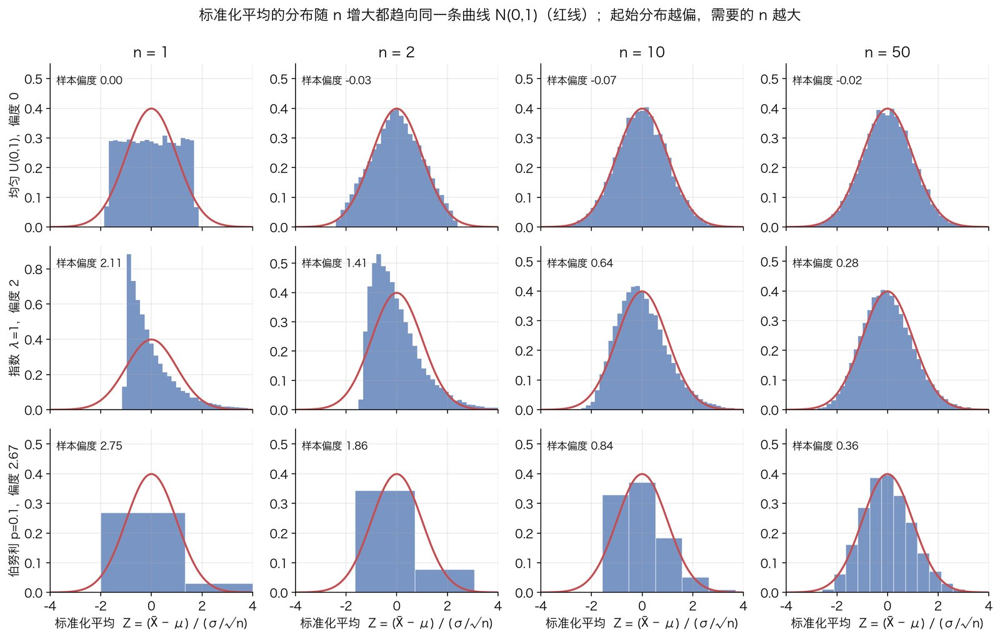
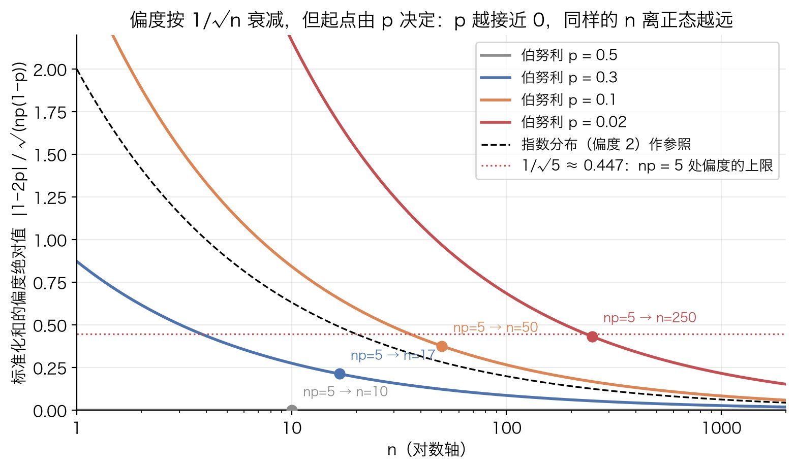
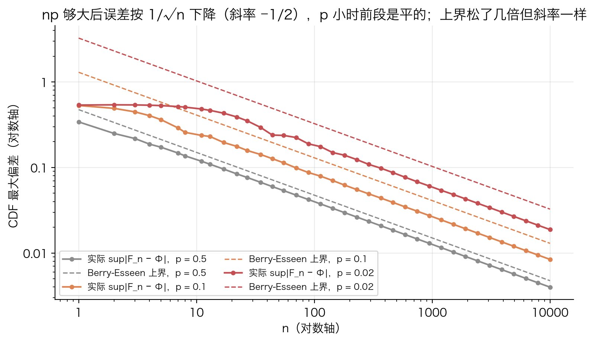

# 中心极限定理

## 解决什么问题

### 场景

手里有 $n$ 个独立、来自同一分布的随机量 $X_1,\dots,X_n$，关心它们的平均 $\bar X_n$ 或和 $S_n$：一批用户的人均时长、$n$ 次抛硬币的正面数、$n$ 个测量误差的累积。要回答的是"这个平均离真值 $\mu$ 通常差多少、差 $x$ 以上的概率是多少"，因为有了它才能做区间、做检验。

麻烦在于单个 $X_i$ 的分布通常不知道，或者知道但很难看：时长是右偏长尾，0/1 变量只有两个取值。按定义算 $\bar X_n$ 的分布要做 $n$ 重卷积，$n=30$ 就已经算不动，而且每换一种 $X$ 就要重算一遍。

中心极限定理（CLT）给的答案是：**只要 $X$ 的方差有限，$n$ 够大时 $\bar X_n$ 的分布都近似正态，而且只用 $\mu$ 和 $\sigma^2$ 两个数就写得出来**，$X$ 本身长什么样不重要。这就是正态分布在统计里无处不在的原因：不是因为数据本身正态，而是因为我们看的东西大多是"很多独立小量的和"。

### 这篇回答四个问题

1. 平均的波动有多大：尺度是 $\sigma/\sqrt n$（第 2 步）。
2. 波动是什么形状、为什么偏偏是正态：定理与证明（第 3、4 步）。
3. "$n$ 够大"是多大、什么决定收敛快慢：偏度与 Berry-Esseen 定理（第 5 步）。
4. "期望频数 $\ge 5$"、"$n\ge 30$" 这些经验规则从哪来（第 5 步与适用边界）。

## 原理

### 第 1 步：大数定律说什么、没说什么

设 $X_1,X_2,\dots$ 独立同分布，$\operatorname EX_i=\mu$，$\operatorname{Var}X_i=\sigma^2<\infty$。记

$$
S_n=X_1+\cdots+X_n,\qquad \bar X_n=\frac{S_n}{n}
$$

大数定律（弱形式）说：对任意 $\varepsilon>0$，

$$
P\big(|\bar X_n-\mu|>\varepsilon\big)\to 0\qquad(n\to\infty)
$$

人话：样本平均最终会贴到真值 $\mu$ 上。这回答了"平均往哪去"，但没回答两个实际要用的问题：

- **多快贴上去。** $n=100$ 时 $|\bar X_n-\mu|=0.3$ 算大还是小？大数定律只说 $n\to\infty$ 时概率趋于 0，对固定的 $n$ 不给数。
- **偏差长什么样。** 偏在左边多还是右边多、偏多远的概率多大，它一概不管。

做区间和检验缺的正是这两样：一个**尺度**（偏差通常多大）和一个**形状**（偏差怎么分布）。第 2 步给尺度，第 3 步给形状。

### 第 2 步：波动的尺度是 1/√n

先算 $\bar X_n$ 的期望和方差，这两个不需要任何近似。

期望用线性性：

$$
\operatorname E\bar X_n=\frac1n\sum_{i=1}^n\operatorname EX_i=\frac{n\mu}{n}=\mu
$$

方差要用独立性。两个变量之和的方差是

$$
\operatorname{Var}(X+Y)=\operatorname{Var}X+\operatorname{Var}Y+2\operatorname{Cov}(X,Y)
$$

独立时 $\operatorname{Cov}(X,Y)=\operatorname E[(X-\mu_X)(Y-\mu_Y)]=\operatorname E[X-\mu_X]\cdot\operatorname E[Y-\mu_Y]=0$（独立变量乘积的期望等于期望的乘积，而每个因子的期望都是 0），交叉项全消，方差**可加**。$n$ 项同理：

$$
\operatorname{Var}S_n=\sum_{i=1}^n\operatorname{Var}X_i=n\sigma^2,\qquad
\operatorname{Var}\bar X_n=\frac{\operatorname{Var}S_n}{n^2}=\frac{\sigma^2}{n}
$$

不独立会怎样：交叉项不为零，正相关时方差比 $\sigma^2/n$ 大，$n$ 个正相关的观测提供的信息少于 $n$ 个独立观测。这是适用边界里"相关数据要改"的根源。

于是 $\bar X_n$ 的标准差是 $\sigma/\sqrt n$：**和本身按 $n$ 长，和的噪声只按 $\sqrt n$ 长**，所以平均的噪声按 $1/\sqrt n$ 缩。要把标准差减半，样本要翻四倍。

顺手证明大数定律。Chebyshev 不等式 $P(|Y-\operatorname EY|>\varepsilon)\le\operatorname{Var}Y/\varepsilon^2$ 用到 $\bar X_n$ 上：

$$
P\big(|\bar X_n-\mu|>\varepsilon\big)\le\frac{\sigma^2}{n\varepsilon^2}\to 0
$$

**标准化。** 既然 $\bar X_n-\mu$ 是 $\sigma/\sqrt n$ 量级，要看它的"形状"就得先把这个越来越小的尺度除掉，否则 $n\to\infty$ 时分布缩成 $\mu$ 处的一个点，什么形状都看不见。定义

$$
Z_n=\frac{\bar X_n-\mu}{\sigma/\sqrt n}=\frac{S_n-n\mu}{\sigma\sqrt n}
$$

由上面的计算，对每个 $n$ 都有 $\operatorname EZ_n=0$，$\operatorname{Var}Z_n=1$。为什么放大倍数偏偏是 $\sqrt n$：把 $S_n-n\mu$ 除以 $n$（即不放大）方差是 $\sigma^2/n\to 0$，分布缩成一点；不除（乘 $n$ 倍放大）方差是 $n\sigma^2\to\infty$，分布摊平；只有除以 $\sqrt n$ 让方差固定在 1，才可能有一个非退化的极限形状。中心极限定理说的就是这个极限形状是什么。

### 第 3 步：定理的陈述

**中心极限定理（独立同分布、有限方差版本，也叫 Lindeberg-Lévy 定理）。** 设 $X_1,X_2,\dots$ 独立同分布，$\operatorname EX_i=\mu$，$0<\operatorname{Var}X_i=\sigma^2<\infty$。则对每个实数 $x$，

$$
P(Z_n\le x)\;\longrightarrow\;\Phi(x)=\int_{-\infty}^{x}\frac{1}{\sqrt{2\pi}}e^{-t^2/2}\,dt\qquad(n\to\infty)
$$

$\Phi$ 是标准正态 $N(0,1)$ 的累积分布函数（见[正态分布](normal-distribution.md)）。

几点解释：

- **收敛的是分布函数，不是密度。** 0/1 变量的和永远是离散的，根本没有密度，但它的阶梯形分布函数可以逐点逼近光滑的 $\Phi$。这种收敛叫**依分布收敛**。
- **实际用法**：$n$ 够大时把 $Z_n$ 当 $N(0,1)$ 用，等价于 $\bar X_n\approx N(\mu,\sigma^2/n)$，$S_n\approx N(n\mu,n\sigma^2)$。
- **奇怪之处**：结论里没有任何关于 $X$ 形状的信息，只剩 $\mu$ 和 $\sigma$。均匀、指数、0/1，标准化之后都往同一条曲线走。

下图是模拟：三种起始分布，$n=1,2,10,50$，每格 20000 次抽样的标准化平均的直方图，红线是 $N(0,1)$ 的密度。$n=1$ 那列就是起始分布本身的样子（均匀分布标准化后是 $\pm\sqrt3$ 之间的平台，指数分布是从 $-1$ 起的下坡，伯努利是两根柱子），往右看它们怎么变成同一个形状：



也能看出"够大"和起始分布有关：均匀分布 $n=2$ 就是三角形、$n=10$ 几乎重合；指数分布 $n=10$ 还明显右偏；伯努利 $p=0.1$ 到 $n=50$ 还看得出台阶和偏斜。第 5 步解释为什么。

### 第 4 步：证明思路：矩母函数

证明的工具是**矩母函数**（moment generating function，MGF）$M_X(t)=\operatorname Ee^{tX}$。选它是因为三条性质正好对上"独立和、标准化、认极限"三件事：

1. **独立和的 MGF 是乘积。** $X,Y$ 独立时 $e^{t(X+Y)}=e^{tX}e^{tY}$，独立变量乘积的期望等于期望之积，所以 $M_{X+Y}(t)=M_X(t)M_Y(t)$。$n$ 重卷积变成 $n$ 次乘法，这是整个证明能算下去的原因。
2. **缩放。** $M_{aX}(t)=\operatorname Ee^{taX}=M_X(at)$。
3. **MGF 在 0 处的导数是矩。** 把 $e^{tX}$ 展开成 $1+tX+t^2X^2/2!+\cdots$ 逐项取期望，$M_X(t)=1+t\operatorname EX+\frac{t^2}{2}\operatorname EX^2+\cdots$，所以 $M_X'(0)=\operatorname EX$，$M_X''(0)=\operatorname EX^2$。

还需要一条"认极限"的定理，只陈述不证。

**连续性定理（Lévy 连续性定理的矩母函数版本）。** 若 $M_{Z_n}(t)\to M_Z(t)$ 对 0 附近某个开区间里的每个 $t$ 成立，则 $Z_n$ 依分布收敛到 $Z$，即 $P(Z_n\le x)\to P(Z\le x)$ 在 $P(Z\le x)$ 的每个连续点成立。

它说的是：MGF 收敛就够了，不用直接和分布函数打交道。

**证明。** 先把每个 $X_i$ 标准化：$Y_i=(X_i-\mu)/\sigma$，则 $\operatorname EY_i=0$，$\operatorname EY_i^2=\operatorname{Var}Y_i=1$，且

$$
Z_n=\frac{S_n-n\mu}{\sigma\sqrt n}=\frac{1}{\sqrt n}\sum_{i=1}^n\frac{X_i-\mu}{\sigma}=\frac{1}{\sqrt n}\sum_{i=1}^nY_i
$$

用性质 1、2 算 $Z_n$ 的 MGF：

$$
M_{Z_n}(t)=\operatorname E\exp\!\Big(\frac{t}{\sqrt n}\sum_{i=1}^nY_i\Big)=\prod_{i=1}^n\operatorname E\exp\!\Big(\frac{t}{\sqrt n}Y_i\Big)=\Big[M_Y\big(\tfrac{t}{\sqrt n}\big)\Big]^n
$$

同分布保证 $n$ 个因子都是同一个函数 $M_Y$。问题变成：$M_Y$ 在一个越来越小的自变量 $s=t/\sqrt n$ 处的值，自乘 $n$ 次，趋向什么。

把 $M_Y$ 在 $s=0$ 附近泰勒展开到二阶，系数用性质 3：

$$
M_Y(s)=M_Y(0)+M_Y'(0)\,s+\frac{M_Y''(0)}{2}s^2+o(s^2)=1+0\cdot s+\frac{1}{2}s^2+o(s^2)
$$

三个系数各有来历：$M_Y(0)=\operatorname Ee^0=1$；一阶系数 $M_Y'(0)=\operatorname EY=0$，**这是减去 $\mu$ 的效果**；二阶系数 $M_Y''(0)=\operatorname EY^2=1$，**这是除以 $\sigma$ 的效果**。如果不中心化，一阶项是 $s\operatorname EY\ne 0$，代入后会出现 $n\cdot\frac{t}{\sqrt n}\cdot\operatorname EY=\sqrt n\,t\operatorname EY$，随 $n$ 发散，极限不存在；如果不除以 $\sigma$，二阶系数是 $\sigma^2$，极限会依赖 $\sigma$，得不到一个普适的分布。$o(s^2)$ 表示比 $s^2$ 更高阶的小量，它要 $\operatorname EY^2$ 有限才写得出来，这就是"有限方差"这个条件用在哪。

代入 $s=t/\sqrt n$：

$$
M_{Z_n}(t)=\Big[1+\frac{t^2}{2n}+o\big(\tfrac1n\big)\Big]^n
$$

这是 $(1+a/n)^n\to e^a$ 的形式。稳妥的做法是取对数，利用 $\log(1+u)=u+O(u^2)$（$u\to 0$）：

$$
\log M_{Z_n}(t)=n\log\Big(1+\frac{t^2}{2n}+o\big(\tfrac1n\big)\Big)=n\Big(\frac{t^2}{2n}+o\big(\tfrac1n\big)\Big)=\frac{t^2}{2}+o(1)\;\longrightarrow\;\frac{t^2}{2}
$$

所以 $M_{Z_n}(t)\to e^{t^2/2}$，对每个固定的 $t$ 成立。（数值感受一下 $t=1$：$n=1,10,100,1000$ 时 $(1+t^2/2n)^n$ 依次是 $1.500$、$1.629$、$1.647$、$1.649$，目标 $e^{1/2}=1.649$。）

最后认出 $e^{t^2/2}$ 是谁。算标准正态的 MGF，指数上配方：$tz-z^2/2=-\tfrac12(z-t)^2+\tfrac{t^2}{2}$，

$$
\operatorname Ee^{tZ}=\int_{-\infty}^{\infty}e^{tz}\frac{e^{-z^2/2}}{\sqrt{2\pi}}\,dz
=e^{t^2/2}\int_{-\infty}^{\infty}\frac{e^{-(z-t)^2/2}}{\sqrt{2\pi}}\,dz=e^{t^2/2}
$$

第二个积分是把 $N(0,1)$ 的密度整体平移 $t$，面积仍是 1（正态分布的 MGF 在[正态分布](normal-distribution.md)里也有推导）。于是 $M_{Z_n}(t)\to M_{N(0,1)}(t)$，由连续性定理，$Z_n$ 依分布收敛到 $N(0,1)$。证毕。

**回顾每个条件用在哪。** 独立用于把期望的乘积拆开（性质 1）；同分布用于 $n$ 个因子相同；有限方差用于二阶泰勒展开；"减 $\mu$ 除 $\sigma$"用于让一阶项为 0、二阶项为 $\tfrac12$。三个条件都可以放宽（见适用边界），但推导的骨架不变。

**一个技术性缺口。** 上面默认 $M_Y(t)$ 在 0 附近有限。不是所有有限方差的分布都满足：对数正态分布、尾指数大于 2 的 Pareto 分布都有有限方差却没有 MGF（$\operatorname Ee^{tX}=\infty$ 对任意 $t>0$）。完整的证明把 $e^{tX}$ 换成 $e^{itX}$（特征函数），它对任何分布都有限，因为 $|e^{itX}|=1$；展开、取极限的代数一模一样，极限变成 $e^{-t^2/2}$，仍是 $N(0,1)$ 的特征函数。这里用 MGF 只是为了少写复数。

### 第 5 步：收敛多快：偏度与 Berry-Esseen 定理

定理只说 $n\to\infty$，实用时要知道有限 $n$ 差多远。线索就在第 4 步的展开里：我们在二阶截断了，被丢掉的 $o(s^2)$ 项决定了有限 $n$ 时和正态的差距。

把展开多写两项，并且直接展开对数。$K_Y(s)=\log M_Y(s)$ 叫**累积量生成函数**，它的泰勒系数是累积量 $\kappa_j$。对标准化的 $Y$：$\kappa_1=\operatorname EY=0$，$\kappa_2=\operatorname{Var}Y=1$，$\kappa_3=\operatorname EY^3$（三阶累积量等于三阶中心矩），$\kappa_4=\operatorname EY^4-3$：

$$
K_Y(s)=\frac{s^2}{2}+\frac{\kappa_3}{6}s^3+\frac{\kappa_4}{24}s^4+\cdots
$$

取对数的好处是独立和的 $K$ 直接相加，$\log M_{Z_n}(t)=nK_Y(t/\sqrt n)$：

$$
\log M_{Z_n}(t)=n\Big[\frac{t^2}{2n}+\frac{\kappa_3}{6}\frac{t^3}{n^{3/2}}+\frac{\kappa_4}{24}\frac{t^4}{n^2}+\cdots\Big]
=\frac{t^2}{2}+\frac{\kappa_3}{6\sqrt n}t^3+\frac{\kappa_4}{24\,n}t^4+\cdots
$$

第一项是正态。**第一个修正项正比于 $\kappa_3/\sqrt n$**，而 $\kappa_3=\operatorname EY^3=\operatorname E(X-\mu)^3/\sigma^3$ 正是 $X$ 的**偏度** $\gamma_1$。也就是说：

- $Z_n$ 的偏度等于 $\gamma_1/\sqrt n$（也可以直接算：和的三阶中心矩是单个的 $n$ 倍，除以 $(\sigma\sqrt n)^3$）。偏度按 $1/\sqrt n$ 衰减，这是靠近正态的主要速度。
- 第二个修正是超额峰度 $\kappa_4/n$，衰减快一个数量级。
- **对称分布（$\gamma_1=0$）跳过了最慢的一项**，所以均匀分布 $n=10$ 就很像正态，而指数分布（$\gamma_1=2$）慢得多，上图看到的正是这个。

这个展开给的是直觉。要一个对所有 $x$ 一致成立的硬上界，用下面这条定理（只陈述不证）。

**Berry-Esseen 定理。** 设 $X_i$ 独立同分布，$\operatorname{Var}X_i=\sigma^2>0$，三阶绝对中心矩 $\rho=\operatorname E|X_i-\mu|^3<\infty$。则对所有 $n$，

$$
\sup_{x}\big|F_n(x)-\Phi(x)\big|\le\frac{C\,\rho}{\sigma^3\sqrt n}
$$

其中 $F_n$ 是 $Z_n$ 的分布函数，$C$ 是一个不依赖于分布和 $n$ 的绝对常数，$C<0.5$（目前已证明的上界约为 $0.4748$；另一方面已知 $C$ 不可能小于约 $0.4097$，这个常数基本已经卡死）。

读法：分布函数的**最坏误差**至多是 $0.4748\times(\rho/\sigma^3)/\sqrt n$。$\rho/\sigma^3=\operatorname E|Y|^3$ 是一个只和 $X$ 的形状有关的数，由 Lyapunov 不等式（Jensen 的推论）$\operatorname E|Y|^3\ge(\operatorname EY^2)^{3/2}=1$，它永远 $\ge 1$；分布越偏、尾越重它越大。它把"起始分布多难看"和"需要多少样本"连成一个公式：要把最坏误差压到 $\delta$ 以下，$n$ 要和 $(\rho/\sigma^3)^2/\delta^2$ 成正比。

**伯努利的情形：期望频数规则的来源。** 取 $X\in\{0,1\}$，$P(X=1)=p$，$\mu=p$，$\sigma^2=p(1-p)$。三阶绝对中心矩按定义算，两个取值各一项：

$$
\rho=\operatorname E|X-p|^3=(1-p)\cdot p^3+p\cdot(1-p)^3=p(1-p)\big[p^2+(1-p)^2\big]
$$

除以 $\sigma^3=[p(1-p)]^{3/2}$：

$$
\frac{\rho}{\sigma^3}=\frac{p^2+(1-p)^2}{\sqrt{p(1-p)}}
$$

$p=\tfrac12$ 时它等于 1，是最小值；$p\to 0$ 时分子趋于 1、分母趋于 0，它像 $1/\sqrt p$ 一样爆炸。几个值（补算）：$p=0.3$ 为 $1.27$，$p=0.1$ 为 $2.73$，$p=0.05$ 为 $4.15$，$p=0.01$ 为 $9.85$。代回 Berry-Esseen 上界，$p$ 小时误差正比于 $1/\sqrt{np}$：**决定近似好坏的不是 $n$，是 $np$，即期望的成功数**。同样的话对 $1-p$ 说一遍，就是 $n(1-p)$，期望的失败数。

偏度讲的是同一件事。伯努利的偏度是 $(1-2p)/\sqrt{p(1-p)}$，$n$ 次的和（[二项分布](binomial-distribution.md)）的偏度是它除以 $\sqrt n$：

$$
\gamma_1(S_n)=\frac{1-2p}{\sqrt{np(1-p)}}
$$

把 $np=5$ 代进去（不妨 $p\le\tfrac12$，$n=5/p$）：$\gamma_1=(1-2p)/\sqrt{5(1-p)}$，它随 $p$ 减小而增大，$p\to 0$ 时趋于 $1/\sqrt5\approx 0.447$。补算核对：$(1-2p)/\sqrt{1-p}\le 1$ 等价于 $(1-2p)^2\le 1-p$，即 $4p^2\le 3p$，即 $p\le\tfrac34$，所以 $p\le\tfrac12$ 时偏度确实不超过 $1/\sqrt5$。也就是说，**"每个格子期望频数 $\ge 5$"这条规则等价于"把二项分布的偏度压到 $0.45$ 以下"**。[卡方检验](../statistics/chi-square-test.md)第 4 步引用的就是这个事实。

下图是几条 $p$ 的偏度随 $n$ 衰减的曲线，圆点是 $np=5$ 的位置，都落在 $0.447$ 这条线以下；黑虚线是指数分布的 $2/\sqrt n$ 作参照，$n=30$ 时是 $0.365$。如果把"$n\ge 30$"理解成针对偏度不超过 2 的起始分布（这是它常被默认的前提，见适用边界），它和"期望频数 $\ge 5$"给出的偏度上限相近：$0.37$ 对 $0.45$（补算出的观察，不是教科书结论；换偏度 1 的起始分布 $n=30$ 给 $0.18$，偏度 4 的给 $0.73$，所以这个对应只在该前提下成立）。



**上界有多松。** 二项分布的 $F_n$ 可以精确算出来，直接量 $\sup_x|F_n(x)-\Phi(x)|$ 和上界比。下图是 $p=0.5,0.1,0.02$ 三条，实线是实际最大偏差，虚线是 Berry-Esseen 上界，双对数轴：



三个观察：

1. $np$ 够大后（图上大约 $np\ge 5$ 起）三条实线斜率都是 $-\tfrac12$；$p$ 小时前段是平的：$p=0.02$ 在 $n\le 5$ 时误差停在 $0.53$ 左右（补算：$n=1,2,5,10$ 依次 $0.537$、$0.540$、$0.529$、$0.491$），要到 $np$ 上了 5 才走上 $1/\sqrt n$ 的直线；$p=0.5$ 从 $n=1$ 起就贴着 $-\tfrac12$。这反过来印证了上面的结论：$np$ 说了算。到了直线段，$1/\sqrt n$ 这个速度对格点分布不能再快：$F_n$ 是阶梯函数，中间一个台阶的高度约是 $\varphi(0)$ 乘格点间距 $1/(\sigma\sqrt n)$，阶梯和任何连续曲线的距离至少是半个台阶 $\varphi(0)/(2\sigma\sqrt n)$，$\varphi(0)=1/\sqrt{2\pi}=0.399$。$p=0.5$ 时这个半台阶就是全部误差（补算：$n=277$ 时半台阶 $0.0240$，实际 $0.0240$；$n=1000$ 时 $0.0126$ 对 $0.0126$）。这也正是连续性校正要修的东西（见卡方检验第 8 步）。
2. 上界松 $1.2$ 倍到几倍（$p=0.5$ 时几乎贴住，$p$ 小、$n$ 小时松得多），但斜率一样。它是最坏情形的保证，不是估计。
3. $p$ 小时整条线上移：$p=0.02$ 要到 $n=250$（$np=5$）误差才降到 $0.116$，和 $p=0.1$ 在 $n=50$ 时的 $0.116$ 相当。再次是 $np$ 说了算。

### 第 6 步：它被用在哪

统计里几乎所有"大样本"方法都是这条定理换个说法：

- **比例的抽样分布。** 成功率 $\hat p$ 是 $n$ 个 0/1 变量的平均，$\mu=p$，$\sigma^2=p(1-p)$，所以 $\hat p\approx N\big(p,\,p(1-p)/n\big)$。"标准误 $\sqrt{p(1-p)/n}$"是第 2 步，"近似正态"是第 3 步。
- **z 检验与置信区间。** [z 检验](../statistics/z-test.md)把 $(\hat p-p_0)/\sqrt{p_0(1-p_0)/n}$ 当 $N(0,1)$ 查表；区间 $\hat p\pm 1.96\sqrt{\hat p(1-\hat p)/n}$ 里的 $1.96$ 是 $\Phi^{-1}(0.975)$，来自第 3 步的极限分布。两比例之差同理：两组各自近似正态，独立相减仍是正态。
- **卡方检验。** [卡方检验](../statistics/chi-square-test.md)的统计量是两比例 $z$ 的平方，$z$ 的正态性就是 CLT；"期望频数 $\ge 5$"是第 5 步。
- **为什么测量误差常是正态的。** 一次测量的误差是许多独立小扰动的叠加，叠加的结果按 CLT 接近正态。这是正态分布在物理测量里出现的经典解释。
- 样本均值的 $t$ 检验在大样本下、回归系数的近似正态、bootstrap 的正当性，都建在它之上，各自要再加一点条件。

反过来它也告诉你**什么时候不该假设正态**：看的量如果不是"很多独立量的和"（一个用户的时长本身、一次购买的金额），没有理由是正态的。CLT 保证的是**平均**近似正态，不是数据本身。

## 适用边界

- **独立。** 第 2 步的方差可加和第 4 步的 MGF 乘积都用了它。时间序列、同一用户的多次记录、同一批次的样本之间有相关；正相关时 $\operatorname{Var}\bar X_n$ 比 $\sigma^2/n$ 大，按 $\sigma/\sqrt n$ 算的区间会偏窄、检验会过于乐观。弱相关序列有对应版本的 CLT，但方差要换成计入自相关的"长期方差"，等效样本量比 $n$ 小。
- **有限方差。** 缺了它第 4 步的二阶展开不成立，结论真的会错，不只是慢。极端例子是柯西分布：$n$ 个独立柯西的平均仍是同一个柯西分布，$n$ 再大也不集中，连大数定律都不成立（补算核对：20 万次模拟中，5 个标准柯西的平均的 $97.5\%$ 分位数是 $12.9$，单个标准柯西是 $12.7$）。方差有限但很大的长尾（人均收入、单用户消费额）在定理范围内，但第 5 步的 $\rho/\sigma^3$ 很大，收敛慢到 $n$ 几千也未必够；这种情况看偏度，或者直接用 bootstrap 看平均的分布。
- **同分布。** 可以放宽：各 $X_i$ 分布不同也行，只要没有哪一项在总方差里占压倒性比重（Lindeberg 条件，对应 Lindeberg-Feller 定理）。回归里"误差是许多不同小因素之和"用的是这个版本。
- **"n 够大"没有通用数字。** 决定量是偏度 $\gamma_1/\sqrt n$（第 5 步）。$n=30$ 对指数分布给 $0.365$，勉强；对 $p=0.01$ 的伯努利给 $1.80$，离正态很远，要到 $n=500$（$np=5$）才降到 $0.45$。看到"$n\ge 30$ 就可以用正态"时，默认的前提是起始分布的偏度在 2 以内。
- **中心准、尾巴不准。** Berry-Esseen 给的是分布函数的**绝对**误差。对 $p$ 值在 $0.01$ 到 $0.1$ 这种量级够用；算 $10^{-6}$ 级的尾概率时，$0.01$ 的绝对误差意味着相对误差是几个数量级，正态近似不能用，要用精确分布或大偏差理论。
- **离散数据有台阶。** 格点分布的分布函数和 $\Phi$ 之间天然有半个台阶的差距（第 5 步），$n$ 不大时用连续性校正，或者直接用精确分布（二项、超几何）。

## 最小算例

### 指数分布的平均：模拟 vs 理论

从指数分布（$\lambda=1$，$\mu=1$，$\sigma=1$，偏度 $2$）抽 $n=1,5,30$ 个求平均，各重复 20000 次，seed 固定：

```python
import numpy as np

rng = np.random.default_rng(20260908)
for n in (1, 5, 30):
    xbar = rng.exponential(1.0, (20000, n)).mean(axis=1)
    z = (xbar - 1) / (1 / np.sqrt(n))
    print(n, xbar.mean(), xbar.std(ddof=1), (z ** 3).mean(),
          (z <= -1.96).mean(), (z >= 1.96).mean())
```

| $n$ | 均值（理论 1） | 标准差（理论 $1/\sqrt n$） | 偏度（理论 $2/\sqrt n$） | $P(Z_n\le -1.96)$（精确） | $P(Z_n\ge 1.96)$（精确） |
|---|---|---|---|---|---|
| 1 | 0.9928 | 0.9924（1.0000） | 1.994（2.000） | 0.00000（0.0000） | 0.04955（0.0518） |
| 5 | 0.9961 | 0.4450（0.4472） | 0.869（0.894） | 0.00050（0.0004） | 0.04055（0.0433） |
| 30 | 0.9997 | 0.1802（0.1826） | 0.303（0.365） | 0.01505（0.0140） | 0.03205（0.0340） |

模拟列是 20000 次里的计数除以 20000，所以都落在 $0.00005$ 的整数倍上，保留五位。"精确"列这样算：$n$ 个独立 $\text{Exp}(1)$ 之和服从 $\text{Gamma}(n,1)$，所以 $P(Z_n\le -1.96)=P\big(S_n\le n(1-1.96/\sqrt n)\big)$ 用 Gamma 分布函数直接得到（`scipy.stats.gamma.cdf(n * (1 - 1.96 / sqrt(n)), n)`），右尾同理。

读表：均值和标准差在 $n=1$ 时就已经和理论一致，这是第 2 步，不需要任何近似。形状不同：正态的两侧尾概率都应是 $\Phi(-1.96)=0.025$，而 $n=1$ 时左尾是 $0$（$Z_1=X-1\ge -1$，根本到不了 $-1.96$）、右尾 $0.052$；$n=30$ 时变成 $0.014$ 和 $0.034$（均为精确值），向 $0.025$ 靠拢但还没到，偏度 $0.365$ 还看得见。

### Berry-Esseen 上界：伯努利 p=0.356，n=277

这是[卡方检验](../statistics/chi-square-test.md)第 4 步引用的那个格子的参数（试验组 $277$ 人，"非满意"的合并比例 $0.356$）。按第 5 步的公式：

$$
\frac{\rho}{\sigma^3}=\frac{0.356^2+0.644^2}{\sqrt{0.356\times 0.644}}=\frac{0.5415}{0.4788}=1.1309,\qquad
\frac{C\rho}{\sigma^3\sqrt n}=\frac{0.4748\times 1.1309}{16.643}=0.0323
$$

所以不管在哪个 $x$ 上，用正态代替这个二项分布算出的概率，误差都不超过 $0.032$。实际最大偏差（用二项分布函数精确算）是 $0.0274$，其中半个台阶 $\varphi(0)/(2\sigma\sqrt n)=0.399/(2\times 0.4788\times 16.643)=0.0250$ 是离散性带来的、连续性校正能修掉的部分，剩下的来自偏度 $(1-2p)/\sqrt{np(1-p)}=0.036$，已经很小。对照 $np=98.6$，这个格子的正态近似没有问题，和卡方检验那篇的判断一致。

```python
import numpy as np
from scipy.stats import binom, norm

p, n, C = 0.356, 277, 0.4748
rho_over_sigma3 = (p ** 2 + (1 - p) ** 2) / np.sqrt(p * (1 - p))   # 1.1309
bound = C * rho_over_sigma3 / np.sqrt(n)                            # 0.0323
k = np.arange(n + 1)
z = (k - n * p) / np.sqrt(n * p * (1 - p))
F_right, Phi = binom.cdf(k, n, p), norm.cdf(z)                      # 阶梯的右极限
F_left = np.concatenate([[0.0], F_right[:-1]])                      # 阶梯的左极限
actual = max(abs(F_right - Phi).max(), abs(F_left - Phi).max())     # 0.0274
```

图由 `tools/figures/central-limit-theorem.py` 生成，seed 固定为 20260908。
