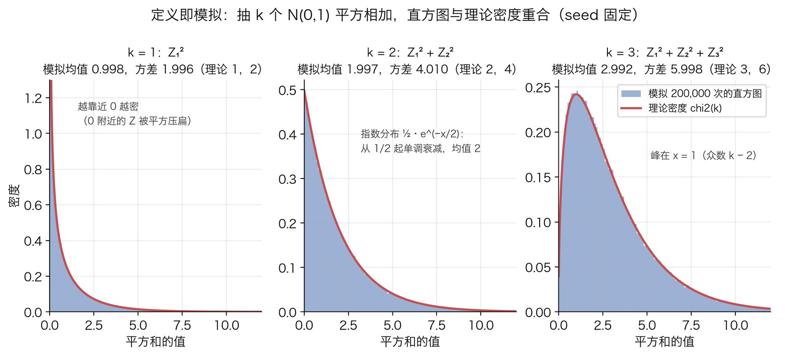
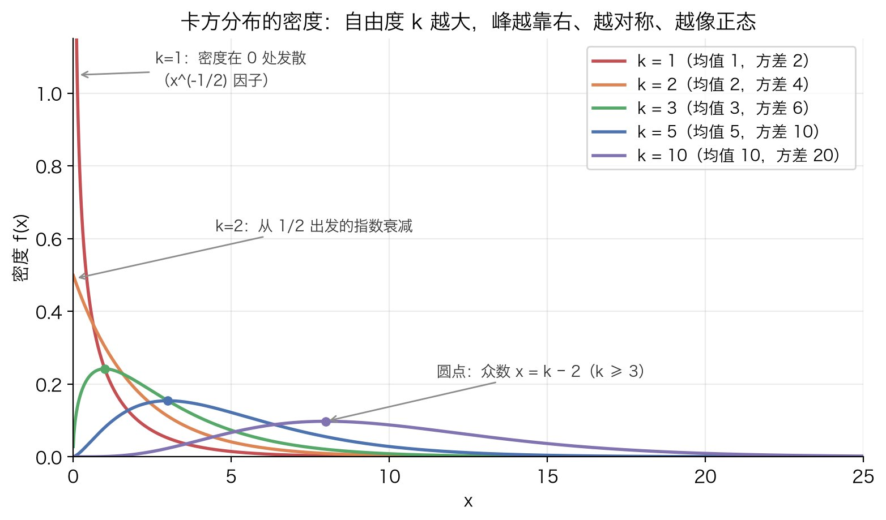
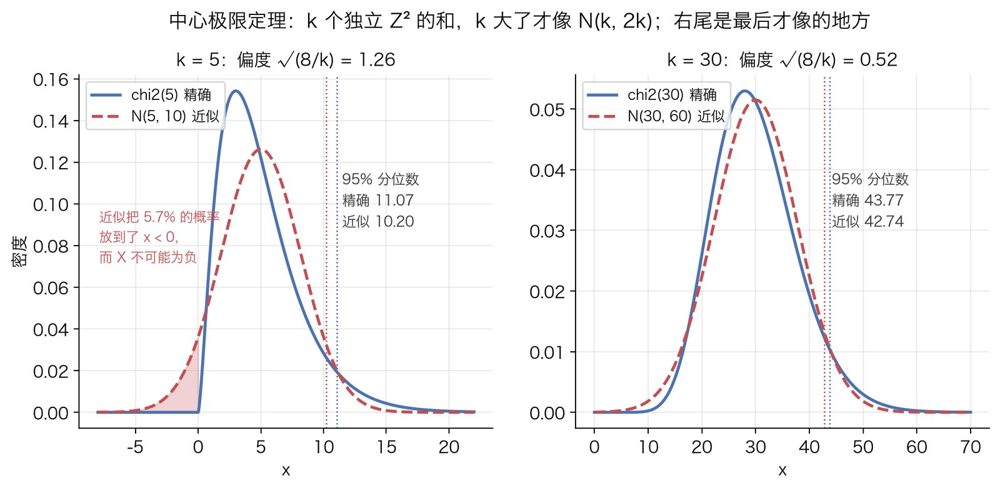
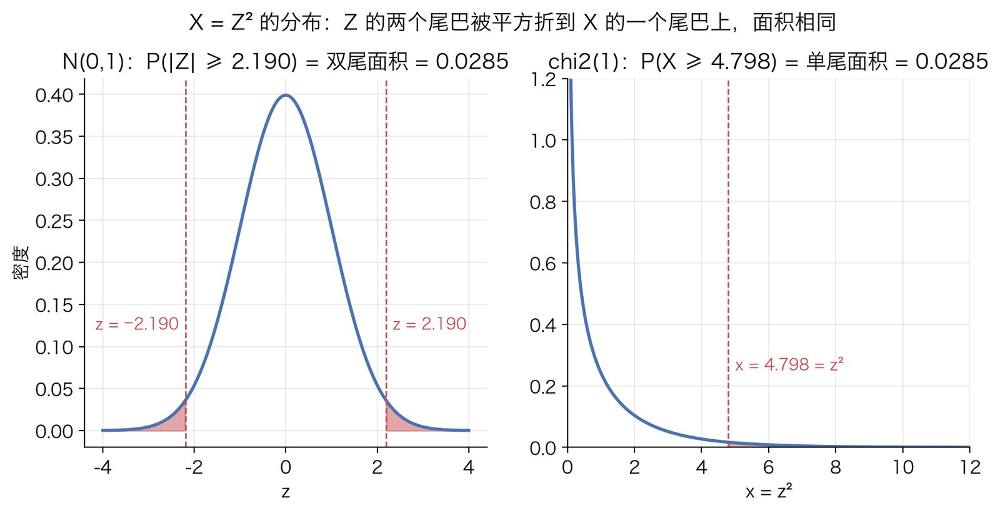

# 卡方分布

## 解决什么问题

统计里反复出现同一种量：把若干个偏离先**标准化**（除以各自的标准差），再**平方**，再**相加**。卡方检验的统计量 $\sum(O-E)^2/E$ 是这种量，样本方差里的 $\sum(x_i-\bar x)^2/\sigma^2$ 是这种量，回归的残差平方和也是。它们的共同结构是：**若干个近似独立、近似标准正态的偏离的平方和**。要回答"这个量光靠运气能有多大"，就得知道这种平方和服从什么分布。

卡方分布就是这个分布。它和二项分布、正态分布不太一样：二项描述的是一个具体的随机过程（重复抛硬币），卡方描述的是一种**运算**（标准化、平方、求和）作用在正态变量上的结果。它没有自己的故事，它的价值全在于是别的东西的零件：卡方检验的 $p$ 值、方差的置信区间、$t$ 分布的分母，用的都是它。

这篇从定义出发，把它的密度、期望与方差、可加性、正态近似一步步推出来，最后说明它出现在哪些地方。全程只用到一元微积分和[正态分布](normal-distribution.md)的基本性质。

## 原理

### 第 1 步：定义，以及为什么是"标准化、平方、求和"

设 $Z_1,Z_2,\dots,Z_k$ 是 $k$ 个**相互独立**的标准正态变量，每个都服从 $N(0,1)$。定义

$$
X=Z_1^2+Z_2^2+\cdots+Z_k^2
$$

称 $X$ 服从**自由度为 $k$ 的卡方分布**，记作 $X\sim\chi^2_{(k)}$。自由度（degrees of freedom）就是参与相加的独立标准正态的个数。第 7 步会说明，实际应用里参与相加的偏离量常常受线性约束，能自由变动的个数比表面的个数少，自由度要按能自由变动的个数算。

这个定义里有三个选择，每个都有理由：

- **为什么先标准化。** 不同偏离的尺度不同：一个期望 100 的格子差 10 是小事，一个期望 5 的格子差 10 是大事，直接相加没有意义。每个偏离除以自己的标准差之后，含义统一成"差了几个标准差"，可以相加；更重要的是相加之后的分布**不再依赖任何未知参数**，均值和方差都被除掉了，只剩下个数 $k$。这是"能查表"的前提：一张表按 $k$ 排，所有问题共用。
- **为什么平方而不是直接相加。** 偏离有正有负，直接相加会互相抵消：$\sum Z_i$ 的期望是 0，看不出总偏离大不大。平方把正负偏离都算成正的贡献。
- **为什么平方而不是绝对值。** 绝对值也能消掉符号，但 $|z|$ 在 0 处有个尖角，不可导，后面求密度、算矩、做极限都麻烦；平方处处光滑，而且 $E[Z^2]$ 正好是方差，和已有的理论直接衔接。代价是大偏离被放大得更厉害，适用边界里会再提。

定义本身就是一个可执行的模拟：抽 $k$ 个标准正态，平方相加，重复很多次画直方图。下图用固定 seed 做了 $k=1,2,3$ 三种，红线是后面几步要推出来的理论密度；图上三条注记（$k=1$ 在 0 处发散、$k=2$ 是指数分布、众数在 $k-2$）分别在第 2、4 步给出推导：



### 第 2 步：自由度 1 的密度

先做最简单的情形：$k=1$，$X=Z^2$。求密度的标准套路是**先求分布函数再求导**，因为 $z\mapsto z^2$ 不是一一对应（$z$ 和 $-z$ 映到同一个点），直接套一维变量替换公式容易漏掉一半。

记 $\varphi$ 和 $\Phi$ 为标准正态的密度和分布函数：

$$
\varphi(z)=\frac{1}{\sqrt{2\pi}}e^{-z^2/2},\qquad \Phi(z)=\int_{-\infty}^{z}\varphi(u)\,du
$$

对 $x>0$，事件 $\{Z^2\le x\}$ 就是 $\{-\sqrt{x}\le Z\le\sqrt{x}\}$，所以

$$
F(x)=P(Z^2\le x)=\Phi(\sqrt{x})-\Phi(-\sqrt{x})=2\Phi(\sqrt{x})-1
$$

最后一步用了正态的对称性 $\Phi(-a)=1-\Phi(a)$。对 $x$ 求导，链式法则：$\Phi$ 的导数是 $\varphi$，$\sqrt{x}$ 的导数是 $\frac{1}{2\sqrt{x}}$，

$$
f(x)=F'(x)=2\,\varphi(\sqrt{x})\cdot\frac{1}{2\sqrt{x}}=\frac{\varphi(\sqrt{x})}{\sqrt{x}}
$$

把 $\varphi(\sqrt{x})=\frac{1}{\sqrt{2\pi}}e^{-x/2}$ 代进去：

$$
f(x)=\frac{1}{\sqrt{2\pi}}\,x^{-1/2}e^{-x/2},\qquad x>0
$$

这就是 $\chi^2_{(1)}$ 的密度。它有两个显眼的特征，都能从公式读出来：

- **在 0 处发散。** 因子 $x^{-1/2}$ 在 $x\to 0$ 时趋于无穷。直觉：$Z$ 在 0 附近密度最高（$\varphi(0)$ 是最大值），而平方把 $[-\varepsilon,\varepsilon]$ 这段长 $2\varepsilon$ 的区间压到 $[0,\varepsilon^2]$ 这段长 $\varepsilon^2$ 的区间里，约 $2\varepsilon\varphi(0)$ 的概率被塞进 $\varepsilon^2$ 的长度，平均密度约 $2\varphi(0)/\varepsilon$，$\varepsilon$ 越小越大。发散不影响总概率为 1，因为 $\int_0^1 x^{-1/2}dx=2$ 是有限的。
- **右尾按指数衰减。** $x$ 大时 $x^{-1/2}$ 变化很慢，尾巴由 $e^{-x/2}$ 主导。用 scipy 算 $P(X>4)=0.0455$，$P(X>8)=0.00468$，$P(X>12)=0.000532$：$x$ 每加 4，尾概率大约缩到十分之一，主要来自 $e^{-4/2}=e^{-2}\approx 1/7.4$，其余来自 $x^{-1/2}$ 的缓慢下降。

顺手核一下总概率确实是 1，这一步会引出后面要用的 $\Gamma(\tfrac12)$。换元 $x=2u$，$dx=2\,du$：

$$
\int_0^\infty\frac{x^{-1/2}e^{-x/2}}{\sqrt{2\pi}}dx=\frac{1}{\sqrt{2\pi}}\int_0^\infty(2u)^{-1/2}e^{-u}\,2\,du=\frac{\sqrt{2}}{\sqrt{2\pi}}\int_0^\infty u^{-1/2}e^{-u}du=\frac{\Gamma(\tfrac12)}{\sqrt{\pi}}
$$

其中 $\Gamma(s)=\int_0^\infty u^{s-1}e^{-u}du$ 是 Gamma 函数，$\Gamma(\tfrac12)=\sqrt{\pi}$（换元 $u=z^2/2$ 就变回正态积分）。所以积分等于 1。

### 第 3 步：期望是 k，方差是 2k

先算一个 $Z^2$ 的。期望直接来自方差的定义：$\operatorname{Var}(Z)=E[Z^2]-(E[Z])^2$，而 $\operatorname{Var}(Z)=1$，$E[Z]=0$，所以

$$
E[Z^2]=1
$$

方差要用到四阶矩：$\operatorname{Var}(Z^2)=E[Z^4]-(E[Z^2])^2=E[Z^4]-1$。算 $E[Z^4]=\int z^4\varphi(z)\,dz$ 的关键是一个小观察：对 $\varphi(z)=\frac{1}{\sqrt{2\pi}}e^{-z^2/2}$ 求导得 $\varphi'(z)=-z\,\varphi(z)$，也就是 $z\varphi(z)=-\varphi'(z)$。于是可以分部积分：

$$
E[Z^4]=\int_{-\infty}^{\infty}z^3\cdot z\varphi(z)\,dz=-\int_{-\infty}^{\infty}z^3\varphi'(z)\,dz=\Big[-z^3\varphi(z)\Big]_{-\infty}^{\infty}+\int_{-\infty}^{\infty}3z^2\varphi(z)\,dz
$$

边界项为 0，因为 $e^{-z^2/2}$ 压过任何多项式；剩下的积分是 $3E[Z^2]=3$。所以

$$
E[Z^4]=3,\qquad \operatorname{Var}(Z^2)=3-1=2
$$

同样的手法可以一直做下去：$E[Z^{2m}]=(2m-1)\,E[Z^{2m-2}]$，得到 $E[Z^2]=1$，$E[Z^4]=3$，$E[Z^6]=15$。第 6 步算偏度时要用 $E[Z^6]=15$。

再从 1 个推到 $k$ 个。期望对任何随机变量都可加；方差对**独立**变量可加。$Z_1^2,\dots,Z_k^2$ 独立（$Z_i$ 独立，各自的函数也独立），所以

$$
E[X]=\sum_{i=1}^k E[Z_i^2]=k,\qquad \operatorname{Var}(X)=\sum_{i=1}^k\operatorname{Var}(Z_i^2)=2k
$$

人话：自由度为 $k$ 的卡方变量平均值就是 $k$，标准差是 $\sqrt{2k}$。标准差比均值长得慢（$\sqrt{2k}/k=\sqrt{2/k}$ 随 $k$ 变小），所以 $k$ 大时分布相对而言越来越集中在 $k$ 附近，这是第 6 步正态近似的伏笔。

### 第 4 步：自由度 2 是指数分布，一般自由度是 Gamma 分布

$k=2$ 时 $X=Z_1^2+Z_2^2$。把 $(Z_1,Z_2)$ 看成平面上的一个随机点，$X$ 就是它到原点距离的平方 $R^2$。两个独立标准正态的联合密度是

$$
\varphi(z_1)\varphi(z_2)=\frac{1}{2\pi}e^{-(z_1^2+z_2^2)/2}=\frac{1}{2\pi}e^{-r^2/2}
$$

它只依赖半径 $r$，不依赖方向，是**旋转对称**的。这提示用极坐标：面积元 $dz_1\,dz_2=r\,dr\,d\theta$。

$$
F(x)=P(R^2\le x)=P(R\le\sqrt{x})=\int_0^{2\pi}\!\!\int_0^{\sqrt{x}}\frac{1}{2\pi}e^{-r^2/2}\,r\,dr\,d\theta=\int_0^{\sqrt{x}}r\,e^{-r^2/2}\,dr
$$

$\theta$ 的积分给出 $2\pi$，恰好和 $\frac{1}{2\pi}$ 抵消。剩下的积分换元 $u=r^2/2$，$du=r\,dr$，上限变成 $x/2$：

$$
F(x)=\int_0^{x/2}e^{-u}\,du=1-e^{-x/2},\qquad f(x)=F'(x)=\tfrac12e^{-x/2}
$$

这是**均值为 2 的指数分布**。核对第 3 步：指数分布均值 2、方差 $2^2=4$，和 $k=2$、$2k=4$ 一致。

为什么 $k=1$ 有个别扭的 $x^{-1/2}$，$k=2$ 却这么干净？极坐标的 Jacobian 是 $r$，它来自"半径 $r$ 处的细圆环面积正比于 $r$"；换到 $x=r^2$ 时 $dx=2r\,dr$，这个 $r$ 正好被吃掉。一维没有这个几何因子，$x^{-1/2}$ 就留下来了。

一般 $k$ 的密度不在这里逐步推（要用 $k$ 维球坐标，思路和上面一样但记号重），先直接给出结果，第 5 步用矩母函数证明它：

$$
f_k(x)=\frac{x^{k/2-1}e^{-x/2}}{2^{k/2}\,\Gamma(k/2)},\qquad x>0
$$

先用 $k=1$、$k=2$ 核对。$k=1$：$x^{-1/2}e^{-x/2}/(2^{1/2}\Gamma(\tfrac12))=x^{-1/2}e^{-x/2}/(\sqrt2\sqrt\pi)=x^{-1/2}e^{-x/2}/\sqrt{2\pi}$，和第 2 步一致。$k=2$：$x^{0}e^{-x/2}/(2\,\Gamma(1))=\tfrac12e^{-x/2}$，和上面一致。

这个式子有个更一般的名字。Gamma 分布（形状参数 $\alpha$，尺度参数 $\theta$）的密度是 $\dfrac{x^{\alpha-1}e^{-x/\theta}}{\theta^{\alpha}\Gamma(\alpha)}$，对照一下：**卡方分布就是 $\alpha=k/2$、$\theta=2$ 的 Gamma 分布**。所以 Gamma 的结论（矩、可加性、与泊松过程的关系）卡方都能直接用；反过来，$k=2$ 的指数分布正是 $\alpha=1$ 的 Gamma。

密度的形状也能从公式读出来。对 $\ln f_k(x)=(\tfrac k2-1)\ln x-\tfrac x2+\text{常数}$ 求导并令其为 0：$\frac{k/2-1}{x}-\frac12=0$，解得 $x=k-2$。所以 $k\ge 3$ 时众数在 $k-2$（下图的圆点）；$k=1,2$ 时导数处处为负，密度单调下降，峰在 0。



### 第 5 步：矩母函数与可加性

要证明"两个独立卡方相加还是卡方"，最省力的工具是**矩母函数**（moment generating function，MGF）$M(t)=E[e^{tX}]$。它有两条性质：独立变量之和的 MGF 等于各自 MGF 的乘积（因为 $e^{t(X+Y)}=e^{tX}e^{tY}$，独立时乘积的期望等于期望的乘积）；MGF 在 0 附近存在时唯一决定分布。所以只要算出 MGF、看它相乘后是什么形状，可加性就出来了。

先算 $k=1$：

$$
M_1(t)=E\big[e^{tZ^2}\big]=\int_{-\infty}^{\infty}e^{tz^2}\frac{1}{\sqrt{2\pi}}e^{-z^2/2}\,dz=\int_{-\infty}^{\infty}\frac{1}{\sqrt{2\pi}}e^{-(1-2t)z^2/2}\,dz
$$

指数上是 $-\frac{(1-2t)z^2}{2}$。要它积得出来，必须 $1-2t>0$，也就是 $t<\tfrac12$，否则被积函数不衰减、积分发散（$t=\tfrac12$ 时指数恰好是 0，被积函数是常数，积分是 $+\infty$）。在 $t<\tfrac12$ 时，令 $\sigma^2=\frac{1}{1-2t}$，被积函数变成 $\frac{1}{\sqrt{2\pi}}e^{-z^2/(2\sigma^2)}$。它和 $N(0,\sigma^2)$ 的密度 $\frac{1}{\sigma\sqrt{2\pi}}e^{-z^2/(2\sigma^2)}$ 只差一个因子 $\sigma$，而密度的积分为 1，所以

$$
M_1(t)=\sigma=(1-2t)^{-1/2},\qquad t<\tfrac12
$$

用 scipy 数值积分核一个点：$t=0.2$ 时积分得 $1.29099$，$(1-0.4)^{-1/2}=1.29099$，一致。

$k$ 个独立的 $Z_i^2$ 相加，MGF 相乘：

$$
M_k(t)=\big[(1-2t)^{-1/2}\big]^k=(1-2t)^{-k/2}
$$

于是**可加性**：若 $X\sim\chi^2_{(a)}$，$Y\sim\chi^2_{(b)}$ 且独立，则

$$
E\big[e^{t(X+Y)}\big]=(1-2t)^{-a/2}(1-2t)^{-b/2}=(1-2t)^{-(a+b)/2}
$$

这正是 $\chi^2_{(a+b)}$ 的 MGF，由唯一性 $X+Y\sim\chi^2_{(a+b)}$。人话：独立卡方相加，自由度直接相加。这件事从定义看也显然（$a$ 个平方加 $b$ 个平方就是 $a+b$ 个平方），MGF 的价值在于它同时对非整数自由度成立，并且能反过来用：如果 $X+Y\sim\chi^2_{(a+b)}$、$X\sim\chi^2_{(a)}$ 且两者独立，那么 $Y\sim\chi^2_{(b)}$。第 7 步讲样本方差时要用这个方向。

MGF 还能补上第 4 步欠的账。对一般的 Gamma 分布算 MGF：

$$
\int_0^\infty e^{tx}\frac{x^{\alpha-1}e^{-x/\theta}}{\theta^\alpha\Gamma(\alpha)}dx=\frac{1}{\theta^\alpha\Gamma(\alpha)}\int_0^\infty x^{\alpha-1}e^{-x(1/\theta-t)}dx=\frac{1}{\theta^\alpha\Gamma(\alpha)}\cdot\frac{\Gamma(\alpha)}{(1/\theta-t)^{\alpha}}=(1-\theta t)^{-\alpha}
$$

中间那步是 Gamma 函数的定义换元（$v=x(1/\theta-t)$，需要 $t<1/\theta$）。代入 $\alpha=k/2$、$\theta=2$ 得 $(1-2t)^{-k/2}$，和 $M_k(t)$ 完全一样。由 MGF 的唯一性，$k$ 个独立标准正态的平方和就是 $\mathrm{Gamma}(k/2,\,2)$，第 4 步"直接给出"的密度公式由此得证。

最后用 MGF 反查一遍第 3 步。$M_k'(t)=k(1-2t)^{-k/2-1}$，$M_k''(t)=k(k+2)(1-2t)^{-k/2-2}$，取 $t=0$：$E[X]=k$，$E[X^2]=k(k+2)$，$\operatorname{Var}(X)=k^2+2k-k^2=2k$。$k=1$ 时 $E[Z^4]=M_1''(0)=3$，和分部积分的结果一致。

### 第 6 步：形状随自由度变化，自由度大时近似正态

$X=\sum Z_i^2$ 是 $k$ 个独立同分布变量的和，每个的均值是 1、方差是 2。[中心极限定理](central-limit-theorem.md)说：独立同分布变量之和减去均值、除以标准差，随个数增加趋向 $N(0,1)$。所以 $k$ 大时

$$
\frac{X-k}{\sqrt{2k}}\approx N(0,1),\qquad\text{即}\qquad X\approx N(k,\,2k)
$$

"多大算大"可以用偏度定量。先算 $Z^2$ 的三阶中心矩，用第 3 步的 $E[Z^2]=1$、$E[Z^4]=3$、$E[Z^6]=15$：

$$
E\big[(Z^2-1)^3\big]=E[Z^6]-3E[Z^4]+3E[Z^2]-1=15-9+3-1=8
$$

独立变量之和的三阶中心矩也可加，理由和第 3 步方差可加一样：交叉项的期望为 0。写出来看：令 $Y_i=Z_i^2-1$，它们独立、均值为 0，先看两项

$$
E\big[(Y_1+Y_2)^3\big]=E[Y_1^3]+3E[Y_1^2]E[Y_2]+3E[Y_1]E[Y_2^2]+E[Y_2^3]=E[Y_1^3]+E[Y_2^3]
$$

中间两个交叉项能拆成乘积是因为独立，拆完各含一个因子 $E[Y_j]=0$，所以消掉。归纳到 $k$ 项，$X-k=\sum Y_i$ 的三阶中心矩就是 $8k$。（四阶不能这样做：$(Y_1+Y_2)^4$ 展开里有一项 $6E[Y_1^2]E[Y_2^2]=6\times2\times2=24$，不含 $E[Y_j]$ 因子，消不掉，所以四阶中心矩不可加。）偏度是三阶中心矩除以标准差的立方：

$$
\text{skew}(X)=\frac{8k}{(2k)^{3/2}}=\frac{8k}{2\sqrt2\,k^{3/2}}=\sqrt{\frac{8}{k}}
$$

$k=1$ 时 $2.83$，$k=5$ 时 $1.26$，$k=30$ 时 $0.52$，$k=100$ 时 $0.28$。偏度按 $k^{-1/2}$ 衰减，所以"像正态"是个渐进的过程，没有哪个 $k$ 突然变对称。

下图左边 $k=5$：正态近似把 $5.7\%$ 的概率放到了 $x<0$，而 $X$ 是平方和不可能为负，峰的位置也不对（真实众数 3，近似的峰在 5）。右边 $k=30$：中间部分已经贴得很近，但右尾仍然偏薄：



右尾恰好是做检验时最关心的地方（$p$ 值就是右尾面积）。$k=30$ 时几个分位数的对比（scipy 算出，保留三位小数）：

| 分位 | 精确值 | 正态近似 | Wilson–Hilferty 近似 |
|---|---|---|---|
| 0.50 | 29.336 | 30.000 | 29.338 |
| 0.90 | 40.256 | 39.927 | 40.246 |
| 0.95 | 43.773 | 42.741 | 43.767 |
| 0.99 | 50.892 | 48.020 | 50.914 |

后果是实打实的：拿正态近似的 42.741 当 $95\%$ 分位数去判显著，真实的右尾概率是 $0.0617$ 而不是 $0.05$；反过来在精确的 $95\%$ 分位数 43.773 处，正态近似算出的尾概率是 $0.0377$。最后一列的 Wilson–Hilferty 近似是对**立方根**做正态近似：$(X/k)^{1/3}\approx N\big(1-\tfrac{2}{9k},\,\tfrac{2}{9k}\big)$，立方根把右偏压平了，所以在 $k=30$ 时误差只有小数点后第二位。实际算 $p$ 值直接用 scipy 的精确函数，近似只用来建立直觉。

### 第 7 步：它在哪出现

**卡方检验的统计量。** [卡方检验](../statistics/chi-square-test.md)那篇对 $2\times 2$ 表证明了 $\sum(O-E)^2/E=z^2$，其中 $z$ 是[两比例 z 检验](../statistics/z-test.md)的统计量，大样本下近似 $N(0,1)$。一个近似标准正态的平方，按定义就是 $\chi^2_{(1)}$。自由度是 1 而不是 4，因为四个格子的偏离量在行和、列和固定后只有一个能自由变动。$r\times c$ 的表是 $(r-1)(c-1)$ 个独立的标准化偏离的平方和，自由度 $(r-1)(c-1)$。检验的 $p$ 值就是 $\chi^2_{(1)}$ 的右尾面积，等价地是 $N(0,1)$ 的双尾面积：

$$
P\big(\chi^2_{(1)}\ge x\big)=P\big(|Z|\ge\sqrt{x}\big)=2\big(1-\Phi(\sqrt{x})\big)
$$

下图取 $x=4.798$（卡方检验那篇算例里的统计量）：左边 $|Z|\ge 2.190$ 的两块面积，右边 $X\ge 4.798$ 的一块面积，都是 $0.0285$。平方把 $Z$ 的两个尾巴折到了 $X$ 的一个尾巴上，这也是卡方检验天然双侧的原因：



**样本方差。** 设 $X_1,\dots,X_n$ 独立同分布于 $N(\mu,\sigma^2)$。如果 $\mu$ 已知，$\sum_{i=1}^n\big(\frac{X_i-\mu}{\sigma}\big)^2$ 是 $n$ 个独立标准正态的平方和，按定义就是 $\chi^2_{(n)}$。实际上 $\mu$ 不知道，只能用样本均值 $\bar X$ 代替，这时

$$
\frac{(n-1)s^2}{\sigma^2}=\sum_{i=1}^n\left(\frac{X_i-\bar X}{\sigma}\right)^2\sim\chi^2_{(n-1)}
$$

自由度从 $n$ 变成 $n-1$：$n$ 个偏离 $X_i-\bar X$ 满足一个线性约束 $\sum_i(X_i-\bar X)=0$（这是 $\bar X$ 的定义决定的），知道了前 $n-1$ 个，最后一个就确定了，真正自由的只有 $n-1$ 个。严格证明要把 $n$ 个相关的偏离量经过一次正交变换拆成 $n-1$ 个独立的标准正态外加一个只和 $\bar X$ 有关的分量，再用第 5 步"反过来用"的可加性，这里不展开。这个结论顺带解释了样本方差为什么除以 $n-1$：$E[\chi^2_{(n-1)}]=n-1$，所以 $E[s^2]=\sigma^2$；除以 $n$ 会系统性偏小。

**t 分布的分母。** $t$ 分布的定义是 $T=\dfrac{Z}{\sqrt{V/k}}$，$Z\sim N(0,1)$，$V\sim\chi^2_{(k)}$，两者独立。单样本 $t$ 统计量正是这个结构：

$$
\frac{\bar X-\mu}{s/\sqrt n}=\frac{(\bar X-\mu)/(\sigma/\sqrt n)}{\sqrt{\dfrac{(n-1)s^2/\sigma^2}{n-1}}}
$$

分子是标准正态，分母是 $\sqrt{\chi^2_{(n-1)}/(n-1)}$，正态样本下 $\bar X$ 与 $s^2$ 独立（正态的特殊性质，这里不证）。由第 3 步，$V/k$ 的均值是 1、方差是 $2/k$，$k$ 越大它越贴近常数 1，$T$ 越接近 $Z$，这就是"$t$ 分布在自由度大时趋于正态"的来源。

除此之外，似然比检验的统计量 $-2\ln\Lambda$ 在大样本下近似卡方（Wilks 定理）、拟合优度检验、正态总体方差的置信区间，用的都是同一个零件。

## 适用边界

- **前提是"独立的标准正态"，两个词都要检查。** 不独立：相关正态的平方和是若干个 $\chi^2_{(1)}$ 的加权和，不是卡方，尾巴可以差很多。不正态：卡方检验里的偏离量是靠[中心极限定理](central-limit-theorem.md)近似正态的，期望频数小时近似不成立，这就是"期望频数 $\ge 5$"规则的来源；重尾数据的标准化偏离平方和比卡方的尾巴厚，$p$ 值会偏小。
- **自由度数错是最常见的错。** 规则是"参与相加的偏离个数，减去它们之间线性约束的个数"，约束往往来自用数据估计的参数：列联表的行和、列和各占一个，样本方差里 $\bar X$ 占一个，拟合优度里每估一个分布参数再减一。自由度错了，查出来的 $p$ 值整个错，最小算例里同一个统计量在自由度 1、2、3 下的尾概率差好几倍。
- **平方对大偏离敏感。** 定义里的平方让一个 3 倍标准差的偏离贡献 9，一个离群点就能把统计量拉大。这是设计使然，不是缺陷，但意味着卡方类统计量对数据质量敏感。
- **正态近似只适合粗算。** 第 6 步的表说明 $k=30$ 时右尾仍差一截。有 scipy 就用精确的 `chi2.sf`；需要近似时用 Wilson–Hilferty 而不是 $N(k,2k)$。
- **和 Gamma 的关系是恒等式，不是近似。** $\chi^2_{(k)}$ 严格等于形状 $k/2$、尺度 2 的 Gamma 分布。反过来注意 $c\cdot\chi^2_{(k)}$（$c\ne 1$）是 Gamma 但不再是卡方，读文献时看清尺度参数。
- **非中心卡方。** 如果 $Z_i$ 的均值不是 0 而是 $\mu_i$（对应备择假设成立时），$\sum Z_i^2$ 服从非中心参数 $\lambda=\sum\mu_i^2$ 的非中心卡方分布，做功效分析时用它。本篇只讲中心卡方。

## 最小算例

### 手算：自由度 1 的右尾概率

取 $x=4.798$（一张 $2\times 2$ 表的卡方检验统计量，见[卡方检验](../statistics/chi-square-test.md)的算例）。按第 7 步，

$$
p=P\big(\chi^2_{(1)}\ge 4.798\big)=2\big(1-\Phi(\sqrt{4.798})\big)=2\big(1-\Phi(2.1904)\big)
$$

用误差函数写就是 $1-\Phi(a)=\tfrac12\operatorname{erfc}(a/\sqrt2)$，所以 $p=\operatorname{erfc}(\sqrt{4.798/2})=\operatorname{erfc}(1.5489)=0.0285$。

自由度 2 更简单，第 4 步给了闭式：$P(\chi^2_{(2)}\ge 4.798)=e^{-4.798/2}=e^{-2.399}=0.0908$。同一个 4.798，自由度从 1 变成 2，尾概率从 $0.028$ 变成 $0.091$，自由度 3 时是 $0.187$：自由度数错一个，结论完全不同。

### 代码：用 scipy 验证均值、方差、尾概率

```python
import numpy as np
from math import erfc, sqrt, exp
from scipy import stats

erfc(sqrt(4.798 / 2))            # 0.028493  手算公式
stats.chi2.sf(4.798, df=1)       # 0.028493  scipy 精确右尾
exp(-4.798 / 2)                  # 0.090809  k=2 的闭式
stats.chi2.sf(4.798, df=2)       # 0.090809
stats.chi2.sf(4.798, df=3)       # 0.187200

stats.chi2.mean(3), stats.chi2.var(3)     # (3.0, 6.0)  = k, 2k
stats.chi2.stats(3, moments="s")          # 1.633  = sqrt(8/3)

# 按定义模拟：三个标准正态平方相加，一百万次，seed 固定
rng = np.random.default_rng(20260908)
s = (rng.standard_normal((1_000_000, 3)) ** 2).sum(axis=1)
s.mean(), s.var(), (s >= 4.798).mean()    # (2.9937, 5.9734, 0.1861)
```

模拟的均值 $2.9937$、方差 $5.9734$、尾概率 $0.1861$，和理论的 $3$、$6$、$0.1872$ 一致，差的那点是一百万次模拟的抽样误差。图由 `tools/figures/chi-square-distribution.py` 生成。
