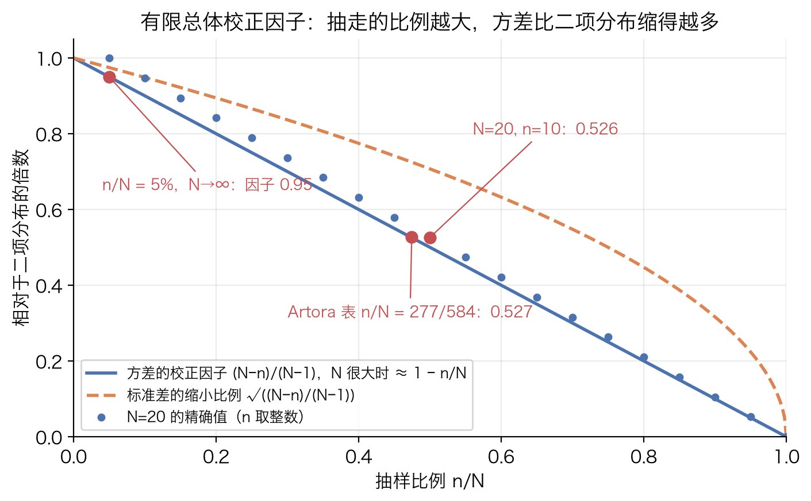
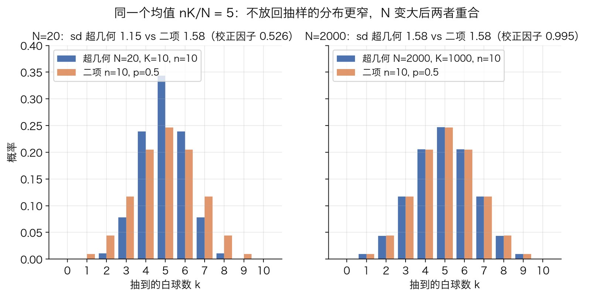
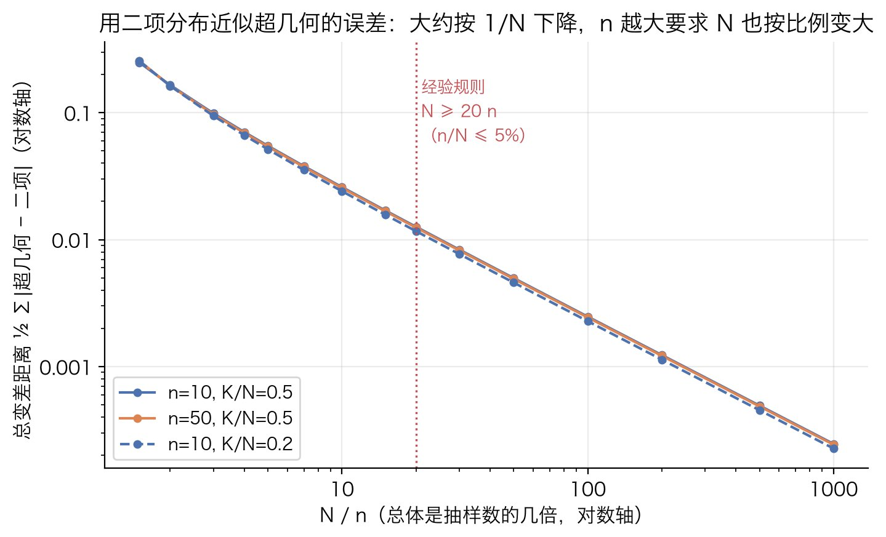
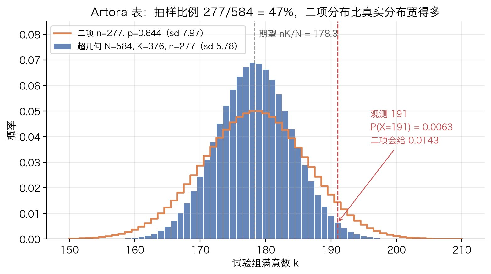

# 超几何分布

## 解决什么问题

### 场景

一个**有限**的总体，共 $N$ 个对象，其中 $K$ 个带某种标记（白球、次品、成功），其余 $N-K$ 个不带。从中**不放回**地随机抽 $n$ 个，问抽到的带标记数 $X$ 服从什么分布。

这个形状的问题到处都是：一批 $N$ 件货里有 $K$ 件次品，抽 $n$ 件检验，抽到几件次品；$N$ 个号码里 $K$ 个中奖，买 $n$ 个，中几个；一张 $2\times 2$ 列联表在"两组没差别"的假设下，把总成功数固定住，某一组的成功数怎么分布。最后这个用法是 [Fisher 精确检验](../statistics/fisher-exact-test.md)的全部基础，第 7 步会推出来。

### 和二项分布的唯一区别

[二项分布](binomial-distribution.md)描述的是：每次成功概率固定为 $p$，各次相互独立，做 $n$ 次，成功几次。"独立且概率不变"对应**放回**抽样：每次抽完把球放回去，总体永远是 $K$ 白 $N-K$ 黑，下一次抽到白球的概率还是 $K/N$。

不放回时，每抽走一个球，总体的组成就变了：抽走一个白球，剩下的白球比例下降；抽走一个黑球，白球比例上升。各次抽取**不独立**，成功概率也**不固定**。这是超几何和二项之间**唯一**的区别，但它带来三个后果，这篇笔记就围绕它们展开：

1. 概率质量函数（pmf）的形式不一样，要用计数推，不能用独立性相乘（第 1 步）。
2. 期望和二项一样是 $nK/N$，但方差多了一个小于 1 的因子 $(N-n)/(N-1)$（第 4、5 步）。
3. 总体 $N$ 远大于样本 $n$ 时，"抽走几个"对总体几乎没影响，两个分布合流（第 6 步）。

## 原理

### 第 1 步：用计数推出 pmf

**样本空间与等可能性。** 把抽出来的 $n$ 个球看成 $N$ 个球的一个 $n$ 元子集，共 $\binom{N}{n}$ 个。这些子集为什么等可能？想象按顺序一个一个抽：第一次 $N$ 个球里任选一个，第二次剩 $N-1$ 个里任选一个，……，第 $n$ 次剩 $N-n+1$ 个。任何一条具体的抽取序列（$n$ 个互不相同的球按顺序排好）的概率都是

$$
\frac{1}{N}\cdot\frac{1}{N-1}\cdots\frac{1}{N-n+1}=\frac{(N-n)!}{N!}
$$

这个数和序列里是哪些球无关。一个 $n$ 元子集对应 $n!$ 条不同顺序的序列，所以每个子集的概率是 $n!\cdot(N-n)!/N!=1/\binom{N}{n}$，全都相等。这一步是后面所有计数的合法性来源：只有等可能，"概率 = 有利结果数 / 总结果数"才成立。

**有利结果数。** 子集里恰好 $k$ 个白球，意味着从 $K$ 个白球里选了 $k$ 个、从 $N-K$ 个黑球里选了 $n-k$ 个。两部分互不干涉（白球的选法不影响黑球的选法），按乘法原理相乘：$\binom{K}{k}\binom{N-K}{n-k}$。

两者相除，就是超几何分布的 pmf：

$$
P(X=k)=\frac{\binom{K}{k}\binom{N-K}{n-k}}{\binom{N}{n}}
$$

人话：所有抽法里，"白球恰好 $k$ 个"的抽法占多大比例。记作 $X\sim\mathrm{HG}(N,K,n)$。

**它加起来等于 1 吗？** 把 $\binom{N}{n}$ 个子集按白球数分类，每个子集恰好属于一类，所以

$$
\sum_{k}\binom{K}{k}\binom{N-K}{n-k}=\binom{N}{n}
$$

这就是 Vandermonde 恒等式，本质上就是这句分类计数。两边同除以 $\binom{N}{n}$，概率之和为 1。

**另一条路：按抽取顺序算。** 这条路给出的形式第 6 步要用。考虑一条具体的序列，比如前 $k$ 次全白、后 $n-k$ 次全黑。按顺序抽，每一步的条件概率是"当前剩余白（黑）球数 / 当前剩余总数"：

$$
\frac{K}{N}\cdot\frac{K-1}{N-1}\cdots\frac{K-k+1}{N-k+1}\cdot\frac{N-K}{N-k}\cdot\frac{N-K-1}{N-k-1}\cdots\frac{N-K-(n-k)+1}{N-n+1}
$$

分母是 $N,N-1,\dots,N-n+1$，分子是 $K,K-1,\dots,K-k+1$ 和 $N-K,\dots,N-K-n+k+1$。如果白球出现在别的位置，分子里这些因子只是换了顺序出现，乘积不变；分母也只是把 $N,N-1,\dots$ 顺序排下来，同样不变。所以**任何**含 $k$ 个白球的序列概率都相同，而白球位置有 $\binom{n}{k}$ 种安排：

$$
P(X=k)=\binom{n}{k}\cdot\frac{K(K-1)\cdots(K-k+1)\cdot(N-K)(N-K-1)\cdots(N-K-n+k+1)}{N(N-1)\cdots(N-n+1)}
$$

它和上面的组合数形式是同一个式子：把 $\binom{K}{k}=\frac{K(K-1)\cdots(K-k+1)}{k!}$、$\binom{N-K}{n-k}=\frac{(N-K)\cdots(N-K-n+k+1)}{(n-k)!}$、$\binom{N}{n}=\frac{N(N-1)\cdots(N-n+1)}{n!}$ 代进去，$\frac{n!}{k!(n-k)!}$ 正好凑成 $\binom{n}{k}$。

### 第 2 步：k 能取哪些值

pmf 里出现了四个"选几个"的数：选 $k$ 个白球、$n-k$ 个黑球、总共 $K$ 个白球里剩 $K-k$ 个没选、$N-K$ 个黑球里剩 $N-K-(n-k)$ 个没选。四个数都不能是负数：

- $k\ge 0$；$K-k\ge 0\Rightarrow k\le K$（白球不够多，抽不出更多白球）
- $n-k\ge 0\Rightarrow k\le n$（抽的总数就 $n$ 个）
- $N-K-(n-k)\ge 0\Rightarrow k\ge n-(N-K)$（黑球只有 $N-K$ 个，抽 $n$ 个时至少 $n-(N-K)$ 个得是白球）

合起来：

$$
\max\big(0,\ n-(N-K)\big)\ \le\ k\ \le\ \min(n,\ K)
$$

下界不是 0 的情形容易被忘掉：$N=10$、$K=7$、$n=5$，黑球只有 3 个，抽 5 个至少 2 个白，所以 $k\ge 2$；上式给 $\max(0,5-3)=2$。范围之外组合数是 0（比如 $\binom{3}{4}=0$），pmf 自动为 0，公式本身不会算错，但手算和写代码时要知道循环从哪儿开始。

### 第 3 步：对称性 —— 哪 n 个被抽和哪 K 个是白地位对等

把 pmf 里三个组合数都展开成阶乘：

$$
P(X=k)
=\frac{\dfrac{K!}{k!\,(K-k)!}\cdot\dfrac{(N-K)!}{(n-k)!\,(N-K-n+k)!}}{\dfrac{N!}{n!\,(N-n)!}}
=\frac{K!\,(N-K)!\,n!\,(N-n)!}{N!\;k!\,(K-k)!\,(n-k)!\,(N-K-n+k)!}
$$

盯着最右边的式子看：分子里 $K$ 和 $n$ 的地位完全一样（$K!\,(N-K)!$ 和 $n!\,(N-n)!$），分母里把 $K$ 和 $n$ 互换，$(K-k)!$ 和 $(n-k)!$ 互换、$(N-K-n+k)!$ 不变。整个式子在 $K\leftrightarrow n$ 下不变。所以

$$
\frac{\binom{K}{k}\binom{N-K}{n-k}}{\binom{N}{n}}=\frac{\binom{n}{k}\binom{N-n}{K-k}}{\binom{N}{K}}
$$

右边的读法是：**固定哪 $n$ 个球被抽走，然后随机给 $N$ 个球里的 $K$ 个涂白**，问被抽走的那 $n$ 个里恰好 $k$ 个白的概率。左边随机的是"抽哪些"，右边随机的是"哪些是白"，两种随机化给出同一个分布。

直觉：把 $N$ 个球排成一张 $2\times 2$ 表，行是"抽中 / 没抽中"（行和 $n$、$N-n$），列是"白 / 黑"（列和 $K$、$N-K$），$k$ 是左上格。四个边际固定后表只剩一个自由度，行和列谁是"抽样"谁是"标记"没有区别。[Fisher 精确检验](../statistics/fisher-exact-test.md)第 3 步里"按行抽"和"按列抽"算出一样的结果，说的就是这件事。实际用途是：**参数 $(N,K,n)$ 和 $(N,n,K)$ 给出同一个分布**，哪个好算用哪个。

### 第 4 步：期望是 nK/N，不需要独立性

直接按定义算 $\sum_k k\,P(X=k)$ 要跟一堆组合数打交道。更省事的路是指示变量。

令 $I_i$ 表示第 $i$ 次抽到白球（是则 1，否则 0），$i=1,\dots,n$。显然 $X=I_1+I_2+\cdots+I_n$。

**第 $i$ 次抽到白球的概率是 $K/N$，对每个 $i$ 都一样。** 理由回到第 1 步的序列模型：所有 $n$ 元有序序列等可能，把球的编号任意置换一下，序列集合不变、每条序列的概率不变，所以"第 $i$ 个位置上是哪个球"在 $N$ 个球里均匀分布，是白球的概率就是 $K/N$。第 1 次是 $K/N$ 好理解；第 2 次表面上"取决于第 1 次抽到什么"，但把两种情况加权平均：$\frac{K}{N}\cdot\frac{K-1}{N-1}+\frac{N-K}{N}\cdot\frac{K}{N-1}=\frac{K(K-1)+K(N-K)}{N(N-1)}=\frac{K(N-1)}{N(N-1)}=\frac{K}{N}$，还是 $K/N$。对称性论证一次说清所有 $i$。

于是 $E[I_i]=K/N$，期望的线性性给出

$$
E[X]=\sum_{i=1}^{n}E[I_i]=n\cdot\frac{K}{N}
$$

**这里的关键是线性性对任何相关性都成立。** $I_1,\dots,I_n$ 明明是相关的（抽走一个白球，下一次白球概率就变小），但求期望时完全不用管这个，只要每一项的期望都是 $K/N$ 就行。独立性是算**方差**时才需要考虑的东西。结果和二项分布的 $np$ 一样（$p=K/N$），放不放回不影响平均值。

**用组合恒等式核一遍。** 用 $k\binom{K}{k}=K\binom{K-1}{k-1}$（从 $K$ 个里选 $k$ 个再指定一个组长，等于先选组长再从剩下 $K-1$ 个里选 $k-1$ 个组员）：

$$
\sum_k k\binom{K}{k}\binom{N-K}{n-k}=K\sum_k\binom{K-1}{k-1}\binom{N-K}{n-k}=K\binom{N-1}{n-1}
$$

最后一步又是 Vandermonde（从 $N-1$ 个球里选 $n-1$ 个，按白球数分类）。除以 $\binom{N}{n}$，用 $\binom{N-1}{n-1}/\binom{N}{n}=n/N$，得 $E[X]=nK/N$。两条路一致。

### 第 5 步：方差与有限总体校正因子

和的方差等于各项方差之和加上所有两两协方差：

$$
\operatorname{Var}(X)=\sum_{i=1}^{n}\operatorname{Var}(I_i)+\sum_{i\ne j}\operatorname{Cov}(I_i,I_j)
$$

二项分布里各次独立，协方差全是 0，只剩第一项。超几何的差别全在第二项。记 $p=K/N$。

**每一项的方差。** $I_i$ 是取 1 概率为 $p$ 的 0/1 变量，$\operatorname{Var}(I_i)=p(1-p)$。

**两两协方差。** $\operatorname{Cov}(I_i,I_j)=E[I_iI_j]-E[I_i]E[I_j]$。$I_iI_j=1$ 当且仅当第 $i$ 次和第 $j$ 次都抽到白球。按第 4 步的对称性，位置 $(i,j)$ 上的一对球在所有有序球对里均匀分布，两个都白的概率是 $\frac{K}{N}\cdot\frac{K-1}{N-1}$。所以

$$
\operatorname{Cov}(I_i,I_j)=\frac{K(K-1)}{N(N-1)}-\left(\frac{K}{N}\right)^2
$$

通分化简，分母取 $N^2(N-1)$：

$$
\operatorname{Cov}(I_i,I_j)=\frac{K(K-1)N-K^2(N-1)}{N^2(N-1)}
=\frac{K\big[(K-1)N-K(N-1)\big]}{N^2(N-1)}
=\frac{K(K-N)}{N^2(N-1)}
=-\frac{p(1-p)}{N-1}
$$

中括号里 $(K-1)N-K(N-1)=KN-N-KN+K=K-N$。协方差是**负的**：抽到一个白球，剩下的白球比例下降，另一次抽到白球的机会变小。绝对值 $p(1-p)/(N-1)$ 随 $N$ 增大而变小，总体越大，抽走一个球的影响越弱。

**合起来。** 共 $n$ 个方差项、$n(n-1)$ 个协方差项：

$$
\begin{aligned}
\operatorname{Var}(X)
&=n\,p(1-p)-n(n-1)\cdot\frac{p(1-p)}{N-1}\\
&=n\,p(1-p)\left(1-\frac{n-1}{N-1}\right)\\
&=n\,p(1-p)\cdot\frac{N-n}{N-1}
\end{aligned}
$$

最后一步：$1-\frac{n-1}{N-1}=\frac{N-1-n+1}{N-1}=\frac{N-n}{N-1}$。

前面的 $np(1-p)$ 就是二项分布的方差，后面的 $\frac{N-n}{N-1}$ 叫**有限总体校正因子**（finite population correction）。看它三个端点：

- $n=1$：因子为 1。只抽一个球，放不放回没有区别，就是一次伯努利试验。
- $n=N$：因子为 0。把球全抽光，$X$ 必然等于 $K$，没有随机性。
- $N\to\infty$（$n$ 固定）：因子 $\to 1$，回到二项方差。

中间情形因子严格在 0 和 1 之间，所以**不放回抽样的方差总比放回小**。原因就是那 $n(n-1)$ 个负协方差：每抽到一个白球都会把后面往黑球那边推一点，这种"自我纠偏"让总数比独立情形更集中在期望附近。

下图把校正因子画成抽样比例 $n/N$ 的函数。$N$ 很大时它几乎就是 $1-n/N$；标准差的缩小比例是它的平方根，所以对标准差的影响比对方差温和。抽走 5% 时方差缩到 0.95 倍、标准差缩到约 0.975 倍，几乎看不出；抽走一半时方差只剩一半、标准差只剩约 0.71 倍：



### 第 6 步：总体足够大时就是二项分布

直觉已经有了：$N$ 很大时抽走几个球对总体组成没影响，不放回和放回没区别。把它变成一个可以写出来的极限。

固定 $n$ 和 $k$，让 $N\to\infty$，同时保持白球比例 $K/N=p$ 不变（即 $K=pN$）。用第 1 步末尾按顺序抽的形式，把分子分母的 $n$ 个因子一一配对：前 $k$ 对是白球的，后 $n-k$ 对是黑球的：

$$
P(X=k)=\binom{n}{k}\prod_{i=0}^{k-1}\frac{K-i}{N-i}\cdot\prod_{j=0}^{n-k-1}\frac{N-K-j}{N-k-j}
$$

看每一个因子。白球的：

$$
\frac{K-i}{N-i}=\frac{pN-i}{N-i}=\frac{p-i/N}{1-i/N}\ \xrightarrow{N\to\infty}\ p
$$

黑球的：

$$
\frac{N-K-j}{N-k-j}=\frac{(1-p)N-j}{N-k-j}=\frac{(1-p)-j/N}{1-(k+j)/N}\ \xrightarrow{N\to\infty}\ 1-p
$$

因为 $n$ 固定，一共只有 $n$ 个因子，有限个数的极限之积等于积的极限，于是

$$
P(X=k)\ \longrightarrow\ \binom{n}{k}p^k(1-p)^{n-k}
$$

正是 $\mathrm{Bin}(n,p)$ 的 pmf。极限过程里被扔掉的是每个因子里的 $i/N$、$j/N$，也就是"已经抽走了几个"相对于总体的份额，这正是放回与不放回的全部差别。

下图是 $n=10$、$p=1/2$（期望都是 5）时两种分布的对比。左边 $N=20$，抽走了一半，超几何明显更瘦（标准差 1.15 对 1.58，校正因子 $10/19=0.526$）；右边 $N=2000$，两者几乎重合（校正因子 0.995）：



**多大的 $N$ 算"够大"？** 常见的经验规则是抽样比例 $n/N\le 5\%$，即 $N\ge 20n$，就可以用二项近似。这是经验规则，不是定理；它对应的校正因子是 0.95。下图用两种分布的总变差距离（所有 $k$ 上概率差的绝对值之和的一半，即最坏情况下任何事件的概率差）看近似误差：对数坐标下近似是一条斜率约为 $-1$ 的直线，误差大约按 $1/N$ 下降；横轴用 $N/n$ 之后，$n=10$ 和 $n=50$ 的曲线几乎重合，说明起作用的是**比例** $n/N$ 而不是 $N$ 本身；$N=20n$ 处 $n=10$、$p=1/2$ 的距离约 0.013。



反过来也要记住：近似误差有方向。第 5 步说过二项方差总是**偏大**，所以用二项代替超几何会把分布画得比实际宽，尾部概率算大。抽样比例大时这个误差不是小数点后几位的事，最小算例里有个把单侧尾概率算大三倍的实例。

### 第 7 步：从两个二项分布条件出来的超几何

到这里超几何都是从"抽球"定义的。它还有另一个来源，和抽球看起来毫无关系，却是它在统计里最重要的用法。

两组人，人数 $r_1$、$r_2$，每人独立地以**同一个**概率 $\pi$ 成功。组 1 成功数 $A\sim\mathrm{Bin}(r_1,\pi)$，组 2 成功数 $C\sim\mathrm{Bin}(r_2,\pi)$，两者独立。现在告诉你总成功数 $A+C=c_1$，问 $A$ 的条件分布。

按条件概率的定义：

$$
P(A=a\mid A+C=c_1)=\frac{P(A=a,\ C=c_1-a)}{P(A+C=c_1)}
$$

分子用独立性拆成两个二项概率相乘。分母：$A+C$ 是 $r_1+r_2$ 个人各自独立、成功概率都是 $\pi$ 的总成功数，所以 $A+C\sim\mathrm{Bin}(r_1+r_2,\pi)$。全写出来：

$$
\begin{aligned}
P(A=a\mid A+C=c_1)
&=\frac{\binom{r_1}{a}\pi^{a}(1-\pi)^{r_1-a}\cdot\binom{r_2}{c_1-a}\pi^{c_1-a}(1-\pi)^{r_2-c_1+a}}
       {\binom{r_1+r_2}{c_1}\pi^{c_1}(1-\pi)^{r_1+r_2-c_1}}\\[8pt]
&=\frac{\binom{r_1}{a}\binom{r_2}{c_1-a}}{\binom{r_1+r_2}{c_1}}
  \cdot\frac{\pi^{a+(c_1-a)}(1-\pi)^{(r_1-a)+(r_2-c_1+a)}}{\pi^{c_1}(1-\pi)^{r_1+r_2-c_1}}\\[8pt]
&=\frac{\binom{r_1}{a}\binom{r_2}{c_1-a}}{\binom{r_1+r_2}{c_1}}
\end{aligned}
$$

第二行是把分子里 $\pi$ 的指数合并：$a+(c_1-a)=c_1$，$(r_1-a)+(r_2-c_1+a)=r_1+r_2-c_1$，和分母的指数**一模一样**，整个 $\pi$ 的部分约成 1。

剩下的式子对照第 1 步的 pmf：$N=r_1+r_2$、$K=r_1$、$n=c_1$、$k=a$，是 $\mathrm{HG}(r_1+r_2,\ r_1,\ c_1)$；按第 3 步的对称性也可以读成 $\mathrm{HG}(r_1+r_2,\ c_1,\ r_1)$。抽球的解释：$r_1+r_2$ 个人里有 $c_1$ 个成功者，组 1 是从所有人里随机抓出来的 $r_1$ 个，问其中几个成功者。

**为什么 $\pi$ 会约掉？** 在"每人成功概率相同"的假设下，$\pi$ 只决定总共有多少人成功，不决定成功的是**哪些人**。把总数固定住之后，$\pi$ 就没有话语权了，成功者落在哪些人头上是均匀随机的，这正是不放回抽球模型。反过来说，如果两组的成功率不同（$\pi_1\ne\pi_2$），指数合并那一步就凑不出相同的幂，$\pi_1$、$\pi_2$ 约不掉，条件分布不再是超几何，而是带一个优势比参数的非中心超几何分布。

这就是 [Fisher 精确检验](../statistics/fisher-exact-test.md)的核心：原假设"两组成功率相同"下条件在总成功数上，未知参数消失，剩下的超几何分布不含任何未知量，$p$ 值可以精确算。那篇笔记从统计的角度把这条推导再走一遍，并解释怎么从分布得到 $p$ 值。

## 适用边界

- **什么时候必须用超几何而不是二项**：总体有限且抽样比例不小。经验上 $n/N$ 超过 5% 到 10% 就该老老实实用超几何；小批量质量抽检（几十件里抽十几件）、从一个小名单里不放回抽奖、以及第 7 步那种"条件在总数上"的推断（$2\times 2$ 表里抽样比例是 $r_1/(r_1+r_2)$，两组人数差不多时接近一半，远超 5%），都属于这一类。
- **什么时候二项够用**：放回抽样，或者总体远大于样本（$N\ge 20n$ 的经验规则），或者总体本身没有"被抽空"这回事（每个用户独立地以某个概率转化，总体是无限的）。判据不是 $N$ 大不大，是 $n/N$ 大不大，第 6 步的图说明了这一点。
- **参数对应要想清楚。** 一个问题里 $N$、$K$、$n$ 各是什么，有时有两种对法（第 3 步的对称性），结果相同，挑好算的。scipy 的参数名容易混：`scipy.stats.hypergeom(M, n, N)` 里 `M` 是总数、`n` 是总体里的白球数、`N` 是抽几个，和这篇的 $(N,K,n)$ 顺序对应但字母不同。
- **前提是等可能。** 第 1 步的一切建立在"每个 $n$ 元子集等可能"上。如果抽样不是均匀随机的（某些球更容易被抽到），就不是超几何。
- **超过两种颜色**用多元超几何分布，pmf 是同样的计数思路：分子是各颜色组合数之积，分母还是 $\binom{N}{n}$。
- **误用的方向**：把不放回当放回，方差会被高估（第 5 步），置信区间和 $p$ 值都偏保守。反过来把放回当不放回则会低估。

## 最小算例

### 手算：N=8、K=4、n=4

8 个球 4 白 4 黑，抽 4 个。第 2 步的范围：$\max(0,4-4)=0$ 到 $\min(4,4)=4$。分母 $\binom{8}{4}=70$。

| $k$ | $\binom{4}{k}$ | $\binom{4}{4-k}$ | 分子 | $P(X=k)$ |
|---|---|---|---|---|
| 0 | 1 | 1 | 1 | $1/70$ |
| 1 | 4 | 4 | 16 | $16/70$ |
| 2 | 6 | 6 | 36 | $36/70$ |
| 3 | 4 | 4 | 16 | $16/70$ |
| 4 | 1 | 1 | 1 | $1/70$ |

分子加总 $1+16+36+16+1=70$，概率之和为 1，Vandermonde 恒等式在这儿是 $\sum_k\binom{4}{k}\binom{4}{4-k}=\binom{8}{4}$。

期望：公式给 $nK/N=4\times 4/8=2$；直接算 $\sum k\,P(X=k)=(0+16+72+48+4)/70=140/70=2$，一致。

方差：公式给 $n\,p(1-p)\frac{N-n}{N-1}=4\times\frac12\times\frac12\times\frac{4}{7}=\frac{4}{7}\approx 0.571$。直接算 $E[X^2]=\sum k^2P(X=k)=(0+16+144+144+16)/70=320/70=\frac{32}{7}$，$\operatorname{Var}(X)=\frac{32}{7}-2^2=\frac{32-28}{7}=\frac{4}{7}$，一致。放回抽样（$\mathrm{Bin}(4,\tfrac12)$）的方差是 $4\times\tfrac12\times\tfrac12=1$，不放回缩到了 $4/7$，缩的倍数就是校正因子 $\frac{8-4}{8-1}=\frac47$。

### Artora 表：抽样比例 47% 的实例

[Artora A/B 实验](../../case/artora-ab-satisfaction-fisher.md)那张 $2\times 2$ 表：总人数 584，满意 376，试验组 277 人。按第 7 步，原假设下试验组满意数 $X\sim\mathrm{HG}(N=584,\ K=376,\ n=277)$。下面的数都是补算：

- 范围：$\max(0,\ 277-208)=69$ 到 $\min(277,376)=277$。
- 期望：$nK/N=277\times 376/584=178.34$。
- 方差：$p=376/584=0.6438$，$np(1-p)=277\times 0.6438\times 0.3562=63.52$；校正因子 $\frac{584-277}{584-1}=\frac{307}{583}=0.5266$；$\operatorname{Var}(X)=63.52\times 0.5266=33.45$，标准差 $5.78$。如果错用二项，标准差是 $\sqrt{63.52}=7.97$，宽了将近四成。
- 观测值 191 的概率：$P(X=191)=0.0063$；二项会给 0.0143，两倍多。
- 单侧尾概率 $P(X\ge 191)=0.0176$；二项会给 0.0625，大了三倍多。这就是第 6 步末尾说的"误差有方向"：抽样比例 $277/584=47\%$，远超 5%，二项把分布画宽了，尾巴自然算大。



Fisher 那篇的双侧 $p=0.031$ 就是把这个分布里概率不超过 0.0063 的所有 $k$ 的概率加起来；本篇只管分布本身，怎么从分布走到 $p$ 值见那篇。

### 代码

零依赖的 pmf，用大整数组合数，$N$ 几百上千不会溢出：

```python
from math import comb

def hypergeom_pmf(N, K, n, k):
    """N 个球 K 个白，不放回抽 n 个，恰 k 个白的概率。范围外自动为 0。"""
    return comb(K, k) * comb(N - K, n - k) / comb(N, n)

def hypergeom_mean_var(N, K, n):
    p = K / N
    return n * p, n * p * (1 - p) * (N - n) / (N - 1)
```

```python
>>> [hypergeom_pmf(8, 4, 4, k) for k in range(5)]
[0.0142857..., 0.2285714..., 0.5142857..., 0.2285714..., 0.0142857...]   # 1/70, 16/70, 36/70, 16/70, 1/70
>>> hypergeom_mean_var(8, 4, 4)
(2.0, 0.5714285714285714)
>>> hypergeom_pmf(584, 376, 277, 191)
0.00628...
>>> hypergeom_mean_var(584, 376, 277)
(178.34246575342468, 33.44837899489734)
```

有 scipy 就用 `scipy.stats.hypergeom`，注意参数顺序是 `(M=总数, n=白球数, N=抽几个)`：

```python
>>> from scipy.stats import hypergeom
>>> rv = hypergeom(584, 376, 277)          # M=584, n=376, N=277
>>> rv.mean(), rv.std()
(178.34246575342465, 5.783457356538331)
>>> rv.pmf(191), rv.sf(190)                # P(X=191), P(X>=191)
(0.00628..., 0.01756...)
>>> rv.support()
(69, 277)
```

图由 `tools/figures/hypergeometric-distribution.py` 生成，所有数字直接由 pmf 算出，没有随机模拟。
