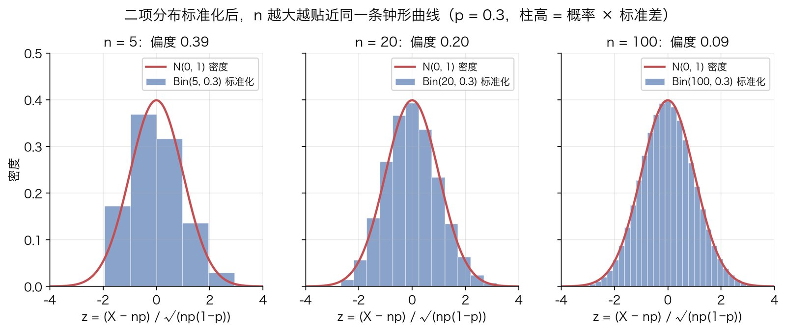
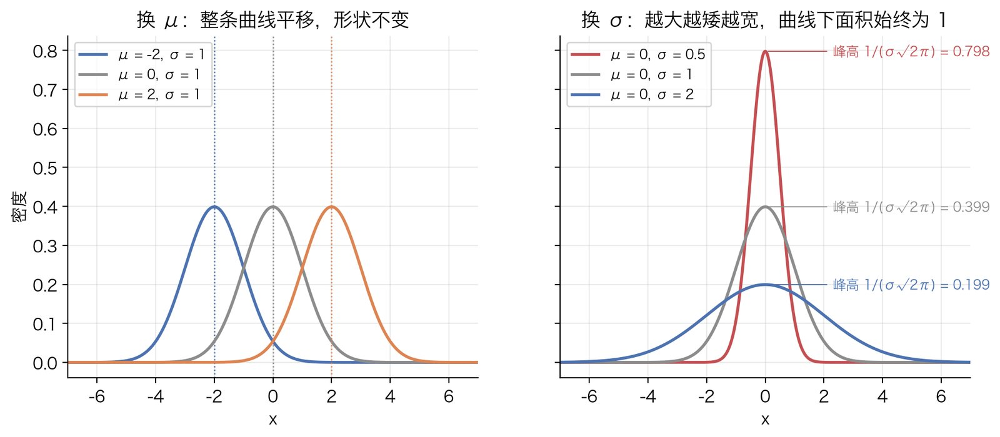
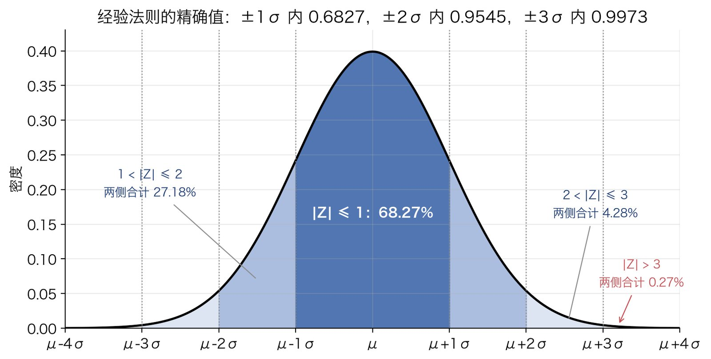

# 正态分布

## 解决什么问题

很多量是"一大堆互相独立的小扰动加起来"的结果：一个比例是几百个 0/1 结果的平均，一次测量是仪器、环境、操作若干小误差的叠加，一个统计量是很多样本点的和。这类量的分布，不管单个扰动本身长什么样，加得够多之后都趋向同一条钟形曲线。这是[中心极限定理](central-limit-theorem.md)的内容，本文不证它，只讲它的极限对象：正态分布 $N(\mu,\sigma^2)$。

它解决的另一个问题是**给"偏离"一个统一的尺度**。"试验组比对照组高 8.7 个百分点"本身说明不了什么，样本大时可能极显著，样本小时可能纯属噪声。把差除以它的标准差，得到"差了 $z$ 个标准差"，如果这个量近似正态，那么"$z=2$ 有多罕见"就有了和场景无关的固定答案。$z$ 检验、置信区间、卡方检验的 $p$ 值最后都落到查这一张表。

这篇按下面的顺序把它讲清楚：钟形从哪来（第 1 步）、密度函数每个部件为什么长那样（第 2 步）、两个参数确实是期望和方差（第 3 步）、为什么一张 $N(0,1)$ 的表够用（第 4 步）、这张表怎么算（第 5 步）、为什么正态变量加起来还是正态（第 6 步）。

## 原理

### 第 1 步：从二项到钟形

从一个离散的、能手算的分布出发：[二项分布](binomial-distribution.md) $X\sim\mathrm{Bin}(n,p)$，$n$ 次独立试验里成功的次数。它的期望是 $np$，方差是 $np(1-p)$。

直接画 $n=5$、$20$、$100$ 的 $\mathrm{Bin}(n,0.3)$，三张图没法比：$n$ 越大，分布越靠右、越宽。要比形状，先把位置和尺度统一掉，也就是**标准化**：

$$
Z_n=\frac{X-np}{\sqrt{np(1-p)}}
$$

减去期望，让中心落在 $0$；除以标准差，让宽度变成 $1$。这样三个分布的期望都是 $0$、方差都是 $1$，剩下的差别才是"形状"。



$n=5$ 时柱子明显右偏（$p=0.3$ 不对称）；$n=20$ 时偏得少了；$n=100$ 时柱子已经和红线几乎重合。偏度的公式是 $(1-2p)/\sqrt{np(1-p)}$，三个 $n$ 对应 $0.39$、$0.20$、$0.09$，分母随 $\sqrt n$ 增长，不对称性以 $1/\sqrt n$ 的速度消失。

红线就是这个极限。二项分布标准化后趋向它，是 de Moivre–Laplace 定理，也是中心极限定理的特例（0/1 变量的和）。中心极限定理说的更多：不止 0/1 变量，任何有有限方差的独立同分布变量之和，标准化后都趋向同一条红线。所以这条曲线值得单独研究：**它是所有"很多小扰动之和"的共同归宿**。

下面几步只做一件事：把这条红线的表达式写出来，然后验证它有该有的性质。

### 第 2 步：密度函数每个部件从哪来

先猜形状，再定常数。

**为什么是指数里放平方。** 要一条曲线满足三件事：关于中心对称、只有一个峰、离中心越远衰减越快。密度必须非负，写成 $f(x)=e^{-g(x)}$ 就自动非负，$g$ 越大密度越小。对称要求 $g$ 是偶函数，$g$ 在 $0$ 处取最小值。一个光滑的偶函数在最小值附近展开，一次项为零（偶函数没有奇次项），最低阶的非平凡项是二次项：$g(x)\approx g(0)+\tfrac{1}{2}g''(0)x^2$。只保留这一项，得到

$$
f(x)\propto e^{-x^2/2}
$$

系数 $1/2$ 是刻意选的，后面会看到它让方差恰好等于 $1$。这一段是动机不是证明：真正把 $e^{-x^2/2}$ 钉死的是第 1 步的极限定理。但它解释了为什么这个形状"最简单"：任何光滑的单峰在峰附近做二阶近似，都是这个样子。

**引入位置和尺度。** 把中心从 $0$ 移到 $\mu$，把宽度从 $1$ 拉到 $\sigma$，就是把 $x$ 换成 $(x-\mu)/\sigma$：

$$
f(x)\propto\exp\!\left(-\frac{(x-\mu)^2}{2\sigma^2}\right)
$$

$x$ 离 $\mu$ 一个 $\sigma$，指数是 $-1/2$；离两个 $\sigma$，指数是 $-2$。所以"离中心几个 $\sigma$"决定密度掉到峰值的几分之几，这和 $\mu$、$\sigma$ 的具体数值无关。

**归一化常数。** 密度的总面积必须是 $1$，所以要算 $I=\int_{-\infty}^{\infty}e^{-x^2/2}\,dx$。这个积分没有初等原函数，直接算不动。经典技巧是算 $I^2$：把两个一样的积分乘起来，变量分别叫 $x$ 和 $y$，

$$
I^2=\int_{-\infty}^{\infty}e^{-x^2/2}\,dx\int_{-\infty}^{\infty}e^{-y^2/2}\,dy
=\iint_{\mathbb{R}^2}e^{-(x^2+y^2)/2}\,dx\,dy
$$

为什么要平方：单个积分的被积函数 $e^{-x^2/2}$ 没有原函数，但两个乘起来出现了 $x^2+y^2$，这是平面上到原点距离的平方，换成极坐标 $x=r\cos\theta$，$y=r\sin\theta$ 之后它就是 $r^2$，而面积元 $dx\,dy=r\,dr\,d\theta$ 里多出来的那个 $r$ 正好让被积函数有了原函数：

$$
I^2=\int_{0}^{2\pi}\!\int_{0}^{\infty}e^{-r^2/2}\,r\,dr\,d\theta
=2\pi\int_{0}^{\infty}e^{-r^2/2}\,r\,dr
=2\pi\Big[-e^{-r^2/2}\Big]_{0}^{\infty}
=2\pi\,(0-(-1))=2\pi
$$

所以 $I=\sqrt{2\pi}\approx 2.5066$。对一般的 $\mu$、$\sigma$，换元 $x=\mu+\sigma u$，$dx=\sigma\,du$：

$$
\int_{-\infty}^{\infty}\exp\!\left(-\frac{(x-\mu)^2}{2\sigma^2}\right)dx
=\sigma\int_{-\infty}^{\infty}e^{-u^2/2}\,du=\sigma\sqrt{2\pi}
$$

除以这个面积，就得到正态密度的完整形式：

$$
f(x)=\frac{1}{\sigma\sqrt{2\pi}}\exp\!\left(-\frac{(x-\mu)^2}{2\sigma^2}\right),\qquad -\infty<x<\infty
$$

记作 $X\sim N(\mu,\sigma^2)$。三个部件各管一件事：指数里的平方决定形状；$\mu$ 决定中心在哪；$\sigma$ 决定宽度，同时通过 $1/\sigma$ 决定峰有多高（面积固定是 $1$，拉宽就得压矮）。峰高是 $1/(\sigma\sqrt{2\pi})\approx 0.399/\sigma$。



### 第 3 步：验证两个参数确实是期望和方差

上一步给参数起名叫 $\mu$、$\sigma$ 是有预谋的，现在验证它们真的是期望和标准差。用第 2 步的换元 $x=\mu+\sigma u$，并记标准正态密度 $\varphi(u)=e^{-u^2/2}/\sqrt{2\pi}$。

**期望。**

$$
E[X]=\int_{-\infty}^{\infty}x\,f(x)\,dx
=\int_{-\infty}^{\infty}(\mu+\sigma u)\,\varphi(u)\,du
=\mu\int_{-\infty}^{\infty}\varphi(u)\,du+\sigma\int_{-\infty}^{\infty}u\,\varphi(u)\,du
$$

第一个积分是 $1$（第 2 步刚算过面积）。第二个积分的被积函数 $u\varphi(u)$ 是奇函数（$u$ 奇、$\varphi$ 偶），在对称区间上积分为 $0$。所以 $E[X]=\mu$。

用对称性消掉奇函数积分有一个前提：$\int|u|\varphi(u)\,du$ 必须有限，否则"正负抵消"是 $\infty-\infty$，没有意义。这里 $e^{-u^2/2}$ 衰减极快，没有问题。这个前提不是白提的，柯西分布同样关于 $0$ 对称，但尾巴太厚，期望不存在。

**方差。** $\operatorname{Var}(X)=E[(X-\mu)^2]$，换元后 $(x-\mu)^2=\sigma^2u^2$：

$$
\operatorname{Var}(X)=\sigma^2\int_{-\infty}^{\infty}u^2\varphi(u)\,du
$$

剩下的积分 $J=\int u^2\varphi(u)\,du$ 用分部积分。关键观察：$\frac{d}{du}\big(-e^{-u^2/2}\big)=u\,e^{-u^2/2}$，所以把 $u^2e^{-u^2/2}$ 拆成 $u\cdot\big(u\,e^{-u^2/2}\big)$，后一个因子有现成的原函数：

$$
\int_{-\infty}^{\infty}u\cdot u\,e^{-u^2/2}\,du
=\Big[u\cdot\big(-e^{-u^2/2}\big)\Big]_{-\infty}^{\infty}-\int_{-\infty}^{\infty}1\cdot\big(-e^{-u^2/2}\big)\,du
=0+\int_{-\infty}^{\infty}e^{-u^2/2}\,du=\sqrt{2\pi}
$$

边界项是 $0$，因为 $u\,e^{-u^2/2}$ 在 $u\to\pm\infty$ 时指数衰减压倒线性增长。除以 $\sqrt{2\pi}$，$J=1$，于是 $\operatorname{Var}(X)=\sigma^2$。

这就是第 2 步里指数写成 $-x^2/2$ 而不是 $-x^2$ 的原因：多出来的 $1/2$ 让标准正态的方差恰好是 $1$，$\sigma$ 才能直接叫标准差。若写 $e^{-x^2}$，方差会是 $1/2$，后面所有公式都得带一个别扭的 $\sqrt2$。

### 第 4 步：标准化，一张表管所有的正态

有了无穷多个 $N(\mu,\sigma^2)$，是不是每一个都要单独一张概率表？不用。令

$$
Z=\frac{X-\mu}{\sigma}
$$

要证 $Z\sim N(0,1)$。做法是先写 $Z$ 的分布函数，再求导得密度。

$$
F_Z(z)=P(Z\le z)=P\!\left(\frac{X-\mu}{\sigma}\le z\right)=P(X\le\mu+\sigma z)=F_X(\mu+\sigma z)
$$

第三个等号用了 $\sigma>0$，不等式两边乘正数方向不变。对 $z$ 求导，链式法则带出内层函数的导数 $\frac{d}{dz}(\mu+\sigma z)=\sigma$，这就是换元的雅可比：

$$
f_Z(z)=\frac{d}{dz}F_X(\mu+\sigma z)=\sigma\,f_X(\mu+\sigma z)
=\sigma\cdot\frac{1}{\sigma\sqrt{2\pi}}\exp\!\left(-\frac{(\mu+\sigma z-\mu)^2}{2\sigma^2}\right)
=\frac{1}{\sqrt{2\pi}}e^{-z^2/2}
$$

$\sigma$ 约掉了，$\mu$ 也消失了，剩下的正是 $\varphi(z)$。所以不管原来的 $\mu$、$\sigma$ 是多少，$(X-\mu)/\sigma$ 都服从**同一个** $N(0,1)$。

为什么这一步重要：任何关于 $X$ 的概率都能换算成关于 $Z$ 的概率，

$$
P(a<X\le b)=P\!\left(\frac{a-\mu}{\sigma}<Z\le\frac{b-\mu}{\sigma}\right)=\Phi\!\left(\frac{b-\mu}{\sigma}\right)-\Phi\!\left(\frac{a-\mu}{\sigma}\right)
$$

$\Phi$ 是 $N(0,1)$ 的分布函数（下一步定义）。于是只需要一张 $\Phi$ 的表，或者一个 `norm.cdf`。这也是"差了几个标准差"这个说法的数学根据：$z$ 就是 $X$ 到 $\mu$ 的距离，以 $\sigma$ 为单位。

这个雅可比不是可有可无的：漏掉 $\sigma$ 会得到 $f_Z(z)=\varphi(z)/\sigma$，总面积是 $1/\sigma$ 而不是 $1$，根本不是密度。

### 第 5 步：分布函数、误差函数与经验法则

**定义。** 标准正态的分布函数

$$
\Phi(x)=P(Z\le x)=\int_{-\infty}^{x}\frac{1}{\sqrt{2\pi}}e^{-t^2/2}\,dt
$$

它没有初等表达式（第 2 步已经说过被积函数没有初等原函数），所以要么查表，要么调库。库里通常提供的是误差函数

$$
\operatorname{erf}(x)=\frac{2}{\sqrt\pi}\int_{0}^{x}e^{-t^2}\,dt,\qquad
\operatorname{erfc}(x)=1-\operatorname{erf}(x)=\frac{2}{\sqrt\pi}\int_{x}^{\infty}e^{-t^2}\,dt
$$

两者只差一个换元。erf 的指数是 $-t^2$，$\Phi$ 的指数是 $-t^2/2$，把尺度对上就行。

**推导上尾概率。** 从 $1-\Phi(x)=P(Z>x)=\int_x^\infty\varphi(t)\,dt$ 出发，令 $t=\sqrt2\,s$，则 $t^2/2=s^2$，$dt=\sqrt2\,ds$，下限变成 $x/\sqrt2$：

$$
1-\Phi(x)=\int_{x}^{\infty}\frac{1}{\sqrt{2\pi}}e^{-t^2/2}\,dt
=\frac{\sqrt2}{\sqrt{2\pi}}\int_{x/\sqrt2}^{\infty}e^{-s^2}\,ds
=\frac{1}{\sqrt\pi}\int_{x/\sqrt2}^{\infty}e^{-s^2}\,ds
=\frac12\operatorname{erfc}\!\left(\frac{x}{\sqrt2}\right)
$$

最后一步把 $\frac{1}{\sqrt\pi}$ 写成 $\frac12\cdot\frac{2}{\sqrt\pi}$，凑出 erfc 的定义。同理 $\Phi(x)=\frac12\big[1+\operatorname{erf}(x/\sqrt2)\big]$。

**对称性与双尾。** 密度是偶函数，所以 $\Phi(-x)=1-\Phi(x)$。"偏离超过 $x$ 个标准差，不管方向"的概率是

$$
P(|Z|>x)=2\big(1-\Phi(x)\big)=\operatorname{erfc}\!\left(\frac{x}{\sqrt2}\right)
$$

这就是双尾 $p$ 值的公式，Python 里一行 `erfc(x / sqrt(2))`，不用装任何库。

**经验法则的精确值。** 用 $P(|Z|\le k)=\Phi(k)-\Phi(-k)=2\Phi(k)-1$ 算 $k=1,2,3$：

| 范围 | 精确概率 | 常说的 |
|---|---|---|
| $\mu\pm 1\sigma$ | $0.682689$ | $68\%$ |
| $\mu\pm 2\sigma$ | $0.954500$ | $95\%$ |
| $\mu\pm 3\sigma$ | $0.997300$ | $99.7\%$ |



三个数值得记住的方式："$2\sigma$ 之外"约 $4.55\%$，"$3\sigma$ 之外"约 $0.27\%$，也就是每 $370$ 次左右出一次。反过来问"多少个 $\sigma$ 恰好包住 $95\%$"，答案是 $1.959964$，这就是置信区间里那个 $1.96$；包住 $99\%$ 要 $2.5758$。

### 第 6 步：线性组合仍是正态

这是正态分布最常被用到、也最容易被当成理所当然的性质：**独立正态变量的和还是正态，均值相加，方差相加。** 它不是显然的。两个独立均匀分布 $U(0,1)$ 的和是三角形分布，不再均匀；正态族在加法下封闭是它特有的。

证明工具是矩母函数（MGF）：$M_X(t)=E[e^{tX}]$。用它有两个理由。第一，MGF 在 $t=0$ 附近存在时**唯一决定分布**，两个变量 MGF 相同就是同分布（这是一条定理，本文直接用）。第二，独立变量之和的 MGF 等于各自 MGF 的乘积：

$$
M_{X_1+X_2}(t)=E\big[e^{t(X_1+X_2)}\big]=E\big[e^{tX_1}e^{tX_2}\big]=E\big[e^{tX_1}\big]E\big[e^{tX_2}\big]=M_{X_1}(t)\,M_{X_2}(t)
$$

第三个等号用了独立性：独立变量的函数的乘积，期望等于期望的乘积。所以"和的分布"这个难算的卷积，变成了"MGF 相乘"这个好算的事。

**先算标准正态的 MGF。**

$$
M_Z(t)=\int_{-\infty}^{\infty}e^{tu}\,\frac{1}{\sqrt{2\pi}}e^{-u^2/2}\,du
=\frac{1}{\sqrt{2\pi}}\int_{-\infty}^{\infty}\exp\!\left(tu-\frac{u^2}{2}\right)du
$$

指数里是关于 $u$ 的二次式，配方法把它凑成完全平方：

$$
tu-\frac{u^2}{2}=-\frac12\big(u^2-2tu\big)=-\frac12\big[(u-t)^2-t^2\big]=-\frac{(u-t)^2}{2}+\frac{t^2}{2}
$$

$t^2/2$ 与 $u$ 无关，提到积分外面：

$$
M_Z(t)=e^{t^2/2}\cdot\frac{1}{\sqrt{2\pi}}\int_{-\infty}^{\infty}e^{-(u-t)^2/2}\,du=e^{t^2/2}\cdot 1=e^{t^2/2}
$$

剩下的积分是一个中心在 $t$、方差为 $1$ 的正态密度的总面积，第 2 步算过它是 $1$。配方法的作用就在这：把"多了一个 $e^{tu}$ 因子的积分"重新认出是"另一个正态的面积"。

**再推一般正态。** $X=\mu+\sigma Z$，

$$
M_X(t)=E\big[e^{t(\mu+\sigma Z)}\big]=e^{\mu t}\,E\big[e^{(\sigma t)Z}\big]=e^{\mu t}M_Z(\sigma t)=\exp\!\left(\mu t+\frac{\sigma^2t^2}{2}\right)
$$

顺手核对第 3 步：$M_X'(t)=(\mu+\sigma^2t)M_X(t)$，在 $t=0$ 取值 $\mu$；$M_X''(t)=\big[\sigma^2+(\mu+\sigma^2t)^2\big]M_X(t)$，在 $t=0$ 取值 $\sigma^2+\mu^2$，即 $E[X^2]$，减去 $\mu^2$ 得方差 $\sigma^2$。两条路算出同样的期望和方差，互相印证。

**独立正态之和。** $X_1\sim N(\mu_1,\sigma_1^2)$，$X_2\sim N(\mu_2,\sigma_2^2)$，独立：

$$
M_{X_1+X_2}(t)=\exp\!\left(\mu_1t+\frac{\sigma_1^2t^2}{2}\right)\exp\!\left(\mu_2t+\frac{\sigma_2^2t^2}{2}\right)
=\exp\!\left((\mu_1+\mu_2)\,t+\frac{(\sigma_1^2+\sigma_2^2)\,t^2}{2}\right)
$$

右边正是 $N(\mu_1+\mu_2,\ \sigma_1^2+\sigma_2^2)$ 的 MGF。由唯一性，$X_1+X_2$ 就服从这个分布。

**带系数。** 对常数 $a$、$b$，$M_{aX+b}(t)=e^{bt}M_X(at)=\exp\!\big((a\mu+b)t+\tfrac12a^2\sigma^2t^2\big)$，所以 $aX+b\sim N(a\mu+b,\ a^2\sigma^2)$。和上面合起来，独立正态的任意线性组合

$$
\sum_i a_iX_i\ \sim\ N\!\left(\sum_i a_i\mu_i,\ \sum_i a_i^2\sigma_i^2\right)
$$

注意方差里是 $a_i^2$：系数取负号不改变方差，所以**两个独立正态的差，方差也是相加**，不是相减。

**为什么这条性质是统计推断的地基。** $n$ 个独立同分布的 $N(\mu,\sigma^2)$ 的样本均值 $\bar X=\frac1n\sum X_i$，取 $a_i=1/n$，得到 $\bar X\sim N(\mu,\sigma^2/n)$，**精确**成立，不需要大样本。两组各自的均值之差，是两个独立正态的差，仍然正态，方差是两者之和。[z 检验](../statistics/z-test.md)里"差除以标准误服从 $N(0,1)$"、置信区间里"$\bar X\pm 1.96\,\sigma/\sqrt n$"，用的都是这一步加第 4 步。当原始数据不是正态时，中心极限定理保证 $\bar X$ 近似正态，此后的推理完全相同。

顺带一提平方：独立标准正态的**平方和**不再是正态，而是[卡方分布](chi-square-distribution.md)，那是另一篇的事。

## 适用边界

- **值域是整条实轴。** 正态给任何实数都分配了正概率密度。比例（限在 $[0,1]$）、计数（非负整数）、时长（非负）都不是严格正态。近似能不能用，看边界离 $\mu$ 有多少个 $\sigma$：比例 $0.6\pm 0.02$ 离 $0$ 和 $1$ 都有几十个 $\sigma$，当正态用没问题；比例 $0.01\pm 0.01$ 就不行，正态会给负值分配可观的概率。
- **偏态量不是正态。** 收入、页面加载时长、订单金额这类"多数很小、少数极大"的量，右尾拖得很长。常见的处理是取对数：若 $\ln X\sim N(\mu,\sigma^2)$，称 $X$ 服从对数正态分布，它是"很多独立小因子**相乘**"的极限，正对应正态是"很多独立小扰动**相加**"的极限。
- **重尾量不是正态。** 正态的尾巴以 $e^{-x^2/2}$ 的速度消失，$3\sigma$ 之外只有 $0.27\%$。金融收益率、网络延迟的极端值出现频率远高于此，用正态会系统性低估极端事件。
- **"看着像钟形"不等于正态。** $t$ 分布（自由度小时）、logistic 分布、两个正态的混合，画出来都是钟形，差别全在尾巴上。判断正态不看中间看两端：QQ 图上两头是否翘起。
- **区分"数据正态"和"估计量近似正态"。** 实践中真正常用的不是"数据服从正态"，而是"样本均值、样本比例这类估计量近似正态"，后者由中心极限定理保证，对原始数据的分布要求很弱。把两者混为一谈，会在数据明显偏态时错误地放弃 $z$ 检验，或者在 $n$ 很小时错误地相信正态近似。
- **相邻分布**：[二项分布](binomial-distribution.md)在 $np$ 与 $n(1-p)$ 都大时近似正态（第 1 步）；独立标准正态的平方和是[卡方分布](chi-square-distribution.md)；方差未知、用样本方差替代时，标准化后的量服从 $t$ 分布而不是正态，$n$ 大时两者重合。

## 最小算例

### 双尾概率：z 等于 2.190

[Artora A/B](../../case/artora-ab-satisfaction-fisher.md) 那张 $2\times 2$ 表算出的两比例 $z$ 统计量是 $2.190$（推导见[卡方检验](../statistics/chi-square-test.md)第 3 步）。问：$|Z|\ge 2.190$ 有多罕见？

用第 5 步的公式，先算 $x/\sqrt2=1.548564$，再查

$$
P(|Z|\ge 2.190)=\operatorname{erfc}(1.548564)=0.028524\approx 0.0285
$$

分开看两个尾巴：$\Phi(2.190)=0.985738$，上尾 $1-\Phi(2.190)=0.014262$，乘 $2$ 得 $0.028524$。两条路一致。（用未截断的 $z=2.190452$ 算得 $0.028491$，四舍五入后同为 $0.0285$。）

```python
from math import erfc, sqrt
from scipy.stats import norm

z = 2.190
p_hand = erfc(z / sqrt(2))       # 第 5 步的公式，零依赖
p_scipy = 2 * norm.sf(z)         # sf = 1 - cdf，上尾概率乘 2
print(p_hand, p_scipy)           # 0.028524236821337767 0.028524236821337753
```

### 经验法则的精确值

```python
from scipy.stats import norm

for k in (1, 2, 3):
    inside = norm.cdf(k) - norm.cdf(-k)
    print(k, round(inside, 6))     # 1 0.682689 / 2 0.9545 / 3 0.9973

print(norm.ppf(0.975))             # 1.959963984540054：包住 95% 需要的 z
```

### 归一化常数

第 2 步的结论可以数值验证：`scipy.integrate.quad(lambda x: exp(-x**2 / 2), -inf, inf)` 返回 $2.5066$，与 $\sqrt{2\pi}=2.506628$ 一致。图由 `tools/figures/normal-distribution.py` 生成。
