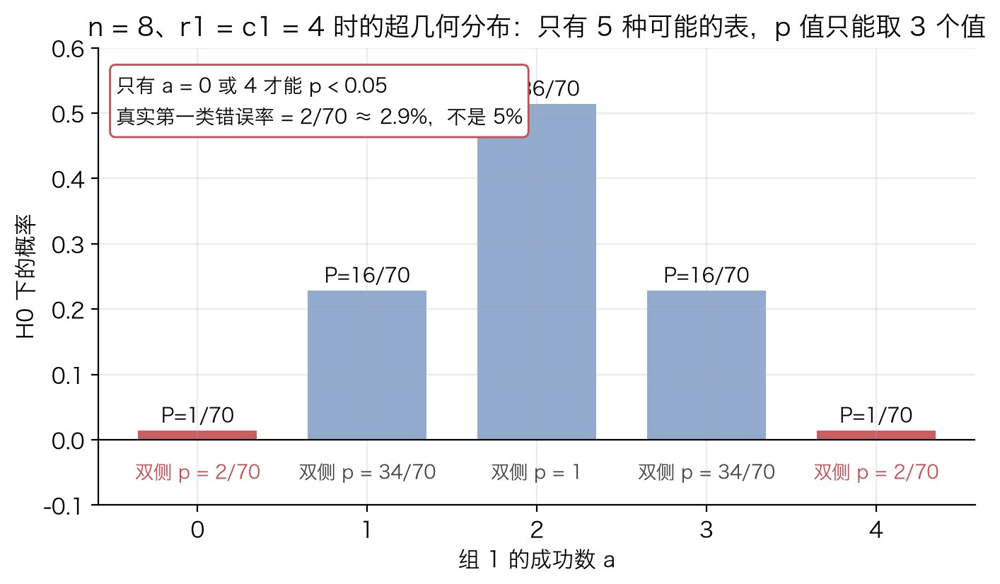

# Fisher 精确检验

## 解决什么问题

### 场景

两组人，每人一个二元结果（成功 / 失败）。把人数填进一张 $2\times 2$ 表：

```
              成功    失败    合计
  组 1         a       b      r1
  组 2         c       d      r2
  合计        c1      c2      n
```

组 1 的成功率是 $a/r_1$，组 2 的是 $c/r_2$。两个数不一样，问题来了：**它们不一样，是因为两组真有差别，还是因为人数有限、随机波动碰巧凑出来的？**

### 假设检验在做什么

假设检验的套路是反证法：先假设两组**没有**差别（原假设 $H_0$），然后问，在这个假设下，出现当前这么大或更大的差距的概率有多大。这个概率就是 $p$ 值。$p$ 很小，说明"没差别"这个假设下几乎看不到这样的数据，那就倾向于推翻它。

要算这个概率，得先知道：**如果 $H_0$ 成立，表里的数会怎么分布**。这一步是全部难点所在。

### 难在哪

$H_0$ 说两组成功率相同，但相同的那个值是多少，我们不知道。记这个共同的成功率为 $\pi$（这里 $\pi$ 是概率，不是圆周率）。$H_0$ 下每个格子的分布都带着 $\pi$，$\pi$ 不知道，概率就算不出具体数字。

传统做法（[卡方检验](chi-square-test.md)）用样本估一个 $\pi$ 代进去，再用大样本近似把误差压下去。样本小的时候这个近似撑不住。

Fisher 的办法不一样：**找一个角度让 $\pi$ 自己消失**，剩下的分布不含任何未知量，概率可以精确算出来。这就是"精确"两个字的意思。下面一步一步推出来。

## 原理

### 第 1 步：把原假设写成概率模型

两组的人数 $r_1$、$r_2$ 是设计决定的（A/B 分流时就定了），当成常数。假设每个人的结果相互独立，组 1 的人成功概率是 $\pi_1$，组 2 的是 $\pi_2$。

那么组 1 的成功数 $A$ 服从二项分布 $\mathrm{Bin}(r_1,\pi_1)$，组 2 的成功数 $C$ 服从 $\mathrm{Bin}(r_2,\pi_2)$，两者独立。原假设：

$$
H_0:\ \pi_1=\pi_2=\pi
$$

在 $H_0$ 下：

$$
P(A=a)=\binom{r_1}{a}\pi^{a}(1-\pi)^{r_1-a},\qquad
P(C=c)=\binom{r_2}{c}\pi^{c}(1-\pi)^{r_2-c}
$$

两个式子都带着未知的 $\pi$。直接拿它们算"当前这张表出现的概率"，算不出数字。

### 第 2 步：消掉未知的成功率 —— 把总成功数当成已知条件

关键观察：总成功数 $c_1=a+c$ 是我们**看得见**的。既然看得见，就可以问一个更窄的问题：**在总成功数正好是 $c_1$ 的前提下，这 $c_1$ 个成功有 $a$ 个落在组 1 的概率是多少？**

写成条件概率：

$$
P(A=a\mid A+C=c_1)=\frac{P(A=a,\ C=c_1-a)}{P(A+C=c_1)}
$$

分子：$A$、$C$ 独立，联合概率是两个二项概率的乘积。

分母：$A+C$ 是 $n=r_1+r_2$ 个人里的成功总数，每人独立、成功概率都是 $\pi$，所以 $A+C\sim\mathrm{Bin}(n,\pi)$。

把两个式子写全：

$$
\begin{aligned}
P(A=a\mid A+C=c_1)
&=\frac{\binom{r_1}{a}\pi^{a}(1-\pi)^{r_1-a}\cdot\binom{r_2}{c_1-a}\pi^{c_1-a}(1-\pi)^{r_2-c_1+a}}
       {\binom{n}{c_1}\pi^{c_1}(1-\pi)^{n-c_1}}\\[8pt]
&=\frac{\binom{r_1}{a}\binom{r_2}{c_1-a}}{\binom{n}{c_1}}
  \cdot\frac{\pi^{c_1}(1-\pi)^{n-c_1}}{\pi^{c_1}(1-\pi)^{n-c_1}}\\[8pt]
&=\frac{\binom{r_1}{a}\binom{r_2}{c_1-a}}{\binom{n}{c_1}}
\end{aligned}
$$

中间那一步是在合并分子里 $\pi$ 的指数：$a+(c_1-a)=c_1$，$(r_1-a)+(r_2-c_1+a)=r_1+r_2-c_1=n-c_1$。合并完发现分子分母里 $\pi$ 的部分**一模一样**，整个约掉。

约掉之后剩下的式子里没有 $\pi$。这就是 Fisher 精确检验的全部核心：**条件在总成功数上，未知参数消失，分布完全已知。** 剩下的分布叫超几何分布。

为什么会约掉？直觉是：在 $H_0$ 下每个人成功的机会一样，$\pi$ 只决定"总共有多少人成功"，不决定"成功的是哪些人"。一旦把总数固定住，$\pi$ 就没有话语权了，成功落在哪些人头上纯粹是均匀随机的。

### 第 3 步：换个角度看同一个式子 —— 抽球模型

第 2 步的结果可以完全不用二项分布、直接数出来。

想象 $n$ 个球，其中 $c_1$ 个白球（成功）、$c_2$ 个黑球（失败）。$H_0$ 说组别与成功无关，那么"组 1 的 $r_1$ 个人"就相当于从 $n$ 个球里**随机不放回地抓 $r_1$ 个**。组 1 里恰好有 $a$ 个白球的概率：

- 分母：从 $n$ 个球里抓 $r_1$ 个，共 $\binom{n}{r_1}$ 种抓法，每种等可能。
- 分子：$a$ 个白球要从 $c_1$ 个白球里选，$\binom{c_1}{a}$ 种；剩下 $r_1-a$ 个黑球要从 $c_2$ 个黑球里选，$\binom{c_2}{r_1-a}$ 种。

$$
P(A=a)=\frac{\binom{c_1}{a}\binom{c_2}{r_1-a}}{\binom{n}{r_1}}
$$

它和第 2 步的式子长得不一样，其实相等。把两边的组合数都展开成阶乘就看出来了。用 $b=r_1-a$、$c=c_1-a$、$d=r_2-c_1+a$ 记四个格子：

$$
\frac{\binom{r_1}{a}\binom{r_2}{c}}{\binom{n}{c_1}}
=\frac{\dfrac{r_1!}{a!\,b!}\cdot\dfrac{r_2!}{c!\,d!}}{\dfrac{n!}{c_1!\,c_2!}}
=\frac{r_1!\,r_2!\,c_1!\,c_2!}{n!\,a!\,b!\,c!\,d!}
$$

$$
\frac{\binom{c_1}{a}\binom{c_2}{b}}{\binom{n}{r_1}}
=\frac{\dfrac{c_1!}{a!\,c!}\cdot\dfrac{c_2!}{b!\,d!}}{\dfrac{n!}{r_1!\,r_2!}}
=\frac{r_1!\,r_2!\,c_1!\,c_2!}{n!\,a!\,b!\,c!\,d!}
$$

两条路走到同一个对称的式子：分子是四个边际的阶乘之积，分母是总数和四个格子的阶乘之积。行和列地位完全对等，这也解释了为什么"按行抽"和"按列抽"算出来一样。

### 第 4 步：a 能取哪些值

边际固定后，四个格子只剩一个自由度：知道 $a$，其余三个是 $b=r_1-a$、$c=c_1-a$、$d=r_2-c_1+a$。四个格子都不能是负数，所以：

- $b\ge 0\Rightarrow a\le r_1$；$c\ge 0\Rightarrow a\le c_1$
- $a\ge 0$；$d\ge 0\Rightarrow a\ge c_1-r_2$

合起来：

$$
\max(0,\ c_1-r_2)\ \le\ a\ \le\ \min(r_1,\ c_1)
$$

这个范围里的每个整数对应一张可能的表，把它们的概率都算出来就是完整的分布。样本小的时候可能的表就那么几张，这一点后面会用到。

### 第 5 步：从分布到 p 值

有了分布，$p$ 值就是"至少和观测一样极端的表"的概率之和。什么叫"至少一样极端"，分两种情况。

**单侧**。如果事先只关心"组 1 是否更好"（$H_1:\pi_1>\pi_2$），那么组 1 成功数越多越极端，$p$ 值就是 $a\ge a_{\text{obs}}$ 的所有表的概率之和：

$$
p_{\text{one-sided}}=\sum_{x=a_{\text{obs}}}^{\min(r_1,c_1)}P(A=x)
$$

**双侧**。如果事先不预设方向，"另一边"也要算进去。麻烦在于超几何分布一般不对称（只要 $r_1\ne r_2$ 或 $c_1\ne c_2$ 就不对称），"离期望同样远"在两边对应的概率不一样。通行的定义不看距离看概率：**把所有概率不大于观测表概率的表都算作"至少一样极端"**：

$$
p_{\text{two-sided}}=\sum_{x:\ P(A=x)\le P(A=a_{\text{obs}})}P(A=x)
$$

R 的 `fisher.test` 和 scipy 的 `fisher_exact` 默认用这个定义。另一种定义是把单侧 $p$ 乘 2（超过 1 就截成 1）。两种定义结果可能不同，报告时要写明用的哪种。

下图是 [Artora A/B 实验](../../case/artora-ab-satisfaction-fisher.md)那张表（$n=584$，$r_1=277$，$c_1=376$）在 $H_0$ 下 $A$ 的分布。期望是 $r_1c_1/n=178.3$，实际观测 $191$。红色柱是所有概率不超过 $P(A=191)$ 的表，左边一截右边一截，加起来就是双侧 $p=0.031$：


### 第 6 步："精确"的含义，以及它的代价

**精确**指的是：第 5 步算出的 $p$ 就是那个条件概率本身，没有任何近似环节，$n$ 是 8 还是 8 万都一样对。这是它和卡方的本质区别，卡方的 $p$ 是近似值，$n$ 小时近似误差大。

代价来自第 4 步：可能的表是**有限个、离散的**。$p$ 值只能取有限个值，不是 0 到 1 之间任意实数。

拿一个最小的例子看。$n=8$、$r_1=c_1=4$，$a$ 只能是 $0,1,2,3,4$，五张表的概率是 $\tfrac{1}{70},\tfrac{16}{70},\tfrac{36}{70},\tfrac{16}{70},\tfrac{1}{70}$（第 3 步的公式直接算，见最小算例）。双侧 $p$ 只可能是三个值：

| 观测的 $a$ | 概率不大于它的表 | 双侧 $p$ |
|---|---|---|
| 0 或 4 | $a=0,4$ | $2/70\approx 0.029$ |
| 1 或 3 | $a=0,1,3,4$ | $34/70\approx 0.486$ |
| 2 | 全部 | $1$ |



后果：按 $\alpha=0.05$ 判显著，只有 $a=0$ 或 $4$ 才过线，而这两张表在 $H_0$ 下的总概率是 $2/70\approx 2.9\%$，不是 5%。也就是说**真实的第一类错误率低于名义水平**，检验偏保守，该拒绝的时候有时拒绝不了（功效损失）。样本大了可取的 $p$ 值越来越密，这个差距就缩小到可以忽略。

还有一层代价：第 2 步把 $c_1$ 当成了固定的，但在 A/B 实验里 $c_1$ 并不是设计固定的，它自己也是随机的。条件化丢掉了 $c_1$ 里可能含有的一点信息。不做条件化、只固定两组人数 $r_1,r_2$ 的方法叫**无条件检验**（Barnard、Boschloo）：它们不消 $\pi$，而是对所有可能的 $\pi$ 取最坏情况，功效更高，计算重得多。scipy.stats 有 `barnard_exact` / `boschloo_exact`，R 有 `Exact` 包。Artora 那张表上两者的 $p$ 分别是 $0.0294$ 和 $0.0293$，都略小于 Fisher 的 $0.0307$，方向正好印证"条件检验偏保守"。

## 适用边界

- **任何样本量都成立**，小样本是它的主场。样本大时它和卡方给出几乎相同的 $p$，选哪个都行；Python 的 `math.comb` 是大整数运算，几百上千的 $n$ 不会溢出。
- **卡方的经验规则**：所有格子期望频数 $E\ge 5$。满足时无校正卡方与 Fisher 的 $p$ 很接近；Yates 校正版通常比 Fisher 还保守（$p$ 更大，属于过度校正），论贴近 Fisher，无校正卡方往往反而更近。**先算期望频数再决定"卡方不能用"**，别凭 $n$ 的大小拍脑袋。

下图把 Artora 那张表按两组实际比例等比例缩小，看三种检验的 $p$ 随总样本量怎么变：三条线在最小期望频数 $\ge 5$ 之后就贴在一起了，只有在最左边几十个样本的区域才明显分开。曲线有锯齿是因为缩放后人数要取整，不是方法本身的问题。


- **前提是观测相互独立**，这是第 1 步写模型时就用了的假设。同一个用户多次提交都算进去，独立性就破了，$p$ 会偏乐观。
- **它只回答"差异是否为零"，不回答"差多少"。** 汇报要带效应量：比例差 $\hat p_1-\hat p_2$ 加置信区间（两比例差用 Newcombe 法比 Wald 法稳）。
- **反复窥探会毁掉它。** 每天跑一次、$p<0.05$ 就停，第一类错误率远超 $5\%$。Fisher 不解决这个；要么预定样本量到了再看，要么用序贯检验。
- 超过 $2\times 2$ 的 $r\times c$ 表有 Fisher–Freeman–Halton 推广，思路一样（固定所有边际，枚举所有表）；配对数据（同一批人前后测）用 McNemar，不是 Fisher。

## 最小算例

### 手算：n = 8 的玩具表

表 $\begin{pmatrix}3&1\\1&3\end{pmatrix}$，$r_1=r_2=c_1=c_2=4$，$n=8$。用第 3 步的公式：

$$
P(A=3)=\frac{\binom{4}{3}\binom{4}{1}}{\binom{8}{4}}=\frac{4\times 4}{70}=\frac{16}{70}
$$

五张表：$P(0)=\tfrac{1\times 1}{70}$，$P(1)=\tfrac{4\times 4}{70}$，$P(2)=\tfrac{6\times 6}{70}$，$P(3)=\tfrac{16}{70}$，$P(4)=\tfrac{1}{70}$，加起来正好是 $70/70=1$。

观测 $a=3$：

- 单侧：$P(3)+P(4)=\tfrac{17}{70}\approx 0.243$
- 双侧：概率 $\le\tfrac{16}{70}$ 的表是 $a=0,1,3,4$，$P(0)+P(1)+P(3)+P(4)=\tfrac{34}{70}\approx 0.486$

### 代码

零依赖实现，双侧用"概率不大于观测表概率之和"的定义：

```python
from math import comb

def fisher_exact(a, b, c, d):
    """2×2 表 [[a, b], [c, d]]。返回 (单侧 P(A>=a), 双侧 p)。"""
    n, r1, c1 = a + b + c + d, a + b, a + c
    pmf = lambda x: comb(r1, x) * comb(n - r1, c1 - x) / comb(n, c1)
    lo, hi = max(0, c1 - (n - r1)), min(r1, c1)
    p_obs = pmf(a)
    greater = sum(pmf(x) for x in range(a, hi + 1))
    two_sided = sum(pmf(x) for x in range(lo, hi + 1) if pmf(x) <= p_obs * (1 + 1e-7))
    return greater, two_sided
```

`pmf` 就是第 2 步的式子，`lo`、`hi` 就是第 4 步的范围，两个求和就是第 5 步的两种 $p$。

```python
>>> fisher_exact(3, 1, 1, 3)
(0.24285714285714285, 0.4857142857142857)
>>> fisher_exact(191, 86, 185, 122)      # Artora 表
(0.01756679091466034, 0.030692257982606948)
```

真实数据的用法见 [Artora 识别优化 A/B](../../case/artora-ab-satisfaction-fisher.md)。图由 `tools/figures/fisher-exact-test.py` 生成。
