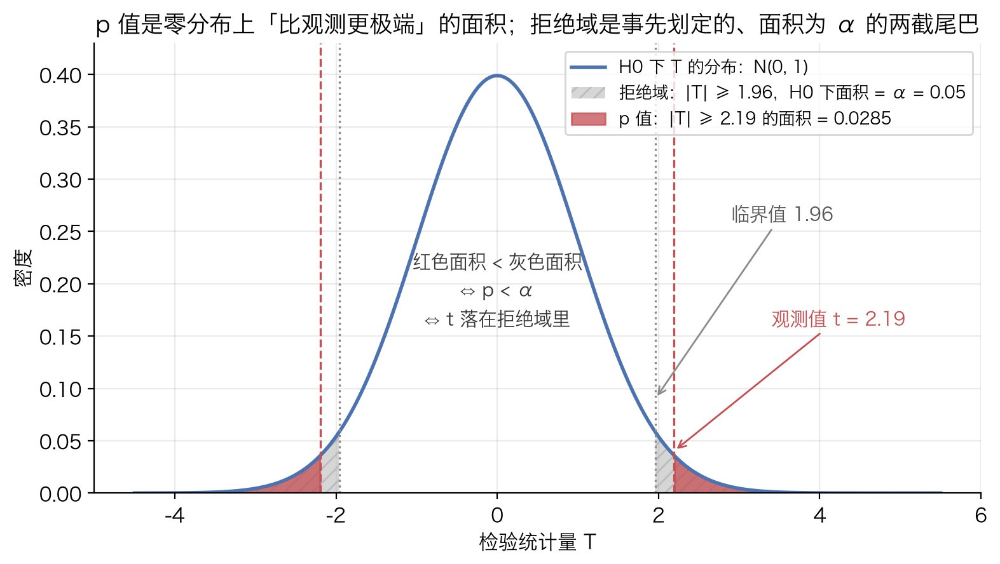
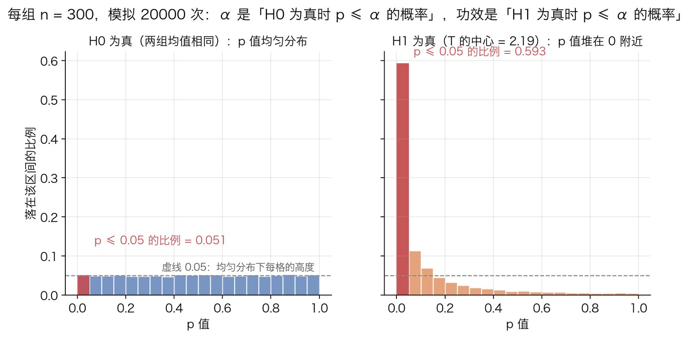
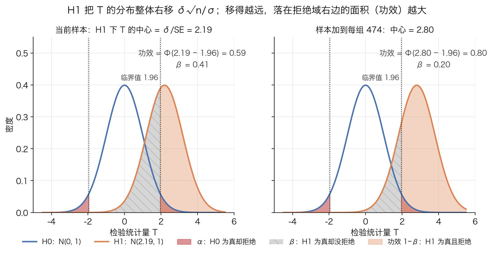
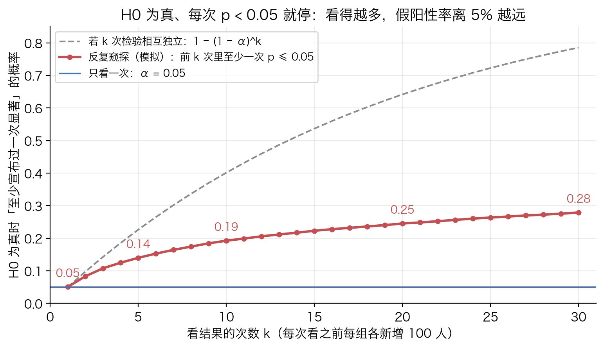

# 假设检验与 p 值

## 解决什么问题

### 场景

手里有一批带噪声的数据，要做一个二元决策。典型的形状：两组样本，各几百人，成功率一个 $69\%$、一个 $60\%$，问"新版本是不是真的更好"。答案只有两个：是，上线；不是，回炉。数据却不会直接给出是或否，它给的是一个差值，而这个差值哪怕两组背后完全一样也不会正好是零。问题于是变成：**观测到的差距，是两组背后的真实差异，还是每组只抽了几百人、纯粹随机分配就能凑出来的波动？**

### 为什么不能直接看差值大小

差值本身没有尺度。设两组成功率都是 $\pi$，每组 $n$ 人，两组样本比例之差在"没有真实差异"时的标准差是 $\sqrt{\pi(1-\pi)\cdot 2/n}$（推导见第 5 步）。取 $\pi=0.64$：

- 每组 $n=300$：标准差 $0.039$，也就是 $3.9$ 个百分点。差 $4$ 个百分点只是**一个**标准差，随机分配三次里就有一次能凑出来。
- 每组 $n=30000$：标准差 $0.0039$。同样差 $4$ 个百分点是**十个**标准差，随机分配几乎不可能凑出来。

同一个数字，意义完全不同。噪声的尺度随 $1/\sqrt n$ 缩小，所以判断一个差值"大不大"必须先回答"在什么都没有的时候，差值通常会晃到多大"。假设检验就是把这句话做成一套可执行、可核查的流程：先写下"什么都没有"这个假设，算出它之下数据会怎么晃，再看观测值落在这个晃动范围的什么位置。

### 这篇讲什么

这篇讲的是所有检验**共用**的框架，不讲某个具体检验。[z 检验](z-test.md)、[卡方检验](chi-square-test.md)、[Fisher 精确检验](fisher-exact-test.md)三篇是同一个框架在不同数据形状下的实例，它们的区别只在第 2 步"用什么统计量、零分布怎么算"，其余步骤一模一样。先读这篇，再读具体检验。

## 原理

### 第 1 步：两个假设，为什么原假设总是"没有效应"

把问题写成两个互补的命题：

$$
H_0:\ \pi_1=\pi_2\qquad\text{对}\qquad H_1:\ \pi_1\ne\pi_2
$$

$H_0$ 叫**原假设**（null hypothesis），内容永远是"没有效应、没有差异、没有关联"；$H_1$ 叫**备择假设**，是 $H_0$ 的补集。为什么 $H_0$ 总是"没有"这一边，而不是反过来先假设"有效应"？

因为要算"数据在这个假设下会怎么晃"，假设必须把数据的概率模型定死。"两组成功率相同"只剩一个未知数（共同的 $\pi$），它可以用样本估出来（z 检验、卡方）或者用条件化消掉（Fisher）；"两组成功率不同"却是无穷多个模型的集合，差 1 个百分点是不同，差 10 个也是不同，没有哪一个分布能代表它。**能算出数据分布的只有 $H_0$，所以推理只能从 $H_0$ 出发。**

推理的结构是反证法的概率版本：

1. 假设 $H_0$ 成立。
2. 在这个假设下算出观测数据（或比它更极端的数据）出现的概率。
3. 如果这个概率很小，说明"$H_0$ 成立"和"看到这样的数据"两件事很难同时发生。数据已经看到了，那就放弃 $H_0$。

和真正的反证法不同的是，这里得到的不是矛盾而是"小概率"，所以结论带着一个错误率（第 4 步的 $\alpha$）。这个结构决定了两件事，后面会反复用到：

- **不对称**。我们能拒绝 $H_0$，但从来不能"证明" $H_0$。概率不小时，结论只是"数据和 $H_0$ 不矛盾"，可能是真的没差异，也可能是样本太少、什么都看不出来。要区分这两种情况得看功效（第 5 步）。
- **条件的方向**。整个推理算的是"$H_0$ 成立时数据有多奇怪"，不是"看到数据后 $H_0$ 有多可能"。这两个条件概率的方向相反，不能互换（第 3 步）。

### 第 2 步：检验统计量与零分布

原始数据是几百个 0/1，没法直接判断"奇不奇怪"。要先把它们压成**一个数** $T$，叫检验统计量。对 $T$ 的要求有两条：

1. $T$ 度量数据偏离 $H_0$、朝 $H_1$ 方向走了多远：$|T|$ 越大，越不像 $H_0$。
2. **$H_0$ 成立时 $T$ 的分布必须能算出来**。这个分布叫**零分布**（null distribution），它就是"什么都没有的时候 $T$ 会晃到哪"的完整描述。

第二条是难点，三个常用检验各有各的办法：

| 检验 | 统计量 $T$ | 零分布 | 怎么做到"能算" |
|---|---|---|---|
| [两比例 z 检验](z-test.md) | $z=\dfrac{\hat p_1-\hat p_2}{\sqrt{\bar p(1-\bar p)(1/n_1+1/n_2)}}$ | $N(0,1)$ | [中心极限定理](../probability/central-limit-theorem.md)说样本比例近似[正态](../probability/normal-distribution.md)；未知的 $\pi$ 用合并比例 $\bar p$ 代替 |
| [卡方检验](chi-square-test.md) | $\chi^2=\sum\dfrac{(O-E)^2}{E}=z^2$ | [卡方分布](../probability/chi-square-distribution.md) $\chi^2_{(1)}$ | 标准正态的平方按定义服从卡方分布 |
| [Fisher 精确检验](fisher-exact-test.md) | 表格左上角的计数 $a$ | [超几何分布](../probability/hypergeometric-distribution.md) | 把行和、列和都固定住，未知的 $\pi$ 被条件化消掉，分布里不再有任何未知数 |

三者都是"数据偏离 $H_0$ 的程度"，只是量法和精确程度不同。

为什么 $z$ 要除以分母：分子 $\hat p_1-\hat p_2$ 就是"解决什么问题"里那个没有尺度的差值，分母是它在 $H_0$ 下的标准差。除完之后 $z$ 的含义是"差了多少个标准差"，它的零分布是 $N(0,1)$，**和 $n$ 无关**。这样一张标准正态表就能服务所有样本量，不用为每个 $n$ 单独造一张。

### 第 3 步：p 值的定义，以及它不是什么

有了零分布，就能给观测值定位。**$p$ 值的定义**：

$$
p=P\big(T\ \text{至少和观测值一样极端}\ \big|\ H_0\big)
$$

"极端"由 $H_1$ 决定。$H_1$ 是 $\pi_1\ne\pi_2$ 时两个方向都算，于是"至少一样极端"就是 $|T|\ge|t_{\text{obs}}|$。对 $z$ 检验，利用标准正态的对称性：

$$
p=P(|Z|\ge|t_{\text{obs}}|)=P(Z\ge|t_{\text{obs}}|)+P(Z\le-|t_{\text{obs}}|)=2\big(1-\Phi(|t_{\text{obs}}|)\big)
$$

$\Phi$ 是标准正态的累积分布函数。下图用 $t_{\text{obs}}=2.19$ 画出来：红色是 $p$ 值，两截尾巴加起来 $0.0285$。



用人话读 $p=0.0285$："如果两组其实一样，光靠随机分配就出现当前这么大或更大差距的概率，大约是 $2.85\%$。"这句话的每个成分都要留着：**条件是 $H_0$ 成立**，**事件是至少这么极端**。去掉任何一个，意思就变了。下面三个常见的误读，每个都是丢掉了其中一个成分：

**它不是 $H_0$ 为真的概率。** $p$ 是 $P(\text{数据这么极端}\mid H_0)$，人们想要的是 $P(H_0\mid\text{数据})$，条件的方向反了。两者用贝叶斯公式联系：

$$
P(H_0\mid\text{数据})=\frac{P(\text{数据}\mid H_0)\,P(H_0)}{P(\text{数据}\mid H_0)\,P(H_0)+P(\text{数据}\mid H_1)\,P(H_1)}
$$

右边需要先验 $P(H_0)$ 和 $H_1$ 下数据的概率，这两样 $p$ 值里都没有。同一个 $p=0.03$，在"一百个想法里通常只有一个靠谱"的场合和"一半想法靠谱"的场合，对应的 $P(H_0\mid\text{数据})$ 相差很远。

**它不是效应大小。** 看 $z$ 的结构：分母是 $\sqrt{\bar p(1-\bar p)(1/n_1+1/n_2)}$，随 $1/\sqrt n$ 缩小，所以等 $n$ 时 $z=\hat\delta\sqrt n/\sigma_0$（$\hat\delta$ 是观测差，$\sigma_0=\sqrt{2\bar p(1-\bar p)}$ 是差值的噪声尺度，即第 5 步的 $\sigma_0$；它是单个观测标准差的 $\sqrt2$ 倍）。同样的 $\hat\delta$，样本翻四倍，$z$ 翻一倍，$p$ 小得多，效应却一点没变。$p$ 把"差多少"和"有多少数据"搅在了一起，要看效应得看 $\hat\delta$ 和它的置信区间（第 7 步）。

**它不是重复实验会得到同样结论的概率。** 重复一次能不能再显著，取决于真实的 $\delta$ 和样本量，这叫功效（第 5 步），和这一次的 $p$ 不是一回事。如果真实效应恰好等于这次观测到的效应，重复实验的功效近似 $\Phi(t_{\text{obs}}-z_{\alpha/2})$；$t_{\text{obs}}$ 刚过 $1.96$ 时，这个值只有 $50\%$ 上下，$t_{\text{obs}}=2.19$ 对应 $0.59$。"$p=0.03$ 所以 $97\%$ 能复现"完全是错的。

### 第 4 步：显著性水平与拒绝域

$p$ 值是连续量，决策却要二元。办法是**在看数据之前**定一个门槛 $\alpha$，叫显著性水平，惯例 $0.05$。它的含义：**$H_0$ 成立时，我们愿意接受的"误拒绝"的概率上限。**

由 $\alpha$ 可以在零分布上划出一块**拒绝域** $R$，满足 $P(T\in R\mid H_0)=\alpha$。双侧时它是两截对称的尾巴：

$$
R=\{t:\ |t|\ge z_{\alpha/2}\},\qquad \Phi(z_{\alpha/2})=1-\tfrac{\alpha}{2}
$$

$\alpha=0.05$ 时 $z_{0.025}=1.960$。上图灰色斜线就是它。

**"$p<\alpha$ 则拒绝"和"$t_{\text{obs}}$ 落在 $R$ 里则拒绝"是同一条规则。** 证明：$p(t)=2(1-\Phi(|t|))$，$\Phi$ 严格递增，所以 $p$ 是 $|t|$ 的严格递减函数。在边界 $|t|=z_{\alpha/2}$ 处代入，$p=2\big(1-(1-\alpha/2)\big)=\alpha$。递减函数上，$p<\alpha$ 当且仅当 $|t|>z_{\alpha/2}$，也就是 $t$ 在拒绝域里。两种说法一个比面积（红色比灰色小），一个比位置（观测值比临界值靠外），等价。

**为什么 $\alpha$ 就是第一类错误率。** 第一类错误是"$H_0$ 成立却拒绝了它"，概率 $P(T\in R\mid H_0)$，按 $R$ 的构造这正好等于 $\alpha$。换个角度看同一件事：$H_0$ 成立时 $p$ 值本身服从 $[0,1]$ 上的均匀分布，因为对任意 $u\in[0,1]$，

$$
P(p\le u\mid H_0)=P\big(|T|\ge z_{u/2}\mid H_0\big)=u
$$

第二个等号就是拒绝域的构造反过来用。于是 $P(p\le\alpha\mid H_0)=\alpha$：**$\alpha$ 是"$H_0$ 为真时 $p\le\alpha$ 的概率"**，不多不少。下图左边是模拟验证（两组各 $300$ 个连续观测，重复 $20000$ 次），$p$ 值均匀铺满 $[0,1]$，落在 $[0,0.05]$ 的比例 $0.051$；右边是 $H_1$ 成立时的样子，$p$ 堆向 $0$，落在 $[0,0.05]$ 的比例就是功效：



一个细节：$T$ 是离散的时候（Fisher），$p$ 只能取有限个值，$P(p\le\alpha\mid H_0)\le\alpha$，检验偏保守。

**为什么必须事先定。** $\alpha$ 是对流程长期行为的承诺："什么都没有的时候，一百次里我最多误报五次"。看完 $p=0.0285$ 再决定用 $\alpha=0.03$，承诺就作废了，因为门槛已经是数据的函数。$0.05$ 只是惯例，不是定律；该多严取决于误报的代价，代价大就用 $0.01$。

### 第 5 步：两类错误与功效

把真相和决策交叉，四种情况：

| | 不拒绝 $H_0$ | 拒绝 $H_0$ |
|---|---|---|
| **$H_0$ 为真**（没效应） | 正确 | 第一类错误，概率 $\alpha$ |
| **$H_1$ 为真**（有效应） | 第二类错误，概率 $\beta$ | 正确，概率 $1-\beta$，叫**功效** |

$\alpha$ 由我们定，$\beta$ 却随真实效应 $\delta$ 和样本量 $n$ 变：效应大、样本多，$\beta$ 小。下面用两比例 $z$ 检验把功效推出来，每组 $n$ 人。

**$H_0$ 下。** 记 $D=\hat p_1-\hat p_2$。每个观测是成功概率 $\pi$ 的 0/1 变量，方差 $\pi(1-\pi)$；$\hat p_i$ 是 $n$ 个的平均，方差 $\pi(1-\pi)/n$；两组独立，差的方差是方差之和：

$$
\operatorname{Var}(D)=\frac{2\pi(1-\pi)}{n}\equiv\frac{\sigma_0^2}{n},\qquad \sigma_0^2=2\pi(1-\pi)
$$

$D$ 的期望是 $0$。标准化得 $T=D\big/(\sigma_0/\sqrt n)$，近似 $N(0,1)$。（"解决什么问题"里的 $\sqrt{\pi(1-\pi)\cdot 2/n}$ 就是 $\sigma_0/\sqrt n$。）

**$H_1$ 下。** 真实成功率是 $\pi_1$、$\pi_2$，差 $\delta=\pi_1-\pi_2>0$。这时 $D$ 的期望是 $\delta$，方差变成

$$
\operatorname{Var}(D)=\frac{\pi_1(1-\pi_1)+\pi_2(1-\pi_2)}{n}\equiv\frac{\sigma_1^2}{n}
$$

$T$ 的定义没变（分母仍是 $H_0$ 下的 $\sigma_0/\sqrt n$，因为检验是按 $H_0$ 算的）。但 $H_1$ 下没有共同的 $\pi$，这个 $\sigma_0$ 该取什么？看检验实际用的分母：它用的是合并比例 $\bar p$，等 $n$ 时 $\bar p$ 收敛到 $(\pi_1+\pi_2)/2$，所以这里的 $\sigma_0=\sqrt{2\bar p(1-\bar p)}$，$\bar p=(\pi_1+\pi_2)/2$，和后面样本量公式里的记号一致。于是 $H_1$ 下

$$
T=\frac{D}{\sigma_0/\sqrt n}\ \sim\ N\!\left(\frac{\delta\sqrt n}{\sigma_0},\ \frac{\sigma_1^2}{\sigma_0^2}\right)
$$

人话：$H_1$ 把 $T$ 的分布**整体向右平移** $\delta\sqrt n/\sigma_0$，宽度几乎不变（$\sigma_1/\sigma_0$ 接近 $1$）。平移量是"信号除以噪声"：效应 $\delta$ 大、样本 $n$ 多、噪声尺度 $\sigma_0$ 小，都让它变大。



**功效。** 拒绝的条件是 $|T|\ge z_{\alpha/2}$，功效是 $H_1$ 下这件事的概率：

$$
1-\beta=P_{H_1}\big(T\ge z_{\alpha/2}\big)+P_{H_1}\big(T\le-z_{\alpha/2}\big)
$$

$\delta>0$ 时 $T$ 的分布中心在右边，落到 $-z_{\alpha/2}$ 左边的概率极小（最小算例的数字下是 $1.5\times 10^{-5}$），**忽略第二项**。第一项把 $T$ 按 $H_1$ 下的均值和标准差标准化：

$$
P_{H_1}\big(T\ge z_{\alpha/2}\big)
=P\!\left(Z\ge\frac{z_{\alpha/2}-\delta\sqrt n/\sigma_0}{\sigma_1/\sigma_0}\right)
=1-\Phi\!\left(\frac{z_{\alpha/2}\,\sigma_0-\delta\sqrt n}{\sigma_1}\right)
=\Phi\!\left(\frac{\delta\sqrt n-z_{\alpha/2}\,\sigma_0}{\sigma_1}\right)
$$

最后一步用了 $1-\Phi(x)=\Phi(-x)$。$\sigma_0$ 和 $\sigma_1$ 差多少可以精确算出来：把 $\pi_1=\bar p+\delta/2$、$\pi_2=\bar p-\delta/2$ 代入 $\sigma_1^2$，

$$
\sigma_1^2=\pi_1+\pi_2-(\pi_1^2+\pi_2^2)=2\bar p-\left(2\bar p^2+\frac{\delta^2}{2}\right)=2\bar p(1-\bar p)-\frac{\delta^2}{2}
$$

即恒等式 $\sigma_0^2-\sigma_1^2=\delta^2/2$（补算，用最小算例的数字核对：$0.4573-0.4536=0.0038$，$0.0869^2/2=0.0038$）。所以 $\delta^2\ll 2\sigma_0^2$ 时 $\sigma_0\approx\sigma_1\equiv\sigma$，得到常用的近似式：

$$
1-\beta\approx\Phi\!\left(\frac{\delta\sqrt n}{\sigma}-z_{\alpha/2}\right)
$$

读法：功效由"平移量减门槛"决定。平移量 $\delta\sqrt n/\sigma$ 是上图 $H_1$ 曲线的中心，门槛 $z_{\alpha/2}$ 是虚线，功效是 $H_1$ 曲线在虚线右边的面积。上图左右两边只差一个 $n$：中心从 $2.19$ 移到 $2.80$，功效从 $0.59$ 涨到 $0.80$。把 $\alpha$ 调小会让门槛右移、功效下降，这就是 $\alpha$ 和 $\beta$ 在固定 $n$ 下的此消彼长；两者都要小，只能加 $n$。

**反解样本量。** 事先定要求的功效 $1-\beta$（惯例 $80\%$），记 $z_\beta=\Phi^{-1}(1-\beta)$（$\beta=0.2$ 时 $z_\beta=0.8416$）。令近似式等于 $1-\beta$：

$$
\frac{\delta\sqrt n}{\sigma}-z_{\alpha/2}=z_\beta
\quad\Longrightarrow\quad
\sqrt n=\frac{(z_{\alpha/2}+z_\beta)\,\sigma}{\delta}
\quad\Longrightarrow\quad
n=\left(\frac{(z_{\alpha/2}+z_\beta)\,\sigma}{\delta}\right)^2
$$

这是每组的样本量。$n\propto 1/\delta^2$：想检出的差减半，样本量翻四倍。不合并 $\sigma_0$、$\sigma_1$ 时，同样的步骤从精确式出发得到

$$
n=\left(\frac{z_{\alpha/2}\,\sigma_0+z_\beta\,\sigma_1}{\delta}\right)^2,\qquad
\sigma_0=\sqrt{2\bar p(1-\bar p)},\quad
\sigma_1=\sqrt{\pi_1(1-\pi_1)+\pi_2(1-\pi_2)}
$$

这正是 [Artora A/B 的 case](../../case/artora-ab-satisfaction-fisher.md) 补算 3 用的公式：$z_{0.975}\sqrt{2\bar p(1-\bar p)}$ 是 $z_{\alpha/2}\sigma_0$，$z_{0.8}\sqrt{p_0(1-p_0)+p_1(1-p_1)}$ 是 $z_\beta\sigma_1$。记号上 case 按累积概率给 $z$ 标下标（$z_{0.975}$、$z_{0.8}$），这里按尾概率标（$z_{0.025}$、$z_{0.2}$），指的是同两个数 $1.960$ 和 $0.8416$。

一个陷阱：实验做完后把观测到的 $\hat\delta$ 代进功效公式，得到的是 $\Phi(t_{\text{obs}}-z_{\alpha/2})$，它只是 $p$ 值的另一种写法，不含任何新信息，这叫"事后功效"，没有用。功效要在实验前算，代入的 $\delta$ 是"我在乎的最小效应"，不是数据说了什么。

### 第 6 步：单侧与双侧

前面默认 $H_1$ 是 $\pi_1\ne\pi_2$，两个方向都算极端，叫**双侧检验**。如果方向事先就定了，$H_1$ 是 $\pi_1>\pi_2$，"至少一样极端"只剩一个方向：

$$
p_{\text{单侧}}=P(T\ge t_{\text{obs}}\mid H_0)=1-\Phi(t_{\text{obs}}),\qquad
p_{\text{双侧}}=2\big(1-\Phi(|t_{\text{obs}}|)\big)
$$

零分布对称时单侧 $p$ 正好是双侧的一半；拒绝域从 $|T|\ge 1.960$ 变成 $T\ge 1.645$（$z_{0.05}$）。零分布不对称时（Fisher 的超几何分布）双侧 $p$ 不是简单的两倍，而是把另一侧概率不超过观测表的那些表加进来，case 里的 $0.0307$ 对 $0.0176$ 就是这样。

**什么时候能用单侧。** 两个条件同时满足：方向在看数据之前就定了；另一个方向的结果和"没差异"处理方式相同，比如"新版本显著更差"和"没差别"都一样不上线。看完数据发现试验组高、于是选"试验组更高"这一侧，是最常见的作弊：这时你实际用的拒绝域是"哪边高就拒哪边"，也就是 $|T|\ge z_\alpha$，它在 $H_0$ 下的概率是 $2\alpha$。名义上 $0.05$，实际 $0.10$。拿不准就用双侧，它是默认。

### 第 7 步：置信区间与检验的对偶

检验回答"差异是不是零"，置信区间回答"差异在哪个范围"。两者是同一个不等式的两种读法。

设要估的参数是 $\theta$（比如 $\pi_1-\pi_2$），估计值 $\hat\theta$，标准误 $\text{SE}$。对任意一个候选真值 $\theta_0$ 做检验 $H_0:\theta=\theta_0$，不拒绝的条件是：

$$
\frac{|\hat\theta-\theta_0|}{\text{SE}}\le z_{\alpha/2}
\iff
\hat\theta-z_{\alpha/2}\,\text{SE}\ \le\ \theta_0\ \le\ \hat\theta+z_{\alpha/2}\,\text{SE}
$$

右边那个区间就是 $1-\alpha$ 置信区间。所以**置信区间是"数据不拒绝的所有 $\theta_0$ 的集合"**。取 $\theta_0=0$：

$$
0\notin\big[\hat\theta\pm z_{\alpha/2}\,\text{SE}\big]\iff\text{拒绝 }H_0:\theta=0
$$

区间不含 $0$ 和 $p<\alpha$ 是一回事。覆盖率也由此而来：真值 $\theta$ 落在区间里，等价于"对真值做检验时没拒绝"，而对真值做检验时 $H_0$ 是对的，不拒绝的概率是 $1-\alpha$。

两点补充。一，对两比例，检验的 $\text{SE}$ 用合并比例 $\bar p$（按 $H_0$ 算），区间的 $\text{SE}$ 用各自的 $\hat p_1$、$\hat p_2$（不再假设相等），两者不完全相同，所以等价关系是近似的；Wilson / Newcombe 这类区间在小样本和比例靠近 $0$、$1$ 时覆盖率比 $\hat\theta\pm z\,\text{SE}$ 更准，case 用的是它。二，区间比 $p$ 多给了两样 $p$ 给不了的东西：效应有多大、这个估计有多不稳。汇报要带区间。

### 第 8 步：常见误用及其数学后果

**反复窥探。** 实验一边跑一边看，每天算一次 $p$，哪天 $p<0.05$ 就宣布显著。每一次看都是一次跨过 $\pm 1.96$ 的机会，看得越多，$H_0$ 成立时至少跨过一次的概率越大。模拟（固定种子，$20000$ 次）：两组成功率都是 $0.6$，每次看之前每组各新增 $100$ 人，最多看 $30$ 次，累计"至少宣布过一次显著"的概率：

| 看的次数 $k$ | 1 | 2 | 3 | 5 | 10 | 20 | 30 |
|---|---|---|---|---|---|---|---|
| 反复窥探（模拟） | $0.051$ | $0.083$ | $0.108$ | $0.140$ | $0.192$ | $0.245$ | $0.279$ |
| $k$ 次独立检验 $1-(1-\alpha)^k$ | $0.050$ | $0.098$ | $0.143$ | $0.226$ | $0.401$ | $0.642$ | $0.785$ |



看五次，名义 $5\%$ 的假阳性率已经是 $14\%$；看三十次接近 $28\%$。它比独立检验那条曲线升得慢，因为相邻两次看的是同一批数据加一点新数据，$T$ 高度相关；但它不封顶，看的次数不受限时这个概率趋向 $1$（$T$ 是随机游走除以 $\sqrt n$，由重对数律它迟早会越过任何固定门槛）。解药有两种：事先用第 5 步定好 $n$，到了只看一次（case 补算 3 的做法）；或者用序贯设计（alpha spending，如 O'Brien–Fleming、Pocock），把每次看的门槛抬高，让总的假阳性率仍是 $\alpha$。

**多重比较。** 做 $m$ 个相互独立的检验、全部 $H_0$ 都成立，至少一个 $p\le\alpha$ 的概率是

$$
1-(1-\alpha)^m
$$

$m=5$ 时 $0.226$，$m=10$ 时 $0.401$，$m=20$ 时 $0.642$。把 A/B 结果按十个维度切片、只汇报显著的那一片，就是这个。Bonferroni 校正：每个检验用 $\alpha/m$。由并集上界 $P(\bigcup A_i)\le\sum P(A_i)=m\cdot\alpha/m=\alpha$，总假阳性率不超过 $\alpha$，而且不需要独立性。代价是每个检验的功效下降。

**显著不等于重要。** $z=\hat\delta/\text{SE}$ 而 $\text{SE}\propto 1/\sqrt n$，所以只要 $\hat\delta\ne 0$，$n$ 够大时 $z$ 想多大有多大，任何非零的差异都会显著。反过来 $n$ 很小时不显著也说明不了没差异。$p$ 回答的是"差异是否可区分于零"，"值不值得做"要看 $\hat\delta$ 和置信区间的范围是否落在有业务意义的区域。

## 适用边界

- **$p$ 值只在零分布算对了的时候有意义。** 零分布的推导用了三个前提：观测相互独立（第 5 步的方差公式），近似足够好（[中心极限定理](../probability/central-limit-theorem.md)要求每格期望频数够大，不够就换 [Fisher](fisher-exact-test.md)），分组是随机的（否则 $\pi_1=\pi_2$ 不是"什么都没有"的正确写法，混杂因素本身就能造出差异）。同一用户多次计数、按天聚合后再当独立样本、非随机分组，都会让 $p$ 变成一个没有意义的数。
- **$p$ 是连续证据，$\alpha$ 是决策门槛。** $0.049$ 和 $0.051$ 的证据强度没有区别，汇报要给 $p$ 本身、效应和区间，不只给"显著 / 不显著"。$\alpha$ 是按误报代价定的政策，不是真理的分界线。
- **不拒绝不等于 $H_0$ 成立。** 只有配合功效才能解读：在你在乎的最小效应下功效有 $80\%$ 以上，不显著才说明"即使有效应也很小"；功效只有 $20\%$，不显著只说明数据不够。
- **它回答的问题很窄。** 只回答"两组是否可区分"，不回答"差多少"（看区间）、"为什么"（一次改多处的实验分不出是哪一处起作用）、"下个月还成立吗"（外推是另一个问题）。
- **贝叶斯是另一条路。** 它直接算 $P(H_0\mid\text{数据})$，但要给先验；频率派的 $p$ 值不给先验，回答的是另一个问题。两者不冲突，别把一个的答案当成另一个的。
- **具体用哪个检验，看第 2 步。** 期望频数够大用 $z$ 或卡方（同一个 $p$，$\chi^2=z^2$），不够用 Fisher；细节在各自的笔记里。

## 最小算例

### 把一组数据走一遍框架

用 [Artora A/B 的 case](../../case/artora-ab-satisfaction-fisher.md) 的表：试验组 $191/277=0.6895$，对照组 $185/307=0.6026$，观测差 $\hat\delta=0.0869$（$8.69$ 个百分点）。

**第 1 步。** $H_0:\pi_b=\pi_a$；$H_1:\pi_b\ne\pi_a$。方向没有事先登记，用双侧。

**第 2 步。** 合并比例 $\bar p=376/584=0.6438$。$H_0$ 下差值的标准误

$$
\text{SE}_0=\sqrt{0.6438\times 0.3562\times\left(\frac{1}{277}+\frac{1}{307}\right)}=0.03968
$$

$z=0.0869/0.03968=2.190$。观测差是 $H_0$ 下噪声的 $2.19$ 个标准差。

**第 3 步。** $p=2\big(1-\Phi(2.190)\big)=2\times(1-0.98574)=0.0285$。

**第 4 步。** $\alpha=0.05$，临界值 $z_{0.025}=1.960$。$2.190>1.960$，拒绝 $H_0$；等价地 $0.0285<0.05$。

**第 5 步，当前样本的功效。** 假设真实差就是 $0.0869$。$H_1$ 下的标准误

$$
\text{SE}_1=\sqrt{\frac{0.6895\times 0.3105}{277}+\frac{0.6026\times 0.3974}{307}}=0.03941
$$

代入精确式（$\delta\sqrt n/\sigma_0$ 写成 $\delta/\text{SE}_0$，$\sigma_1/\sqrt n$ 写成 $\text{SE}_1$）：

$$
1-\beta=\Phi\!\left(\frac{0.0869-1.960\times 0.03968}{0.03941}\right)=\Phi(0.232)=0.592
$$

忽略的另一尾是 $\Phi\big((-0.0869-0.0778)/0.03941\big)=1.5\times 10^{-5}$。近似式 $\Phi(2.190-1.960)=\Phi(0.230)=0.591$，几乎一样。这是事后功效，只是 $p$ 值的另一种写法；它的用处是说明：**即使真实效应就有这么大，这个样本量也只有六成把握检出来**，这次刚好过线有运气成分。

**第 5 步，要 $80\%$ 功效需要多少样本。** 用 $p_0=0.6026$、$p_1=0.6895$ 做设计值：$\bar p=(0.6026+0.6895)/2=0.6461$，$\sigma_0=\sqrt{2\times 0.6461\times 0.3539}=0.6763$，$\sigma_1=\sqrt{0.6026\times 0.3974+0.6895\times 0.3105}=0.6735$，

$$
n=\left(\frac{1.960\times 0.6763+0.8416\times 0.6735}{0.0869}\right)^2=\left(\frac{1.3255+0.5668}{0.0869}\right)^2=21.78^2=474
$$

每组 $474$，和 case 补算 3 一致。合并 $\sigma$ 的近似式给 $\big((1.960+0.8416)\times 0.6763/0.0869\big)^2=475$。读数时两组是 $277$ 和 $307$，不到一半。

**第 7 步。** 差值的 Newcombe 区间 $[+0.9,\ +16.3]$ 个百分点（case 补算 2），不含 $0$，和 $p<0.05$ 一致；同时说明效应本身很不确定。

### 代码

```python
from math import sqrt
from scipy.stats import norm

def two_prop_framework(x1, n1, x2, n2, alpha=0.05, power_target=0.8):
    """两比例：返回 (z, 双侧 p, 是否拒绝, 真实差=观测差时当前样本的功效, 达到 power_target 每组需要的 n)。"""
    p1, p2 = x1 / n1, x2 / n2
    d = p1 - p2
    pbar = (x1 + x2) / (n1 + n2)
    se0 = sqrt(pbar * (1 - pbar) * (1 / n1 + 1 / n2))         # 第 2 步：H0 下的标准误
    z = d / se0
    p = 2 * (1 - norm.cdf(abs(z)))                             # 第 3 步
    zc = norm.ppf(1 - alpha / 2)                               # 第 4 步：临界值
    se1 = sqrt(p1 * (1 - p1) / n1 + p2 * (1 - p2) / n2)        # 第 5 步：H1 下的标准误
    power_now = norm.cdf((abs(d) - zc * se0) / se1)
    pm = (p1 + p2) / 2
    s0, s1 = sqrt(2 * pm * (1 - pm)), sqrt(p1 * (1 - p1) + p2 * (1 - p2))
    n_req = ((zc * s0 + norm.ppf(power_target) * s1) / d) ** 2  # 每组
    return z, p, abs(z) >= zc, power_now, n_req
```

```python
>>> two_prop_framework(191, 277, 185, 307)
(2.190..., 0.0285, True, 0.592, 473.9)
```

图由 `tools/figures/hypothesis-testing.py` 生成，四张图的数字（包括两个模拟）都由它打印。
