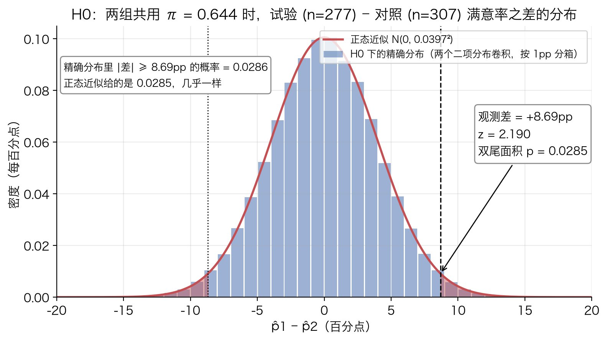
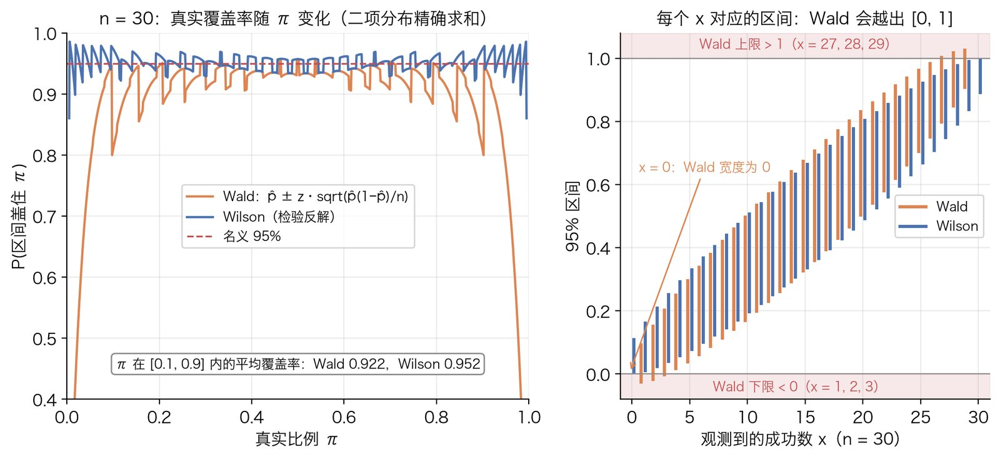
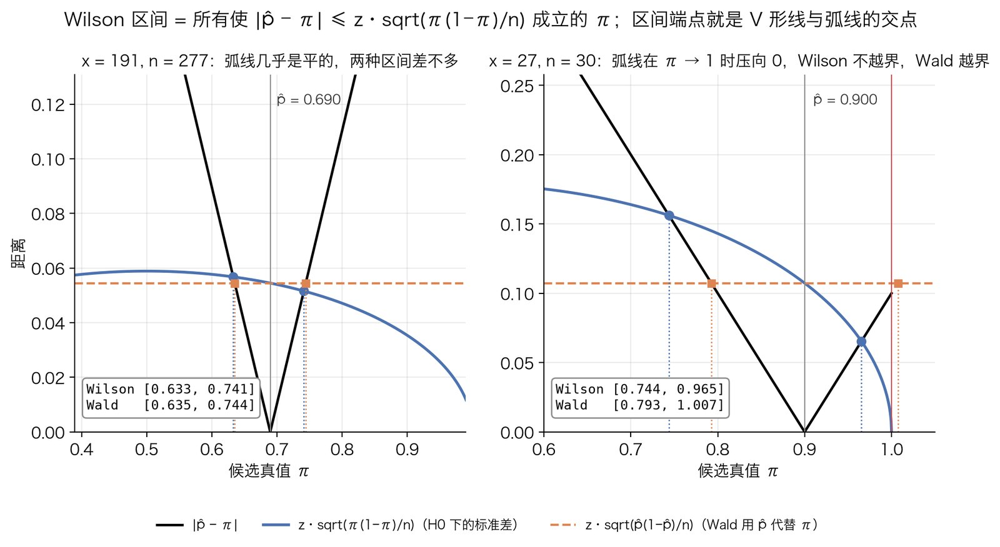

# z 检验：单比例与两比例

## 解决什么问题

### 场景

手里有一个样本，要回答"某个量是不是等于某个值"或"两组是不是一样"。最常见的两种形状：

- **单样本**：$n$ 次独立观测，每次成功或失败，样本成功率 $\hat p$。问：真实成功率 $\pi$ 是不是等于某个参考值 $\pi_0$（比如"这枚硬币是不是公平的"、"今天的转化率是不是还在历史基线上"）。
- **两样本**：两组独立观测，各自的成功率 $\hat p_1$、$\hat p_2$。问：两组的真实成功率 $\pi_1$、$\pi_2$ 是不是相等。这就是 $2\times 2$ 列联表，和[卡方检验](chi-square-test.md)、[Fisher 精确检验](fisher-exact-test.md)面对的是同一个问题。

两种情形都还要回答第二个问题：**差多少**。$p$ 值只说"差异是不是随机波动能解释的"，置信区间才说"真实值大概在哪个范围"。

### z 检验的思路

所有 $z$ 检验只做一件事：

$$
z=\frac{\text{观测值}-H_0\text{ 下的期望值}}{H_0\text{ 下观测值的标准差}}
$$

分子是"偏离了多少"，分母是"随机波动本来就有多大"，商是"偏离了几个标准差"。如果 $z$ 在 $H_0$ 下近似服从标准正态 $N(0,1)$，查一张固定的表就得到 $p$ 值。整个方法建立在一个近似上：**统计量的抽样分布近似正态**。这篇要讲清楚的是：

1. 这个近似从哪来（[中心极限定理](../probability/central-limit-theorem.md)）；
2. 分母怎么算，尤其是"用 $H_0$ 下的值还是用样本估计值"这个贯穿全篇的选择；
3. 把检验反过来解，怎么得到置信区间，为什么教科书上最常见的 Wald 区间有问题、Wilson 区间怎么修好它；
4. 近似在哪里失效。

和卡方检验的关系：对 $2\times 2$ 表，两比例 $z$ 检验的 $z^2$ 就是卡方统计量，两者是同一个检验的两种写法。卡方那篇从这里出发推出 $\sum (O-E)^2/E$；这篇把重点放在卡方形式讲不了的东西：单侧检验、置信区间、功效与样本量。

## 原理

### 第 1 步：最简单的情形：单样本均值，方差已知

先从比例退一步，看一般的均值问题，因为比例只是均值的特例。

设 $X_1,\dots,X_n$ 独立同分布，均值 $\mu$，方差 $\sigma^2$。样本均值 $\bar X=\frac1n\sum_i X_i$。两个基本事实：

$$
E\bar X=\frac1n\sum_i E X_i=\mu,\qquad
\operatorname{Var}\bar X=\frac1{n^2}\sum_i\operatorname{Var}X_i=\frac{\sigma^2}{n}
$$

第一个用期望的线性性；第二个用了独立性（独立变量的和，方差等于方差之和）以及常数平方提出来（$\operatorname{Var}(aX)=a^2\operatorname{Var}X$）。人话：平均 $n$ 个东西，中心不变，波动的标准差缩小到 $1/\sqrt n$。

[中心极限定理](../probability/central-limit-theorem.md)补上分布形状：不管 $X_i$ 本身是什么分布，$n$ 大时 $\bar X$ 近似服从[正态分布](../probability/normal-distribution.md) $N(\mu,\sigma^2/n)$。如果 $X_i$ 本身就是正态，这一条精确成立，不需要 $n$ 大。

检验 $H_0:\mu=\mu_0$。把 $\bar X$ 减去 $H_0$ 下的均值、除以它的标准差：

$$
z=\frac{\bar X-\mu_0}{\sigma/\sqrt n}
$$

$H_0$ 成立时 $z\approx N(0,1)$。为什么非要标准化：$\bar X-\mu_0=3$ 这个数本身没有意义，$3$ 是大是小取决于 $\bar X$ 的波动有多大；除以标准差之后，$z$ 的单位是"标准差的个数"，任何问题都能和同一张标准正态表比。

**为什么方差未知时要换 $t$**：上式假定 $\sigma$ 已知。实际上 $\sigma$ 几乎总是要用样本标准差 $s$ 估计，分母因此多了一层随机性，$z$ 的分布比 $N(0,1)$ 尾巴更厚。$X_i$ 本身正态时，精确分布是自由度 $n-1$ 的 $t$ 分布（这一条靠正态性：它保证 $\bar X$ 与 $s^2$ 独立、且 $(n-1)s^2/\sigma^2$ 服从卡方）；非正态总体下只是大样本近似。$n$ 到几十以上时 $t$ 和正态几乎重合。这就是"方差已知用 $z$，未知用 $t$"的来历。下一步会看到，比例问题**没有**这个麻烦。

### 第 2 步：单比例：方差不用另外估，它由比例本身决定

现在每次观测是 0 或 1：$P(X_i=1)=\pi$，$P(X_i=0)=1-\pi$。算它的期望和方差：

$$
EX_i=1\cdot\pi+0\cdot(1-\pi)=\pi,\qquad
EX_i^2=1^2\cdot\pi+0^2\cdot(1-\pi)=\pi
$$

$$
\operatorname{Var}X_i=EX_i^2-(EX_i)^2=\pi-\pi^2=\pi(1-\pi)
$$

成功总数 $X=\sum_i X_i$ 服从[二项分布](../probability/binomial-distribution.md) $\mathrm{Bin}(n,\pi)$，$EX=n\pi$，$\operatorname{Var}X=n\pi(1-\pi)$。样本比例 $\hat p=X/n$ 就是第 1 步的 $\bar X$，套第 1 步的结论：

$$
E\hat p=\pi,\qquad \operatorname{Var}\hat p=\frac{\pi(1-\pi)}{n}
$$

关键观察：**一个 0/1 变量的方差完全由它的均值决定**，没有一个独立的 $\sigma$ 要估。第 1 步"$\sigma$ 未知"的困难在这里不存在：$H_0:\pi=\pi_0$ 一旦给定，$\hat p$ 的标准差就是一个确定的数 $\sqrt{\pi_0(1-\pi_0)/n}$。于是

$$
z=\frac{\hat p-\pi_0}{\sqrt{\dfrac{\pi_0(1-\pi_0)}{n}}}
$$

**分母为什么用 $\pi_0$，不用 $\hat p$**：$p$ 值的定义是"假设 $H_0$ 为真，看到至少这么极端的数据的概率"。既然是在 $H_0$ 为真的世界里算，那个世界里 $\pi$ 就等于 $\pi_0$，$\hat p$ 的标准差就是 $\sqrt{\pi_0(1-\pi_0)/n}$，是已知的，没有理由拿带噪声的 $\hat p$ 去估一个已知量。把分母换成 $\sqrt{\hat p(1-\hat p)/n}$ 也能得到一个大样本下等价的统计量（叫 Wald 型），但小样本时表现更差，而且和第 5 步的 Wilson 区间对不上。记住这条原则，它贯穿全篇：**零分布在 $H_0$ 下算，所以检验的分母用 $H_0$ 下的值。**

一个小例子核对：抛 100 次得 60 次正面，$H_0:\pi_0=0.5$。

$$
z=\frac{0.60-0.50}{\sqrt{0.5\times 0.5/100}}=\frac{0.10}{0.05}=2.0,\qquad p_{\text{双侧}}=2\big(1-\Phi(2.0)\big)=0.0455
$$

直接用二项分布算的精确双侧 $p$ 是 $0.0569$。差在哪：$z$ 检验用连续的正态去近似离散的二项，"$X\ge 60$"在连续曲线上对应的其实是"$\ge 59.5$"。把分子改成 $|\hat p-\pi_0|-\frac{1}{2n}=0.10-0.005$，$z=1.9$，$p=0.0574$，和精确值就贴近了。这叫连续性校正，$n$ 大时可以不管，$n$ 小时值得做（$n=100$、$\pi_0=0.5$ 已经算是近似不错的情形，两个 $p$ 仍差两成）。

### 第 3 步：两比例：差的方差，与合并比例

两组独立：$X_1\sim\mathrm{Bin}(n_1,\pi_1)$，$X_2\sim\mathrm{Bin}(n_2,\pi_2)$，$\hat p_1=X_1/n_1$，$\hat p_2=X_2/n_2$。要检验 $H_0:\pi_1=\pi_2$，自然的统计量是差 $\hat p_1-\hat p_2$。它的期望和方差：

$$
E(\hat p_1-\hat p_2)=\pi_1-\pi_2
$$

$$
\operatorname{Var}(\hat p_1-\hat p_2)=\operatorname{Var}\hat p_1+\operatorname{Var}\hat p_2-2\operatorname{Cov}(\hat p_1,\hat p_2)=\frac{\pi_1(1-\pi_1)}{n_1}+\frac{\pi_2(1-\pi_2)}{n_2}
$$

协方差项为零是因为两组独立。注意是**加**不是减：差的方差等于两个方差之和，两边的噪声都会进到差里来。这一步用了独立性，配对数据（同一批人前后各测一次）不满足，见适用边界。

$H_0$ 下 $\pi_1=\pi_2$，记这个共同的值为 $\pi$，方差化简为

$$
\operatorname{Var}_{H_0}(\hat p_1-\hat p_2)=\pi(1-\pi)\left(\frac1{n_1}+\frac1{n_2}\right)
$$

和第 2 步不同的地方来了：第 2 步的 $H_0$ 直接给了 $\pi_0$ 的值，这里的 $H_0$ 只说"两组相等"，没说等于多少，$\pi$ 仍然未知，必须估计。按第 2 步的原则，要在 $H_0$ 的世界里估：$H_0$ 下两组是同一个成功率的两批样本，最合理的做法是把它们合起来当一个样本：

$$
\bar p=\frac{X_1+X_2}{n_1+n_2}
$$

这不只是直觉，它是 $H_0$ 下的极大似然估计。$H_0$ 下两组的联合似然是

$$
L(\pi)\propto\pi^{X_1}(1-\pi)^{n_1-X_1}\cdot\pi^{X_2}(1-\pi)^{n_2-X_2}=\pi^{X_1+X_2}(1-\pi)^{(n_1+n_2)-(X_1+X_2)}
$$

取对数求导令其为零，记 $S=X_1+X_2$，$N=n_1+n_2$：

$$
\frac{d}{d\pi}\Big[S\ln\pi+(N-S)\ln(1-\pi)\Big]=\frac{S}{\pi}-\frac{N-S}{1-\pi}=0
\ \Longrightarrow\ S(1-\pi)=(N-S)\pi\ \Longrightarrow\ \pi=\frac{S}{N}
$$

所以 $\bar p$ 就是"把两组当一组"的成功率，也等于 $\hat p_1$、$\hat p_2$ 按样本量加权的平均。把它代进方差，得到两比例 $z$ 检验：

$$
z=\frac{\hat p_1-\hat p_2}{\sqrt{\bar p(1-\bar p)\left(\dfrac1{n_1}+\dfrac1{n_2}\right)}}
$$

对比一下另一种分母 $\sqrt{\hat p_1(1-\hat p_1)/n_1+\hat p_2(1-\hat p_2)/n_2}$（不合并，各用各的）：那是 Wald 型，适合做置信区间（第 5 步），不适合做检验，理由和第 2 步相同。两组样本都大、$\hat p_1$ 和 $\hat p_2$ 又接近时两种分母差别很小（下面的算例里是 $0.0397$ 对 $0.0394$），样本小或两个比例悬殊时差别会放大。

顺带一提均值版本：两组均值、方差已知时 $z=(\bar X_1-\bar X_2)\big/\sqrt{\sigma_1^2/n_1+\sigma_2^2/n_2}$，同一个思路，分母是"两个方差之和开根号"。

下图是两比例 $z$ 检验的全部内容画在一张图上。$H_0$ 下两组共用 $\pi=\bar p=0.644$，$\hat p_1-\hat p_2$ 的精确分布（两个二项分布的卷积，枚举全部 $278\times 308$ 种组合算出来的）和正态近似 $N(0,\ 0.0397^2)$ 几乎重合；观测差 $+8.69$ 个百分点落在右尾，两尾面积 $0.0285$ 就是 $p$ 值，精确分布给的是 $0.0286$：



### 第 4 步：p 值、判定，以及和卡方检验的关系

$H_0$ 下 $z\approx N(0,1)$，记 $\Phi$ 为标准正态的累积分布函数，$z_{\text{obs}}$ 为算出来的值。

- **双侧**（$H_1:\pi_1\ne\pi_2$，只问"有没有差"）：$p=P(|Z|\ge|z_{\text{obs}}|)=2\big(1-\Phi(|z_{\text{obs}}|)\big)$。用误差函数写是 $\operatorname{erfc}(|z_{\text{obs}}|/\sqrt2)$，Python 里 `erfc(abs(z) / sqrt(2))`。
- **单侧**（$H_1:\pi_1>\pi_2$，事先就只关心一个方向）：$p=P(Z\ge z_{\text{obs}})=1-\Phi(z_{\text{obs}})$。$z_{\text{obs}}>0$ 时正好是双侧的一半。

按显著性水平 $\alpha$ 判定：双侧拒绝 $H_0$ 当 $|z_{\text{obs}}|\ge z_{1-\alpha/2}$，单侧当 $z_{\text{obs}}\ge z_{1-\alpha}$。$z_{1-\alpha/2}$ 是标准正态右尾面积为 $\alpha/2$ 的那个点，$\alpha=0.05$ 时 $z_{0.975}=1.960$，$z_{0.95}=1.645$。单侧门槛更低是因为只在一个方向上花 $\alpha$。方向必须在看数据之前定；看完数据再选单侧，等于把 $\alpha$ 偷偷翻倍。

**和卡方检验的关系。** [卡方分布](../probability/chi-square-distribution.md)的定义是"标准正态的平方和"，一个 $N(0,1)$ 变量的平方服从 $\chi^2_{(1)}$。对 $2\times 2$ 表，[卡方检验](chi-square-test.md)第 5 步用代数证明了 $\sum(O-E)^2/E$ 恰好等于上面这个 $z$ 的平方，所以：

$$
\chi^2=z^2,\qquad P\big(\chi^2_{(1)}\ge z_{\text{obs}}^2\big)=P\big(|Z|\ge|z_{\text{obs}}|\big)
$$

两者给出**完全相同**的双侧 $p$。区别只在两点：平方把符号丢了，所以卡方天然是双侧的，要做单侧只能用 $z$；卡方能推广到 $r\times c$ 表，$z$ 只管两组。

### 第 5 步：把检验反过来就是置信区间

$p$ 值回答"$\pi=\pi_0$ 这个假设站不站得住"。换个问法：**哪些 $\pi_0$ 站得住？** 把所有在 $\alpha=0.05$ 下不会被拒绝的 $\pi_0$ 收集起来，就是 $95\%$ 置信区间。形式上，是这个不等式的解集：

$$
|\hat p-\pi|\le z\cdot\operatorname{SD}(\pi),\qquad z=z_{0.975}=1.960
$$

分母 $\operatorname{SD}$ 用什么，决定了得到哪种区间。

#### (a) Wald 区间：分母用样本值

最省事的做法是把标准差里的 $\pi$ 换成 $\hat p$：$\operatorname{SD}=\sqrt{\hat p(1-\hat p)/n}$。这时不等式右边不含 $\pi$，直接解出来：

$$
\hat p-z\sqrt{\frac{\hat p(1-\hat p)}{n}}\ \le\ \pi\ \le\ \hat p+z\sqrt{\frac{\hat p(1-\hat p)}{n}}
$$

这就是入门教材里的"$\hat p\pm 1.96\,\text{SE}$"。这里用 $\hat p$ 有它的道理：做区间时没有一个特定的 $H_0$ 值可以代，$\pi$ 是要求的未知数，手头唯一的估计就是 $\hat p$。

#### (b) Wald 区间的问题

三个毛病，都源于"分母用了 $\hat p$"和"离散被当成连续"：

1. **$x=0$ 或 $x=n$ 时宽度为零。** $\hat p(1-\hat p)=0$，区间退化成一个点 $[0,0]$ 或 $[1,1]$，等于说 30 次全成功就断定成功率是 $100\%$，显然不对。
2. **端点越界。** $n=30$、$x=1$ 时区间是 $[-0.031,\ 0.098]$，$x=29$ 时是 $[0.902,\ 1.031]$。概率不可能是负的或超过 1。
3. **覆盖率不够。** "$95\%$ 区间"的承诺是：真值为 $\pi$ 时反复抽样，$95\%$ 的区间会盖住 $\pi$。这个承诺能精确检验：给定 $n$ 和 $\pi$，成功数 $x$ 只有 $n+1$ 种可能，每种的概率是二项分布 $\binom nx\pi^x(1-\pi)^{n-x}$，每种对应一个确定的区间，于是

$$
\text{覆盖率}(\pi)=\sum_{x=0}^{n}\binom nx\pi^x(1-\pi)^{n-x}\cdot\mathbb 1\big[\pi\in\text{CI}(x)\big]
$$

不需要模拟，是一个精确的有限求和。下图左边是 $n=30$ 时两种区间的覆盖率随 $\pi$ 变化的曲线，右边是 31 个可能的 $x$ 各自对应的区间：



Wald 在 $\pi=0.05$ 时覆盖率只有 $0.782$，$\pi=0.1$ 时 $0.809$；即便把 $\pi$ 限制在 $[0.1,0.9]$ 里平均，也只有 $0.922$，达不到承诺的 $0.95$。锯齿形是离散性造成的（$x$ 每跨过一个整数，区间集合就跳一下），两种区间都有；但 Wald 的锯齿整体压在 $0.95$ 线下面，且越靠边越糟。机制是：$\hat p$ 碰巧偏小时，分母 $\sqrt{\hat p(1-\hat p)/n}$ 跟着偏小，区间变窄，恰恰在最需要宽的时候变窄了。

#### (c) Wilson 区间：解一个二次不等式

修法是回到第 2 步的原则：分母用候选真值 $\pi$ 自己，而不是 $\hat p$：

$$
|\hat p-\pi|\le z\sqrt{\frac{\pi(1-\pi)}{n}}
$$

现在 $\pi$ 两边都有，不能直接移项。两边都非负，平方不改变不等号方向：

$$
(\hat p-\pi)^2\le\frac{z^2}{n}\,\pi(1-\pi)
$$

左边展开、右边展开：

$$
\hat p^2-2\hat p\,\pi+\pi^2\le\frac{z^2}{n}\pi-\frac{z^2}{n}\pi^2
$$

全部移到左边，按 $\pi$ 的幂次整理：

$$
\left(1+\frac{z^2}{n}\right)\pi^2-\left(2\hat p+\frac{z^2}{n}\right)\pi+\hat p^2\le 0
$$

这是关于 $\pi$ 的二次不等式。二次项系数 $1+z^2/n>0$，抛物线开口向上，"$\le 0$"的解集就是两个根之间的闭区间。所以 Wilson 区间的两个端点就是这个二次方程的两个根。用求根公式，$a=1+\frac{z^2}{n}$，$b=-\big(2\hat p+\frac{z^2}{n}\big)$，$c=\hat p^2$：

$$
\pi=\frac{\left(2\hat p+\dfrac{z^2}{n}\right)\pm\sqrt{\left(2\hat p+\dfrac{z^2}{n}\right)^2-4\left(1+\dfrac{z^2}{n}\right)\hat p^2}}{2\left(1+\dfrac{z^2}{n}\right)}
$$

把判别式展开化简：

$$
\begin{aligned}
\left(2\hat p+\frac{z^2}{n}\right)^2-4\left(1+\frac{z^2}{n}\right)\hat p^2
&=4\hat p^2+\frac{4\hat p z^2}{n}+\frac{z^4}{n^2}-4\hat p^2-\frac{4\hat p^2z^2}{n}\\
&=\frac{4z^2}{n}\hat p(1-\hat p)+\frac{z^4}{n^2}
=4z^2\left[\frac{\hat p(1-\hat p)}{n}+\frac{z^2}{4n^2}\right]
\end{aligned}
$$

开根号提出 $2z$，分子分母同除以 2，得到 Wilson 区间：

$$
\pi_{\text{lo},\text{hi}}=\frac{\hat p+\dfrac{z^2}{2n}\ \pm\ z\sqrt{\dfrac{\hat p(1-\hat p)}{n}+\dfrac{z^2}{4n^2}}}{1+\dfrac{z^2}{n}}
$$

怎么读这个公式：

- **中心**不再是 $\hat p$，而是 $\dfrac{\hat p+z^2/(2n)}{1+z^2/n}=\dfrac{x+z^2/2}{n+z^2}$，相当于在数据里加了 $z^2/2\approx 1.92$ 次成功和 $1.92$ 次失败，把中心往 $1/2$ 拉。$n$ 大时这个修正消失。
- **半宽**里根号下多了 $z^2/(4n^2)$，永远不为零，所以 $x=0$ 时宽度不再是零；外面又除以 $1+z^2/n$，整体略微收窄。
- **端点不越界**。$x=0$ 时算一下：中心 $=\frac{z^2/2}{n+z^2}$，半宽 $=\frac{z\cdot z/(2n)}{1+z^2/n}=\frac{z^2/2}{n+z^2}$，两者相等，所以下限恰好是 $0$，上限是 $\frac{z^2}{n+z^2}$；$n=30$ 时上限 $3.84/33.84=0.1135$。同理 $x=n$ 时上限恰好是 $1$。
- 上面覆盖率图里，Wilson 在 $[0.1,0.9]$ 上平均 $0.952$，锯齿围着 $0.95$ 上下摆，这就是"反解一个分母正确的检验"换来的。

几何上看更直观。横轴是候选真值 $\pi$，画两条曲线：$|\hat p-\pi|$ 是以 $\hat p$ 为顶点的 V 形，$z\sqrt{\pi(1-\pi)/n}$ 是两端压到零的弧线。Wilson 区间就是 V 形线在弧线**下方**的那一段 $\pi$，端点是两条线的交点。Wald 区间是把弧线换成一条高度为 $z\sqrt{\hat p(1-\hat p)/n}$ 的水平线：



左图 $n=277$，弧线在 $\hat p$ 附近几乎是平的，两种区间只差在第三位小数；右图 $n=30$、$\hat p=0.9$，弧线在 $\pi\to 1$ 时压向零，V 形线的右支和弧线的交点被拦在 $0.965$，而水平线让 Wald 的右端跑到了 $1.007$。

还有一个一致性：$\pi_0$ 落在 $95\%$ Wilson 区间内，当且仅当第 2 步的 $z$ 检验在 $\alpha=0.05$ 下不拒绝 $H_0:\pi=\pi_0$。Wald 区间对应的是分母用 $\hat p$ 的那个 Wald 检验，和第 2 步的检验不配套。

#### (d) 两比例之差：Newcombe 区间

要的是 $\pi_1-\pi_2$ 的区间。直接把第 3 步的检验反过来解也可以，但 $\bar p$ 依赖于未知的 $\pi_1$、$\pi_2$，没有闭式解，要数值求根。Newcombe 的混合法（hybrid score）给了一个闭式的近似：先分别算两组的 Wilson 区间 $[l_1,u_1]$、$[l_2,u_2]$，记 $\hat d=\hat p_1-\hat p_2$，然后

$$
\Delta_{\text{lo}}=\hat d-\sqrt{(\hat p_1-l_1)^2+(u_2-\hat p_2)^2},\qquad
\Delta_{\text{hi}}=\hat d+\sqrt{(u_1-\hat p_1)^2+(\hat p_2-l_2)^2}
$$

为什么这样拼：

- **方向**。差 $\pi_1-\pi_2$ 最小的情形是 $\pi_1$ 偏低、$\pi_2$ 偏高，所以下限用组 1 **向下**的距离 $\hat p_1-l_1$ 和组 2 **向上**的距离 $u_2-\hat p_2$；上限反过来。
- **勾股式组合**。两组独立，差的方差是方差之和（第 3 步），标准差就按平方和开根号的方式合并，"距离"也照此处理。检验一下：如果两个 Wilson 区间恰好对称、半宽分别是 $z s_1$、$z s_2$，上式给出 $\hat d\pm z\sqrt{s_1^2+s_2^2}$，正是差的 Wald 区间公式。所以 Newcombe 区间可以理解为"差的 Wald 公式，但把两个对称半宽换成 Wilson 的不对称半宽"。

它是一个**经验构造**：不是从某个单一不等式严格推出来的，而是把两个有良好性质的单比例区间按方差相加的逻辑拼起来，其覆盖率是靠数值比较验证的，实践中接近名义值，端点也不会越出 $[-1,1]$。

### 第 6 步：功效与样本量

功效的一般定义（$H_1$ 为真时正确拒绝 $H_0$ 的概率）和它与 $\alpha$、效应量、$n$ 的关系见[假设检验与 p 值](hypothesis-testing.md)。这里只推两比例版本，因为它是 A/B 实验定样本量的标准公式。

设两组各 $n$ 人，基线 $p_0$，希望能检出的差是 $\delta$，即 $p_1=p_0+\delta$；双侧 $\alpha$，目标功效 $1-\beta$。记 $\bar p=(p_0+p_1)/2$，两组等量时它就是 $H_0$ 下的合并比例。差 $d=\hat p_1-\hat p_0$ 在两个世界里的分布：

$$
H_0:\ d\approx N\!\left(0,\ \sigma_0^2\right),\ \sigma_0=\sqrt{\frac{2\bar p(1-\bar p)}{n}};\qquad
H_1:\ d\approx N\!\left(\delta,\ \sigma_1^2\right),\ \sigma_1=\sqrt{\frac{p_0(1-p_0)+p_1(1-p_1)}{n}}
$$

$H_0$ 下的方差用合并比例（第 3 步），$H_1$ 下两组比例不同，各用各的。拒绝域是 $d\ge z_{1-\alpha/2}\sigma_0$（$\delta>0$ 时另一侧尾巴的概率可以忽略）。功效就是 $H_1$ 下落进拒绝域的概率：

$$
1-\beta=P\big(d\ge z_{1-\alpha/2}\sigma_0\ \big|\ H_1\big)=\Phi\!\left(\frac{\delta-z_{1-\alpha/2}\sigma_0}{\sigma_1}\right)
$$

令括号里等于 $z_{1-\beta}$（因为 $\Phi(z_{1-\beta})=1-\beta$）：

$$
\delta=z_{1-\alpha/2}\,\sigma_0+z_{1-\beta}\,\sigma_1
$$

人话：效应量要够大，大到既能跨过 $H_0$ 的拒绝门槛（第一项），又留出 $H_1$ 自身波动的余量（第二项）。两个 $\sigma$ 都带 $1/\sqrt n$，提出来解 $n$：

$$
n_{\text{每组}}=\frac{\Big(z_{1-\alpha/2}\sqrt{2\bar p(1-\bar p)}+z_{1-\beta}\sqrt{p_0(1-p_0)+p_1(1-p_1)}\Big)^2}{\delta^2}
$$

$n$ 与 $\delta^2$ 近似成反比（分子随 $p_1$ 略变）：要检出一半大的差，大约要四倍的人。这个公式就是 [Artora 那篇 case](../../case/artora-ab-satisfaction-fisher.md) 补算 3 用的公式；以对照组 $0.6026$ 为基线、$\delta=0.0869$、$\alpha=0.05$、功效 $80\%$（$z_{0.975}=1.960$，$z_{0.8}=0.842$），算出每组约 $474$ 人，和那里一致，具体数字在最小算例里。

## 适用边界

- **正态近似要够好。** 单比例要求 $n\pi_0$ 和 $n(1-\pi_0)$ 都不小（常用门槛 $5$，保守的教材要 $10$）；两比例要求每组在合并比例下的期望成功数和期望失败数都不小，这和卡方检验"每格期望频数 $\ge 5$"是同一条规则的两种说法（原因见[卡方检验](chi-square-test.md)第 4 步：二项分布的偏度由 $n\pi$ 和 $n(1-\pi)$ 决定）。看的是期望频数不是总人数：总人数上万但结果稀有（$2\%$ 的投诉率）照样可能不满足。不满足时单比例用精确二项检验，两比例用 [Fisher 精确检验](fisher-exact-test.md)或 Barnard / Boschloo 无条件精确检验。
- **检验分母用 $H_0$ 下的值，区间用 Wilson。** 单比例检验用 $\pi_0$，两比例检验用 $\bar p$；置信区间用 Wilson（单比例）和 Newcombe（两比例差）。Wald 区间只在 $n$ 大且 $\hat p$ 远离 $0$ 和 $1$ 时可以用，报告里见到 $\hat p\pm 1.96\,\text{SE}$ 要先看 $n$ 和 $\hat p$。
- **观测要独立。** 第 1、3 步算方差时都用了独立性。同一用户多次计数、同一设备重复曝光都会让真实方差比公式大，$p$ 偏乐观。配对数据（同一批对象前后各测一次）不能用两比例 $z$，用 McNemar 检验。
- **单侧还是双侧要先定。** 看完数据再选方向等于把 $\alpha$ 翻倍。
- **均值的 $z$ 检验实际少用。** $\sigma$ 已知的场景很少，一般用 $t$；$n$ 在几十以上时两者几乎没差别。比例问题没有这个区分，$z$ 就是标准做法。
- **小样本可加连续性校正。** 第 2 步的例子里 $n=100$ 时校正让 $p$ 从 $0.0455$ 变到 $0.0574$，更贴近精确值 $0.0569$；两比例的对应物是卡方的 Yates 校正。$n$ 大时不需要。
- **显著不等于差多少。** $n$ 大时芝麻大的差也显著。汇报要带点估计和区间，不只报 $p$。

## 最小算例

### 手算：两比例 z 检验

数据取自 [Artora 识别满意度 A/B](../../case/artora-ab-satisfaction-fisher.md)：试验组 $191/277$，对照组 $185/307$。下面所有中间量都按全精度计算、显示时四舍五入，照着显示的数复算末位可能差 $1$。

第 3 步，两个比例和差：

$$
\hat p_1=\frac{191}{277}=0.68953,\qquad \hat p_2=\frac{185}{307}=0.60261,\qquad \hat d=0.08692
$$

合并比例与 $H_0$ 下的标准差：

$$
\bar p=\frac{191+185}{277+307}=\frac{376}{584}=0.64384,\qquad \bar p(1-\bar p)=0.64384\times 0.35616=0.22931
$$

$$
\frac1{277}+\frac1{307}=0.0036101+0.0032573=0.0068674,\qquad
\sigma_0=\sqrt{0.22931\times 0.0068674}=\sqrt{0.0015748}=0.039684
$$

$$
z=\frac{0.086925}{0.039684}=2.1905
$$

第 4 步，$p$ 值：$\Phi(2.1905)=0.98575$，双侧 $p=2\times(1-0.98575)=0.0285$，单侧 $0.0142$。核对卡方：$z^2=4.798$，和[卡方检验](chi-square-test.md)算例里的 $\chi^2=4.798$、$p=0.0285$ 一致。

### 手算：191/277 的 Wilson 区间

第 5 步 (c) 的公式，$z=1.959964$，$z^2=3.841459$，$n=277$：

$$
\frac{z^2}{n}=0.013868,\qquad \frac{z^2}{2n}=0.006934,\qquad \hat p+\frac{z^2}{2n}=0.689531+0.006934=0.696465
$$

$$
\frac{\hat p(1-\hat p)}{n}=\frac{0.689531\times 0.310469}{277}=0.00077285,\qquad
\frac{z^2}{4n^2}=\frac{3.841459}{4\times 277^2}=0.00001252
$$

$$
z\sqrt{0.00077285+0.00001252}=1.959964\times\sqrt{0.00078536}=1.959964\times 0.0280243=0.054927
$$

$$
\pi_{\text{lo}}=\frac{0.696465-0.054927}{1.013868}=\frac{0.641538}{1.013868}=0.6328,\qquad
\pi_{\text{hi}}=\frac{0.696465+0.054927}{1.013868}=\frac{0.751391}{1.013868}=0.7411
$$

即 $[63.3\%,\ 74.1\%]$。scipy 核对：`binomtest(191, 277).proportion_ci(method="wilson")` 给 $(0.63276,\ 0.74111)$。对比 Wald：$\hat p\pm 1.96\times 0.027800$，得 $[0.6350,\ 0.7440]$，$n=277$ 时两者只差第三位小数。同样的步骤算对照组 $185/307$：Wilson $[0.5469,\ 0.6558]$。

### 手算：差的 Newcombe 区间

第 5 步 (d)，$\hat d=0.086925$，$l_1=0.632763$，$u_1=0.741114$，$l_2=0.546922$，$u_2=0.655754$：

$$
\Delta_{\text{lo}}=0.086925-\sqrt{(0.689531-0.632763)^2+(0.655754-0.602606)^2}
=0.086925-\sqrt{0.0032226+0.0028247}=0.086925-0.077764=0.0092
$$

$$
\Delta_{\text{hi}}=0.086925+\sqrt{(0.741114-0.689531)^2+(0.602606-0.546922)^2}
=0.086925+\sqrt{0.0026608+0.0031007}=0.086925+0.075904=0.1628
$$

即 $[+0.9,\ +16.3]$ 个百分点，和 case 里的数一致。区间不含 $0$，和双侧 $p=0.0285<0.05$ 方向一致（两者不是同一个公式，Newcombe 是经验构造，所以只说"方向一致"不说"等价"）。

### 手算：样本量

第 6 步，$p_0=0.60261$，$p_1=0.68953$，$\delta=0.086925$，$\bar p=0.64607$，$z_{0.975}=1.959964$，$z_{0.8}=0.841621$：

$$
1.959964\times\sqrt{2\times 0.64607\times 0.35393}=1.959964\times\sqrt{0.45733}=1.959964\times 0.67626=1.32545
$$

$$
0.841621\times\sqrt{0.23947+0.21408}=0.841621\times\sqrt{0.45355}=0.841621\times 0.67346=0.56680
$$

$$
n_{\text{每组}}=\frac{(1.32545+0.56680)^2}{0.086925^2}=\frac{3.5806}{0.0075559}=473.9\approx 474
$$

### 代码

零依赖实现，两比例检验、Wilson、Newcombe 各一个函数：

```python
from math import erfc, sqrt

Z = 1.959964  # z_{0.975}


def two_prop_z(x1, n1, x2, n2):
    """两比例 z 检验。返回 (z, 双侧 p)。分母用合并比例。"""
    p1, p2 = x1 / n1, x2 / n2
    pbar = (x1 + x2) / (n1 + n2)
    se0 = sqrt(pbar * (1 - pbar) * (1 / n1 + 1 / n2))
    z = (p1 - p2) / se0
    return z, erfc(abs(z) / sqrt(2))


def wilson(x, n, z=Z):
    """单比例 Wilson 区间：第 5 步 (c) 二次方程的两个根。"""
    p = x / n
    den = 1 + z * z / n
    centre = (p + z * z / (2 * n)) / den
    half = z * sqrt(p * (1 - p) / n + z * z / (4 * n * n)) / den
    return centre - half, centre + half


def newcombe(x1, n1, x2, n2, z=Z):
    """两比例差 p1 - p2 的 Newcombe 混合区间。"""
    p1, p2 = x1 / n1, x2 / n2
    l1, u1 = wilson(x1, n1, z)
    l2, u2 = wilson(x2, n2, z)
    d = p1 - p2
    return d - sqrt((p1 - l1) ** 2 + (u2 - p2) ** 2), d + sqrt((u1 - p1) ** 2 + (p2 - l2) ** 2)
```

```python
>>> two_prop_z(191, 277, 185, 307)
(2.190..., 0.0285)
>>> wilson(191, 277)
(0.6328, 0.7411)
>>> newcombe(191, 277, 185, 307)
(0.0092, 0.1628)
```

有 scipy 时，单比例区间用 `scipy.stats.binomtest(x, n).proportion_ci(method="wilson")`；两比例双侧 $p$ 直接拿 `scipy.stats.chi2_contingency(..., correction=False)` 的结果，和 $z$ 检验完全相同。图由 `tools/figures/z-test.py` 生成。
